# Modelo de Negocio

> Documento integral que describe el modelo de negocio del sistema POS, el diagrama de la base de datos y los diagramas de actividad de las funcionalidades principales.

---

## 1. Descripción General del Negocio

### 1.1 ¿Qué es este sistema?

Este es un **Sistema de Punto de Venta (POS)** moderno, diseñado como **SaaS multi-tenant** para comercios argentinos. Permite gestionar ventas, stock, caja, clientes, facturación electrónica (ARCA/AFIP) y catálogo público desde una única plataforma web.

### 1.2 Modelo de Negocio

| Aspecto | Descripción |
|---------|-------------|
| **Tipo** | SaaS multi-tenant |
| **Tenant** | Cada `Business` es un tenant independiente con sus propios datos |
| **Monetización** | Planes por suscripción (BASIC, PRO, ENTERPRISE) con features progresivos |
| **Mercado** | Comercios argentinos (soporte ARCA, IVA, CUIT, condiciones fiscales) |
| **Usuarios** | Multi-rol por comercio (SUPER_ADMIN, ADMIN, USER) |

### 1.3 Planes y Feature Gates

El sistema controla el acceso a funcionalidades mediante **feature gates** basados en el plan contratado:

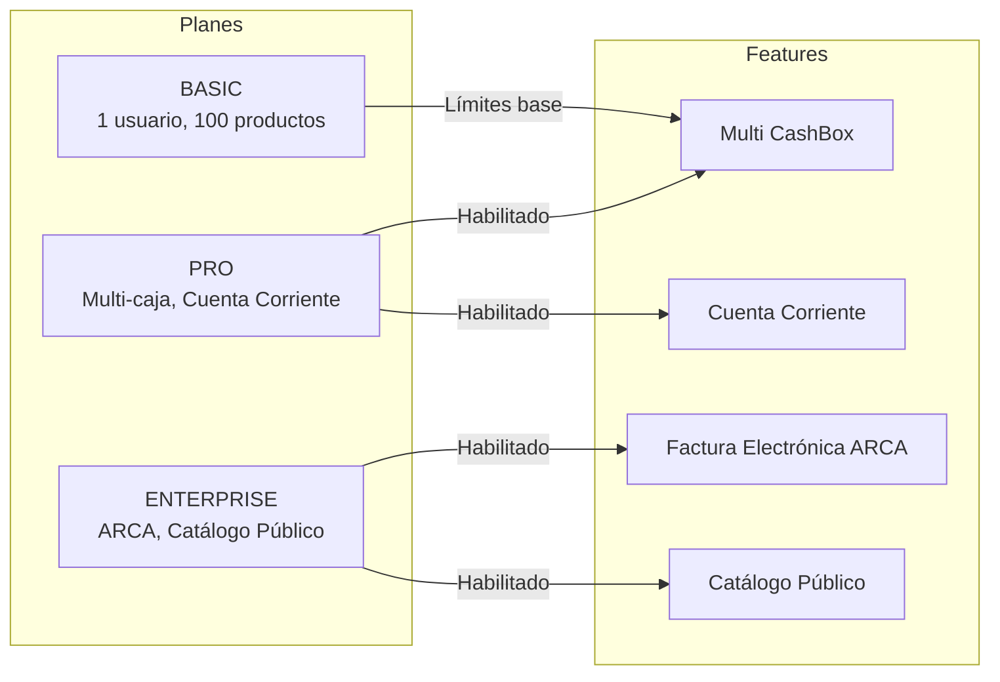

| Plan | Usuarios | Productos | Features |
|------|----------|-----------|----------|
| **BASIC** | 1 | 100 | Funcionalidades base |
| **PRO** | Ilimitado | Ilimitado | Multi-caja, Cuenta Corriente |
| **ENTERPRISE** | Ilimitado | Ilimitado | + ARCA, + Catálogo Público |

### 1.4 Multi-tenancy

Cada `Business` opera como un tenant completamente aislado. **TODAS** las consultas a la base de datos filtran por `businessId`:

```
Business A (slug: "tienda-juan")
├── Productos, Clientes, Proveedores
├── Cajas, Sesiones, Órdenes
└── Configuración ARCA propia

Business B (slug: "comercio-maria")
├── Productos, Clientes, Proveedores
├── Cajas, Sesiones, Órdenes
└── Configuración ARCA propia
```

### 1.5 Stack Tecnológico

| Capa | Tecnología |
|------|-----------|
| **Framework** | Next.js 15 (App Router) |
| **Frontend** | React 19, Tailwind CSS v4, Radix UI |
| **ORM** | Prisma 6 + PostgreSQL |
| **Auth** | NextAuth.js v5 (Auth.js) |
| **Validación** | Zod + React Hook Form |
| **Tiempo Real** | Pusher (WebSockets) |
| **Facturación ARCA** | Google Cloud Functions |
| **Imágenes** | Firebase Storage |

---

## 2. Diagrama de la Base de Datos

### 2.1 Modelo Entidad-Relación (ERD)

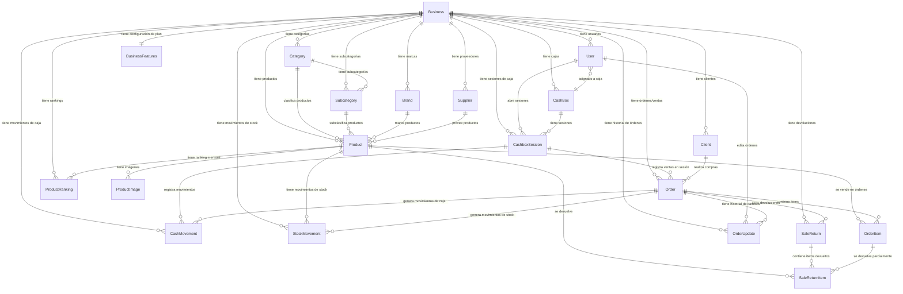

### 2.2 Diagrama de Estados

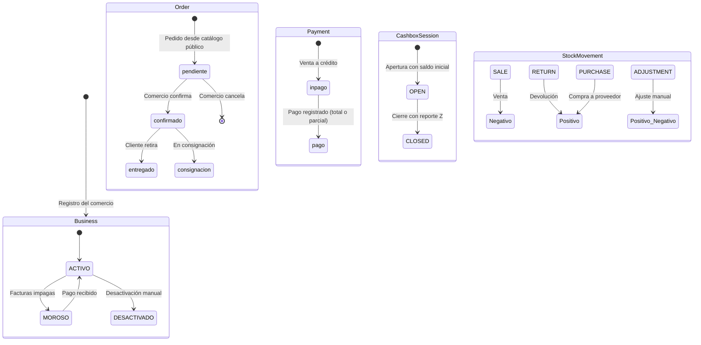

### 2.3 Modelos Principales

#### Business (Tenant)

```prisma
model Business {
  id   String  @id @default(cuid())
  name String
  slug String  @unique

  // Owner
  userId String? @unique

  // Multi-tenancy: todas las entidades hijas
  products        Product[]
  clients         Client[]
  suppliers       Supplier[]
  orders          Order[]
  cashBoxes       CashBox[]
  cashboxSessions CashboxSession[]

  // Configuración ARCA (factura electrónica argentina)
  cuit              String?
  condicionIva      IvaCondition  @default(MONOTRIBUTO)
  cert              String?       @db.Text  // Certificado encriptado
  key               String?       @db.Text  // Clave privada encriptada
  ptoVenta          Int[]         @default([])

  // Estado de cuenta
  accountStatus     BusinessStatus @default(ACTIVO)
  lastPaymentDate   DateTime?

  // Branding
  brandLogo           String?
  brandPrimaryColor   String?     @default("#2563eb")
  brandSecondaryColor String?     @default("#f59e0b")

  // Plan y features
  features            BusinessFeatures?
}
```

#### Order (Venta)

```prisma
model Order {
  id         String      @id @default(cuid())
  date       DateTime    @default(now())
  total      Float       @default(0)
  status     OrderStatus @default(confirmado)
  paidStatus PaidStatus  @default(inpago)
  seller     String?

  // Métodos de pago (soporta pago dividido en 2 métodos)
  paymentMethod  String? @default("Efectivo")
  paymentMethod2 String?
  totalMethod2   Float?  @default(0)

  // Descuentos
  discountPercentage Float @default(0)
  discountAmount     Float @default(0)

  // Cliente
  clientId String?
  client   Client?

  // Factura electrónica ARCA
  CAE Json?  // { CAE, nroComprobante, vencimiento, qrData }

  // Sesión de caja
  cashboxSessionId String?
  cashboxSession   CashboxSession?

  // Relaciones
  items          OrderItem[]
  returns        SaleReturn[]
  stockMovements StockMovement[]
  updates        OrderUpdate[]
  cashMovements  CashMovement[]
}
```

#### Product (Producto)

```prisma
model Product {
  id          String  @id @default(cuid())
  code        String?    // Código de barras / SKU
  description String?    // Nombre del producto

  // Clasificación jerárquica
  brandId     String?
  brand       Brand?
  categoryId  String?
  category    Category?
  subCategoryId String?
  subCategory   Subcategory?

  // Precios
  price     Float @default(0)  // Precio de costo
  salePrice Float @default(0)  // Precio de venta
  gain      Float @default(0)  // Margen de ganancia (%)

  // Stock
  amount Float @default(0)
  unit   String?  // "unidades", "kg", "litros", etc.

  // Proveedor
  supplierId String?
  supplier   Supplier?

  // Catálogo público
  catalog Boolean @default(true)
  details String?

  // Historial de ventas
  rankings ProductRanking[]
}
```

---

## 3. Diagramas de Actividad — Features Principales

### 3.1 Flujo Completo de Venta (Core del Negocio)

El flujo de venta es el **corazón del sistema**. Conecta los módulos de facturación, caja, stock y ranking en una sola transacción atómica.

```mermaid
flowchart TD
    INICIO([Usuario abre NewBill]) --> CAJA{Sesión de caja abierta?}
    CAJA -->|No| ABRIR[Abrir sesión con saldo inicial]
    CAJA -->|Sí| PARAMS[Configurar parámetros de factura]
    ABRIR --> PARAMS

    PARAMS --> CLIENTE[Seleccionar o crear cliente]
    CLIENTE --> PRODUCTOS[Agregar productos al carrito]

    PRODUCTOS --> DESCUENTO[Aplicar descuento % si corresponde]
    DESCUENTO --> PAGO[Seleccionar método de pago]
    PAGO --> DIVIDIDO{Pago dividido?}
    DIVIDIDO -->|Sí| METODO2[Seleccionar segundo método + montos]
    DIVIDIDO -->|No| CONTINUE

    METODO2 --> CONTINUE
    CONTINUE --> ARCA{Factura electrónica?}

    ARCA -->|Sí - Plan Enterprise| CAE[Obtener CAE de ARCA vía Cloud Function]
    ARCA -->|No| PROCESAR

    CAE --> PROCESAR

    subgraph TX[Transacción Prisma - Atómica]
        PROCESAR --> ORDER[Crear Order + OrderItems]
        ORDER --> STOCK[Descontar stock: product.amount -= quantity]
        STOCK --> STOCKMOV[Crear StockMovement type: SALE]
        STOCKMOV --> RANKING[Upsert ProductRanking mensual]
        RANKING --> CAJA_EF[Solo si Efectivo: CashBox.total += monto]
        CAJA_EF --> CAJAMOV[Crear CashMovement(s)]
    end

    TX --> PUSHER[Notificar vía Pusher]
    PUSHER --> REVALIDATE[Revalidar rutas afectadas]
    REVALIDATE --> IMPRIMIR[Imprimir comprobante]
    IMPRIMIR --> FIN([Venta procesada ✓])

    style TX fill:#e6f3ff,stroke:#4a90d9,stroke-width:2px
    style FIN fill:#d4edda,stroke:#28a745,stroke-width:2px
```

**Reglas de Negocio Clave:**
- El stock se descuenta **en la misma transacción** que se crea la orden
- Los movimientos de caja solo se registran para pagos en **Efectivo**
- El ranking mensual se actualiza con `upsert` (acumula ventas del mes)
- La sesión de caja debe estar **OPEN** para poder procesar ventas

---

### 3.2 Gestión de Caja (Cash Register)

Cada usuario debe abrir una sesión de caja al iniciar su jornada. Al cerrarla, se genera un **Reporte Z** con el resumen del día.

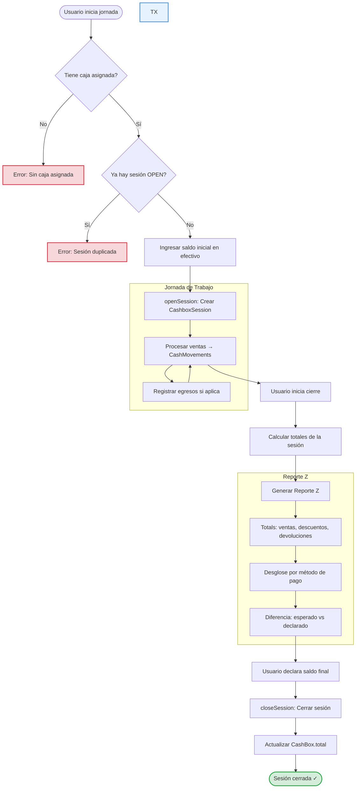

**Reporte Z - Estructura:**

| Campo | Descripción | Ejemplo |
|-------|-------------|---------|
| `totalSales` | Suma de ventas | $125,000 |
| `totalDiscounts` | Descuentos aplicados | -$5,200 |
| `totalReturns` | Devoluciones | -$3,400 |
| `netTotal` | Ventas - Devoluciones | $121,600 |
| `orderCount` | Cantidad de transacciones | 45 |
| `paymentMethods` | Desglose por método | Efectivo: $85K, Tarjeta: $28K |
| `expectedFinalBalance` | Saldo calculado | $150,000 |
| `declaredFinalBalance` | Saldo declarado por usuario | $149,800 |
| `difference` | Diferencia (ideal: 0) | -$200 |

---

### 3.3 Gestión de Stock y Productos

El sistema soporta tanto operaciones unitarias como carga masiva por Excel con cálculo automático de precios.

```mermaid
flowchart TD
    INICIO_GESTION([Gestión de Productos]) --> MODO{Modo de operación}

    MODO -->|Individual| CRUD[CRUD de producto]
    MODO -->|Masivo| EXCEL[Carga por Excel/CSV]

    subgraph CRUD[Operaciones Individuales]
        CRUD_CREAR[Crear producto<br/>código, descripción, precio]
        CRUD_ACT[Actualizar producto<br/>precio, stock, imágenes]
        CRUD_ELIM[Eliminar producto]
    end

    subgraph BULK[Carga Masiva]
        EXCEL --> UPLOAD[Subir archivo Excel]
        UPLOAD --> SUPPLIER[Seleccionar proveedor]
        SUPPLIER --> FORMULA[Configurar fórmula de precios]

        subgraph FORMULA_SEC[Fórmula de Precios]
            FORMULA_DESC[Descuento % del proveedor]
            FORMULA_IVA[IVA: 0%, 10.5% o 21%]
            FORMULA_GAIN[Ganancia % deseada]
            FORMULA_CALC[ costPrice = filePrice × (1 - discount/100) × (1 + iva/100)<br/>salePrice = costPrice × (1 + gain/100) ]
        end

        FORMULA_CALC --> PREVIEW[Vista previa de cambios]
        PREVIEW --> CLASIF{Clasificar productos}

        CLASIF -->|Nuevo| CREATE[Marcar como CREATE]
        CLASIF -->|Existe + cambio| UPDATE[Marcar como UPDATE]
        CLASIF -->|Sin cambios| IGNORE[Marcar como IGNORE]

        CREATE --> CONFIRMAR[Confirmar carga]
        UPDATE --> CONFIRMAR
        IGNORE --> CONFIRMAR

        CONFIRMAR --> BULK_EXEC[createProductsBulk]
        BULK_EXEC --> BULK_TX[Transacción: crear/actualizar productos]
        BULK_TX --> SAVE_SUPPLIER[Guardar fórmula en proveedor]
    end

    CRUD --> FIN_CRUD([Producto actualizado ✓])
    BULK --> FIN_BULK([Carga masiva completada ✓])

    style BULK fill:#e6f3ff,stroke:#4a90d9,stroke-width:2px
    style FORMULA_SEC fill:#fff3cd,stroke:#ffc107,stroke-width:1px
    style FIN_CRUD fill:#d4edda,stroke:#28a745,stroke-width:2px
    style FIN_BULK fill:#d4edda,stroke:#28a745,stroke-width:2px
```

**Clasificación Jerárquica de Productos:**

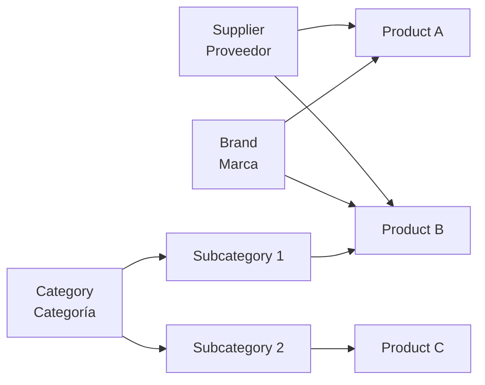

---

### 3.4 Cuenta Corriente (Client Ledger)

Permite a los comercios vender a crédito y registrar pagos parciales. Feature disponible en plan **PRO+**.

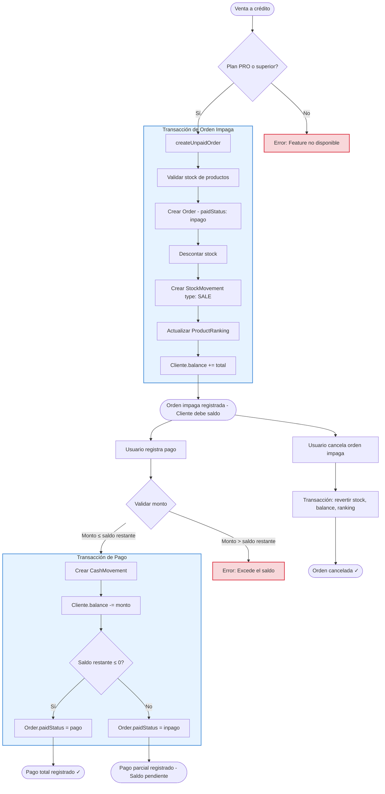

---

### 3.5 Edición de Ventas con Historial

Operación restringida a **ADMINs** que mantiene un registro completo de cada cambio (event sourcing).

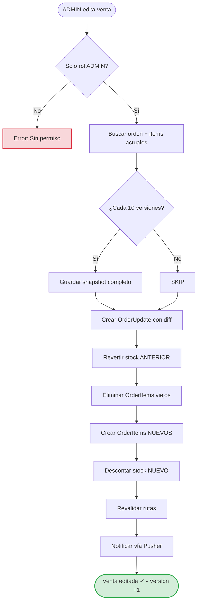

**Estructura de OrderUpdate (Historial):**

```typescript
{
  version: 1,           // Secuencial por orden
  type: "ITEMS_UPDATED", // Tipo de cambio
  updatedBy: "Admin",    // Quién lo hizo
  changes: {             // Diff detallado
    items: [
      { productId: "p1", oldQuantity: 2, newQuantity: 3 },
      { productId: "p2", action: "added", quantity: 1 }
    ]
  },
  snapshot: { ... }      // Snapshot completo (cada 10 versiones)
}
```

---

### 3.6 Catálogo Público y Pedidos Online

Feature **Enterprise** que permite a los clientes ver productos y hacer pedidos sin autenticarse.

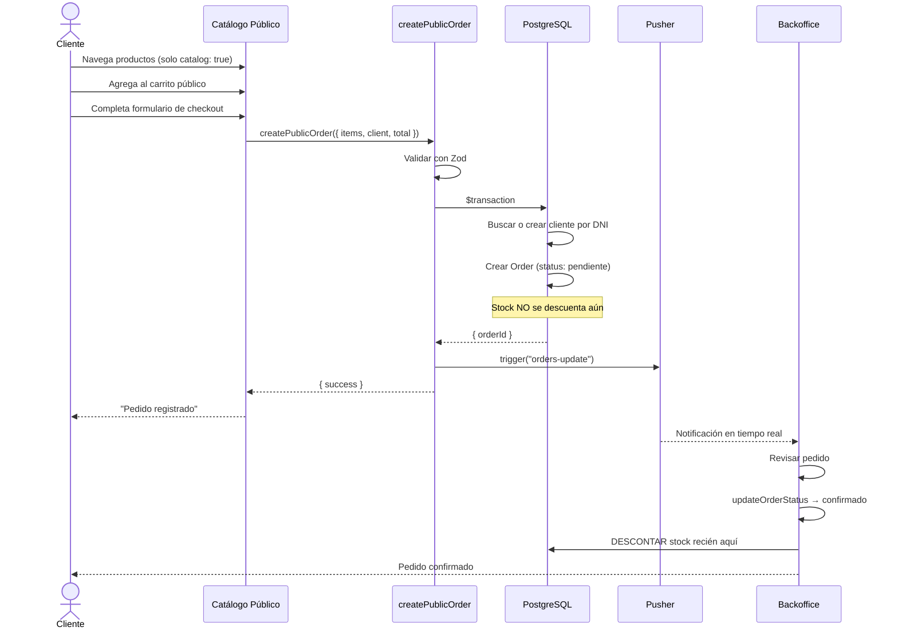

### 3.7 Factura Electrónica ARCA/AFIP

Integración con ARCA (ex AFIP) para emitir comprobantes electrónicos con CAE. Feature **Enterprise** que requiere configuración fiscal del negocio.

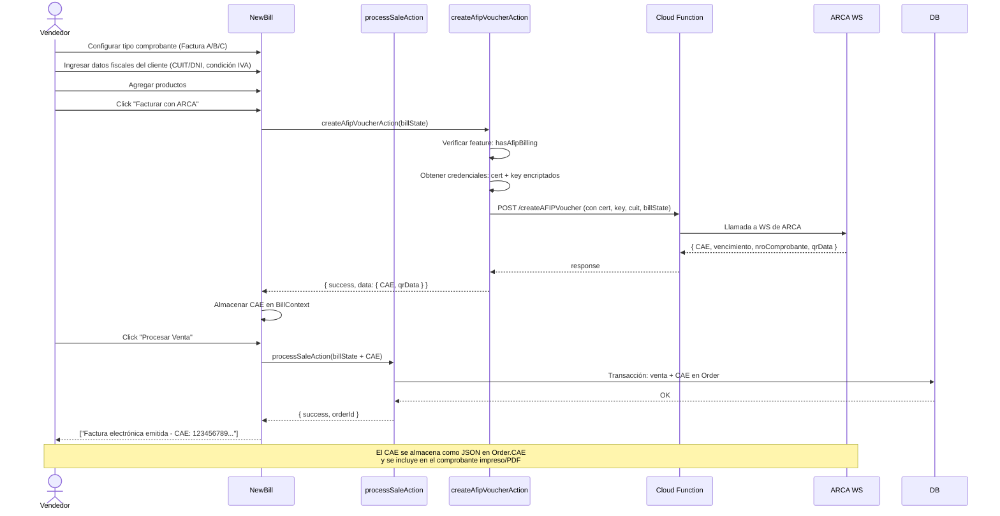

---

### 3.8 Devoluciones (Sale Returns)

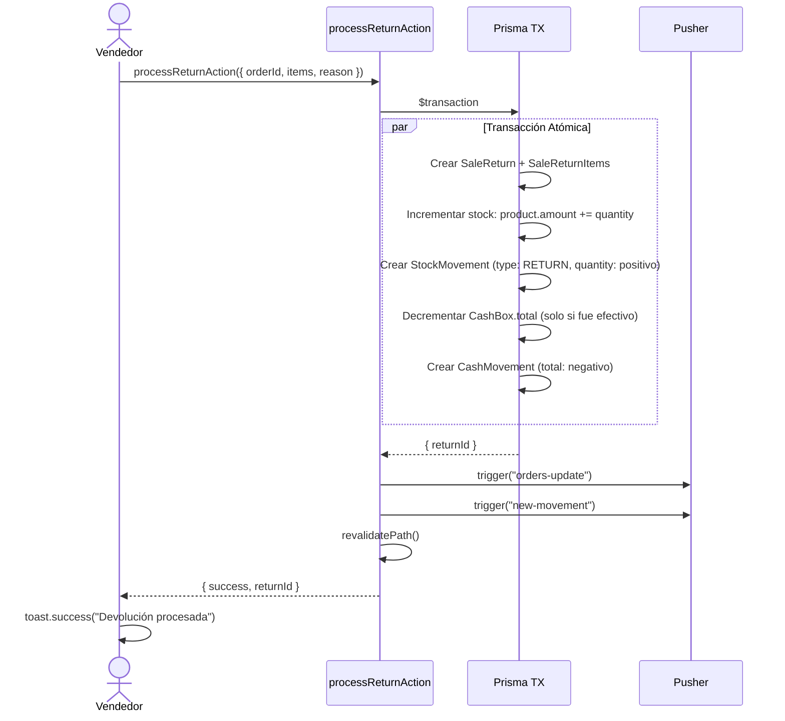

### 3.9 Reportes

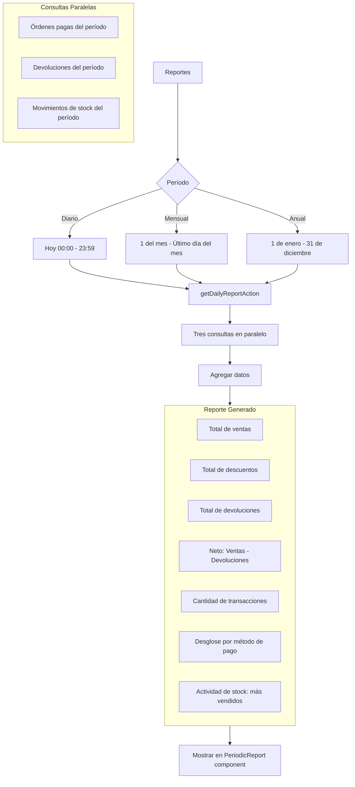

---

## 4. Flujo de Datos Transversal

### 4.1 Ciclo de Vida de una Transacción

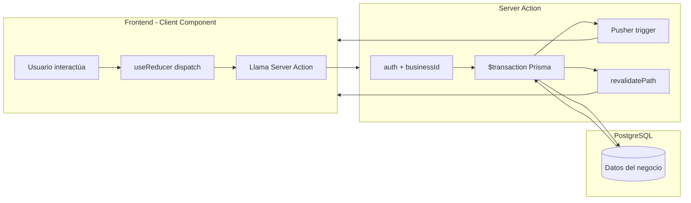

### 4.2 WebSockets (Pusher) - Tiempo Real

```mermaid
flowchart LR
    SA[Server Action] -->|1. DB Write| DB[(PostgreSQL)]
    SA -->|2. Pusher trigger| WS[Pusher Channels]
    SA -->|3. revalidatePath| CACHE[Next.js Cache]

    WS -->|Cliente A| REFRESH_A[Recarga UI]
    CACHE -->|Cliente B nuevo request| FETCH[Fetch nuevos datos]

    REFRESH_A --> FETCH

    subgraph CANALES[Canales Pusher]
        O[orders-{businessId}]
        M[movements-{businessId}]
    end

    WS --> O
    WS --> M

    O --> ORDERS[orders-update<br/>Nuevas órdenes, cambios]
    M --> MOVEMENTS[new-movement<br/>Movimientos de caja]
    M --> REFRESH[refresh<br/>CRUD productos]
```

---

## 5. Índice de Módulos

| # | Módulo | Descripción | Documentación |
|---|--------|-------------|---------------|
| 1 | **Arquitectura General** | Stack, estructura, patrones, flujo de datos | [01-architecture.md](./01-architecture.md) |
| 2 | **Autenticación** | NextAuth.js, roles, gates, plan-based features | [02-auth.md](./02-auth.md) |
| 3 | **Facturación** | Creación de facturas, carrito, medios de pago, descuentos | [03-billing.md](./03-billing.md) |
| 4 | **Caja** | Sesiones de caja, apertura/cierre, reporte Z | [04-cash-register.md](./04-cash-register.md) |
| 5 | **Stock y Productos** | CRUD, proveedores, marcas, categorías, carga masiva | [05-stock.md](./05-stock.md) |
| 6 | **Ventas y Cuenta Corriente** | Historial, edición, devoluciones, cuenta corriente | [06-sales-ledger.md](./06-sales-ledger.md) |
| 7 | **Reportes** | Reportes diarios, mensuales, anuales, ranking | [07-reports.md](./07-reports.md) |
| 8 | **Catálogo Público** | Catálogo online, pedidos públicos, checkout | [08-public-catalog.md](./08-public-catalog.md) |
| 9 | **ARCA/AFIP** | Factura electrónica, CAE, Cloud Functions | [09-arca-afip.md](./09-arca-afip.md) |
| 10 | **Tiempo Real** | Pusher, WebSockets, eventos | [10-realtime.md](./10-realtime.md) |
| 11 | **Búsqueda de Facturas** | Filtros avanzados, búsqueda histórica | [11-search-bills.md](./11-search-bills.md) |
| 12 | **Modelos de Datos** | Esquema Prisma completo con relaciones | [12-data-models.md](./12-data-models.md) |

---

## 6. Convenciones de Datos

| Concepto | Convención |
|----------|------------|
| **IDs** | `cuid()` generados por Prisma |
| **Fechas** | `date` / `createdAt`: creación; `updatedAt`: última modificación; `startTime`/`endTime`: sesiones |
| **Montos** | `Float` (PostgreSQL real), siempre positivos excepto `CashMovement.total` (negativo = egreso) |
| **Stock** | `StockMovement.quantity`: negativo = salida, positivo = entrada |
| **Multi-tenancy** | Toda consulta incluye `businessId` en el WHERE |
| **Pago dividido** | Dos métodos de pago: `paymentMethod` + `paymentMethod2` con `totalMethod2` |
| **Errores** | Server Actions retornan `{ success, ... }` o `{ error: string }` |
