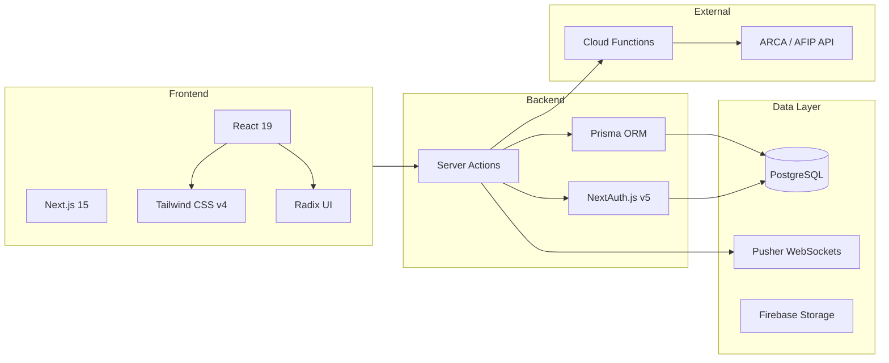
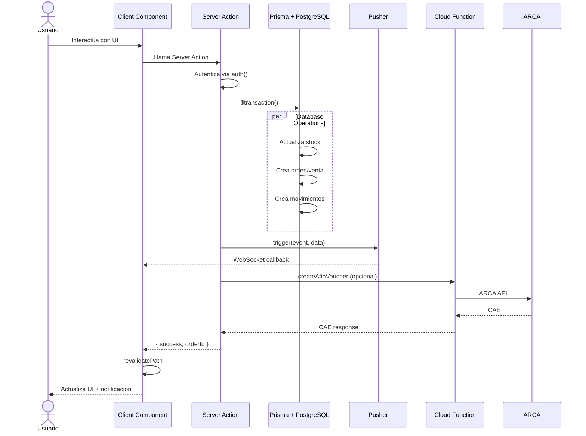
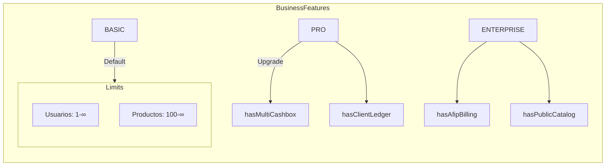
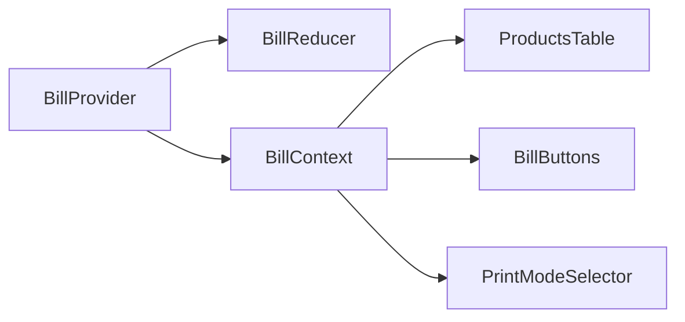

# 1. Arquitectura General

## Stack Tecnológico



## Patrón de Arquitectura

El sistema sigue una arquitectura orientada a **Server Actions** con separación clara de responsabilidades:

### Capas

| Capa | Directorio | Responsabilidad |
|------|-----------|-----------------|
| **Presentación** | `src/app/` | Páginas y layouts (RSC) |
| **Componentes** | `src/components/` | UI components (client + server) |
| **Estado** | `src/context/` | Context + Reducer para estado del carrito |
| **Acciones** | `src/actions/` | Server Actions (toda la lógica de negocio) |
| **Datos** | `src/models/` | Tipos e interfaces TypeScript |
| **Validación** | `src/schemas/` | Esquemas Zod |
| **Utilidades** | `src/lib/` | Helpers (DB, auth, pusher, print) |

### Flujo de Datos



## Multi-tenancy

Cada `Business` es un tenant independiente. **TODAS** las consultas filtran por `businessId`:

```typescript
// Ejemplo de patrón multi-tenant
const session = await auth();
const businessId = session?.user?.businessId;
if (!businessId) return { error: "No autorizado" };

// Toda consulta incluye businessId en el WHERE
const products = await db.product.findMany({
  where: { businessId },  // ← SIEMPRE
});
```

## Feature Gates (Auth Gates)

El sistema tiene un sistema de **gates basados en plan** que controla qué funcionalidades están disponibles:



- `assertWritePermission()` — verifica auth + cuenta no morosa
- `requireFeature("hasClientLedger")` — feature gate por plan
- `assertLimit("maxUsers", count)` — verifica límites operacionales

## Rutas Protegidas

```
/(protected)/
  ├── newBill/       → Facturación
  ├── sales/[id]/    → Detalle de venta
  ├── stock/         → Stock y productos
  ├── cashRegister/  → Caja
  ├── account-ledger/→ Cuenta corriente
  ├── report/        → Reportes
  └── searchBill/    → Búsqueda
```

## Errores y Manejo de Errores

Todas las Server Actions retornan un objeto consistente:

```typescript
// Éxito
return { success: true, orderId: "abc123" };
return { success: "Producto creado", product };

// Error
return { error: "No autorizado" };
return { error: "Stock insuficiente" };
```

Los errores se muestran al usuario mediante `react-hot-toast`.

## Persistencia de Estado (Carrito)

El estado del carrito de facturación se maneja con `useReducer` + `React.Context`:



## Tiempo Real (Pusher)

WebSockets para actualizaciones en vivo:

| Evento | Channel | Descripción |
|--------|---------|-------------|
| `orders-update` | `orders-{businessId}` | Nueva orden o cambio de estado |
| `new-movement` | `movements-{businessId}` | Nuevo movimiento de caja |
| `refresh` | `movements-{businessId}` | Refrescar datos (CRUD productos) |
