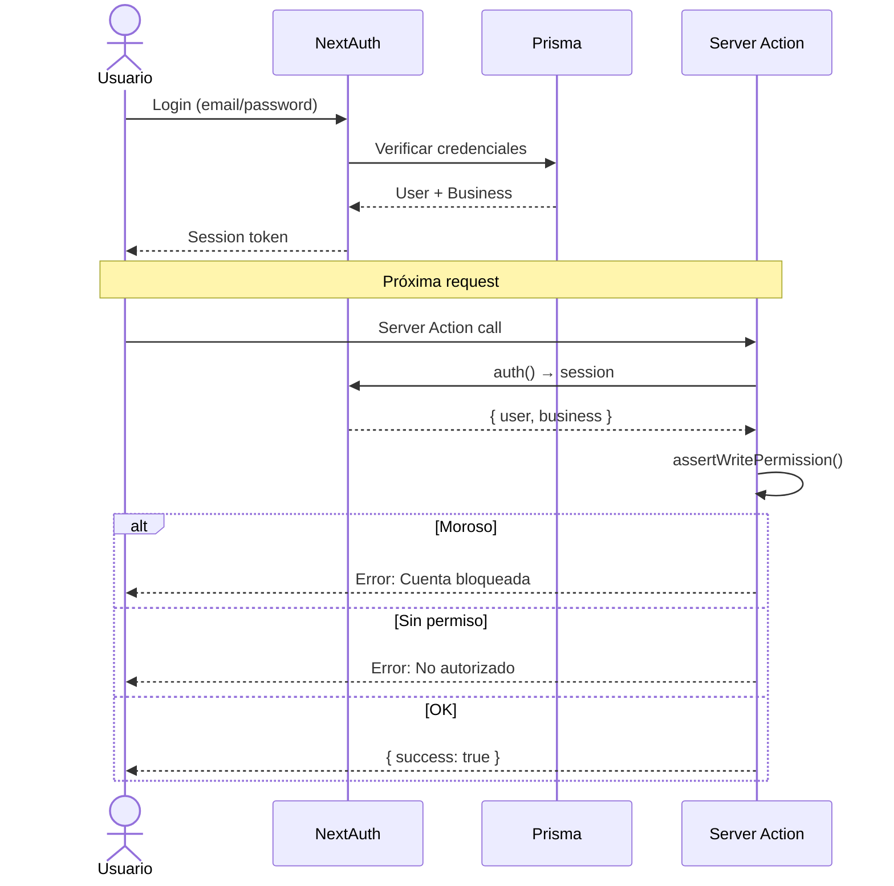

# 2. Autenticación y Autorización

## Stack

- **NextAuth.js v5** (Auth.js) con adaptador Prisma
- **Roles**: `SUPER_ADMIN`, `ADMIN`, `USER`
- **Business Gates**: Control de acceso por plan y estado de cuenta

## Modelos de Usuario

```prisma
model User {
  id        String   @id @default(cuid())
  name      String?
  email     String?  @unique
  password  String?
  role      UserRole @default(USER)
  
  businessId String
  business   Business @relation("BusinessUsers", fields: [businessId], references: [id])
  
  cashboxId String?
  cashbox   CashBox? @relation(fields: [cashboxId], references: [id])
  
  sessions  CashboxSession[]
  accounts  Account[]
}

enum UserRole {
  SUPER_ADMIN  // Acceso global, managea negocios
  ADMIN        // Admin de un negocio específico
  USER         // Vendedor / operador
}
```

## Flujo de Autenticación



## Auth Gates (Control de Acceso)

### `assertWritePermission()`

Verifica que el usuario esté autenticado y que su negocio no esté en estado `MOROSO`:

```typescript
export const assertWritePermission = async () => {
  const session = await auth();
  if (!session || !session.user) {
    throw new FeatureAccessError(
      "Debes iniciar sesión para realizar esta acción.",
      "UNAUTHENTICATED"
    );
  }
  if (business?.accountStatus === "MOROSO") {
    throw new FeatureAccessError(
      "Acción bloqueada. Tu cuenta posee facturas vencidas impagas.",
      "DELINQUENT"
    );
  }
  return session.user;
};
```

### `requireFeature(featureName: string)`

Gate basado en plan:

```typescript
await requireFeature("hasClientLedger"); // Solo PRO+
await requireFeature("hasAfipBilling");   // Solo ENTERPRISE
await requireFeature("hasPublicCatalog"); // Solo ENTERPRISE
await requireFeature("hasMultiCashbox");  // Solo PRO+
```

### `assertLimit(limitName: string, value: number)`

Verifica límites operacionales:

```typescript
await assertLimit("maxUsers", currentUserCount);
await assertLimit("maxProducts", currentProductCount);
```

### FeatureAccessError

```typescript
class FeatureAccessError extends Error {
  constructor(
    message: string,
    public code: "UNAUTHENTICATED" | "DELINQUENT" | "FORBIDDEN" | "LIMIT_EXCEEDED"
  ) {
    this.name = "FeatureAccessError";
  }
}
```

## Códigos de Error

| Código | Mensaje | Acción |
|--------|---------|--------|
| `UNAUTHENTICATED` | "Debes iniciar sesión" | Redirigir a login |
| `DELINQUENT` | "Cuenta con facturas vencidas" | Bloquear operación |
| `FORBIDDEN` | "Función no habilitada en tu plan" | Mostrar upgrade |
| `LIMIT_EXCEEDED` | "Has superado el límite" | Mostrar upgrade |

## Roles y Permisos

| Acción | SUPER_ADMIN | ADMIN | USER |
|--------|-------------|-------|------|
| Ver negocios | ✅ | ❌ | ❌ |
| Configurar ARCA | ✅ | Solo su negocio | ❌ |
| Administrar usuarios | ✅ | ✅ | ❌ |
| Crear/Editar productos | ✅ | ✅ | ❌ |
| Realizar ventas | ✅ | ✅ | ✅ |
| Editar ventas pasadas | ✅ | ✅ | ❌ |
| Abrir/Cerrar caja | ❌ | ✅ | ✅ |
| Ver reportes | ✅ | ✅ | ✅ |

## Manejo de Sesión en Server Actions

```typescript
"use server";
import { auth } from "@/lib/auth";

export const myAction = async () => {
  const session = await auth();
  
  // 1. Verificar autenticación
  if (!session?.user?.businessId) return { error: "No autorizado" };
  
  // 2. Usar businessId para multi-tenancy
  const businessId = session.user.businessId;
  
  // 3. Verificar rol para operaciones sensibles
  if (session.user.role !== "ADMIN") return { error: "Solo administradores" };
  
  // 4. Feature gate
  await requireFeature("hasClientLedger");
};
```
