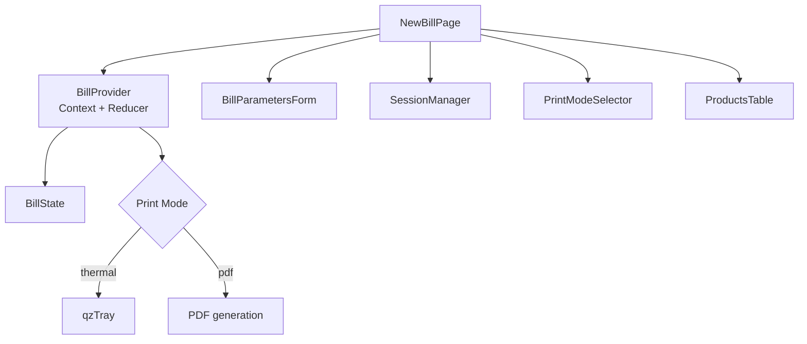
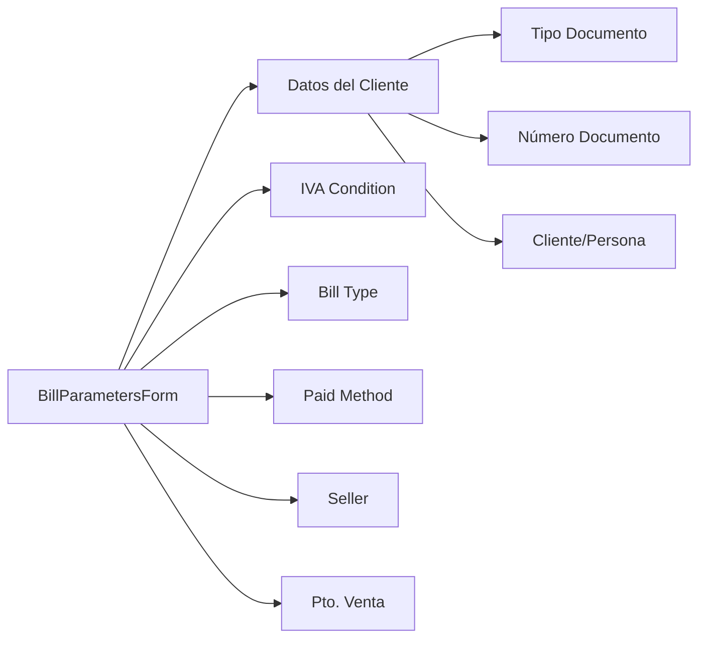
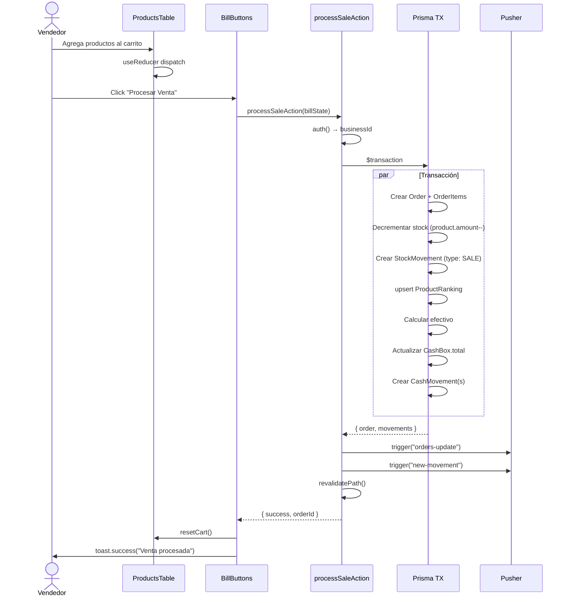
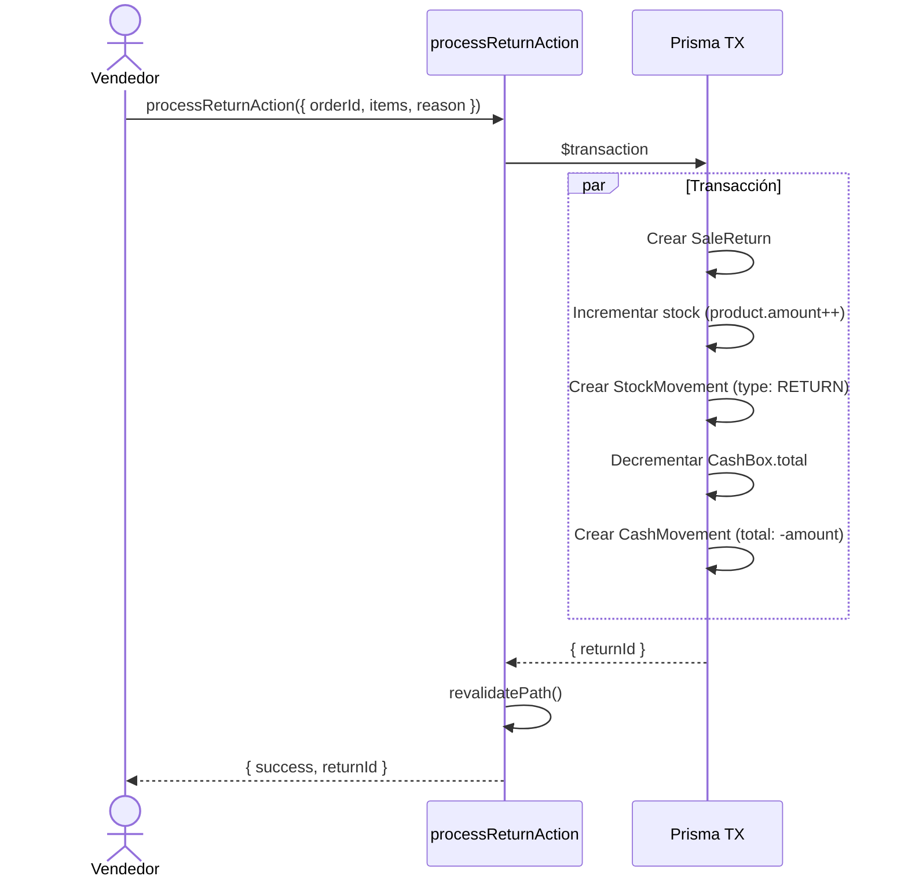

# 3. Facturación (Billing)

## Descripción General

El módulo de facturación es el **core del sistema**. Permite crear ventas con selección de productos, descuentos, múltiples métodos de pago, impresión térmica/PDF y factura electrónica ARCA.

## Vista General

```
/(protected)/newBill  → Página principal de facturación
```



## Estado del Carrito (BillState)

### Interfaz

```typescript
interface BillState {
  id: string;
  products: Product[];
  total: number;
  totalWithDiscount: number;
  seller: string;
  discount: number;          // Porcentaje 0-100
  date: Date;
  typeDocument: string;      // "DNI", "CUIT", etc.
  documentNumber: number;
  secondPaidMethod?: string; // Para pago dividido
  totalSecondMethod?: number;
  IVACondition: string;      // "Consumidor Final", etc.
  twoMethods: boolean;       // Pago en dos métodos
  CAE?: CAE;                 // Para factura electrónica
  entrega?: number;
  paidMethod?: string;       // "Efectivo", "Tarjeta", etc.
  clientId?: string;
  client?: string;
  billType?: string;         // "Factura C", "Remito", etc.
}
```

### Reducer - Acciones Disponibles

| Action | Descripción | Payload |
|--------|-------------|---------|
| `addItem` | Agrega producto (o incrementa si existe) | `Product` |
| `addUnit` | Incrementa cantidad en 1 | `Product` |
| `removeUnit` | Decrementa cantidad en 1 | `{ id }` |
| `removeItem` | Elimina producto del carrito | `{ id }` |
| `removeAll` | Limpia todo el carrito | `null` |
| `changePrice` | Cambia precio de un producto | `Product` |
| `changeUnit` | Cambia cantidad de un producto | `Product` |
| `total` | Recalcula total | `null` |
| `discount` | Aplica descuento porcentual | `number` |
| `setState` | Restaura estado completo | `BillState` |

### Lógica de `discount`

```typescript
case "discount":
  const subtotal = products.reduce(
    (acc, cur) => acc + cur.salePrice * cur.amount, 0
  );
  return {
    ...state,
    discount: action.payload,
    totalWithDiscount: subtotal - (subtotal * action.payload * 0.01),
  };
```

## Componentes Clave

### BillParametersForm

Parámetros de la factura actual:



### ProductsTable

Tabla de productos en el carrito con acciones inline:

| Columna | Descripción |
|---------|-------------|
| Código | Código del producto |
| Descripción | Nombre del producto |
| Cantidad | Input para modificar cantidad |
| Precio Unit. | Precio de venta (editable) |
| Subtotal | Cantidad × Precio |
| Acciones | +1 / -1 / Eliminar |

### PrintModeSelector

Selecciona modo de impresión:

- **thermal** — Impresión térmica vía qzTray (aplicación de escritorio)
- **pdf** — Generación de PDF para impresora convencional

## Flujo de Procesamiento de Venta



## Pago en Dos Métodos

El sistema soporta dividir un pago entre dos métodos:

```typescript
// Ejemplo: Venta de $1000
// $600 en Efectivo
// $400 en Tarjeta
const saleInput = {
  total: 1000,
  paidMethod: "Efectivo",       // Método principal
  secondPaidMethod: "Tarjeta",  // Segundo método
  totalSecondMethod: 400,       // Monto del segundo
  twoMethods: true,
};
```

En caja, solo se incrementa el efectivo correspondiente:

```typescript
// Solo afecta CashBox si el método es efectivo
if (billState.paidMethod === "Efectivo") {
  cashToIncrement += (total - totalSecondMethod);
}
if (billState.secondPaidMethod === "Efectivo") {
  cashToIncrement += totalSecondMethod;
}
```

## Devoluciones (Returns)



## Server Actions del Módulo

### `processSaleAction(input: ProcessSaleInput)`

**Input:**
```typescript
interface ProcessSaleInput {
  total: number;
  totalWithDiscount?: number;
  seller: string;
  paidMethod?: string;
  secondPaidMethod?: string;
  totalSecondMethod?: number | null;
  discount?: number;
  clientId?: string;
  twoMethods?: boolean;
  products: {
    id: string; code: string; description: string;
    price?: number; salePrice?: number; amount: number;
  }[];
  clientIvaCondition?: string;
  clientDocumentNumber?: string;
  CAE?: { CAE: string; vencimiento: string; nroComprobante: number; qrData: string };
}
```

**Output:** `{ success: true, orderId: string }` | `{ error: string }`

### `processReturnAction(data: ReturnInput)`

**Input:**
```typescript
{
  orderId: string;
  items: { productId: string; quantity: number; refundAmount: number }[];
  reason: string;
}
```

### `saveOrderAction(billState: BillStateInput)`

Versión simplificada para guardar órdenes sin flujo completo de caja.

## Edición de Ventas

Vea [Ventas y Cuenta Corriente → Edición](./06-sales-ledger.md#edición-de-ventas).
