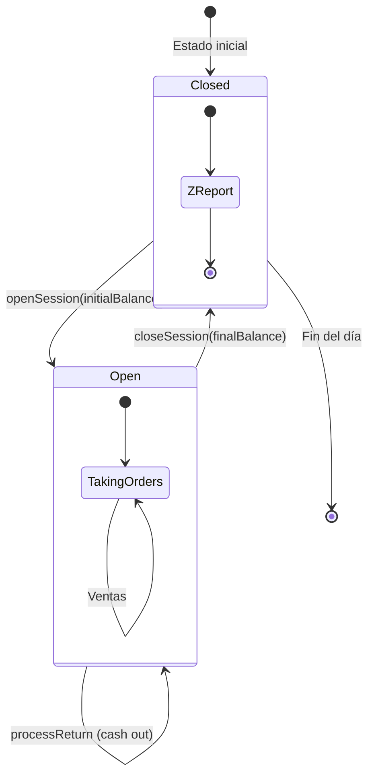
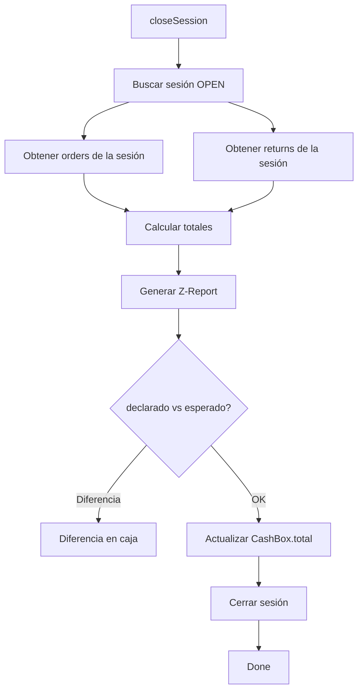
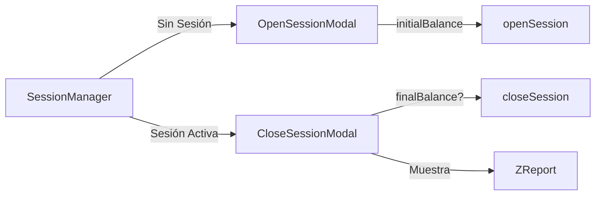
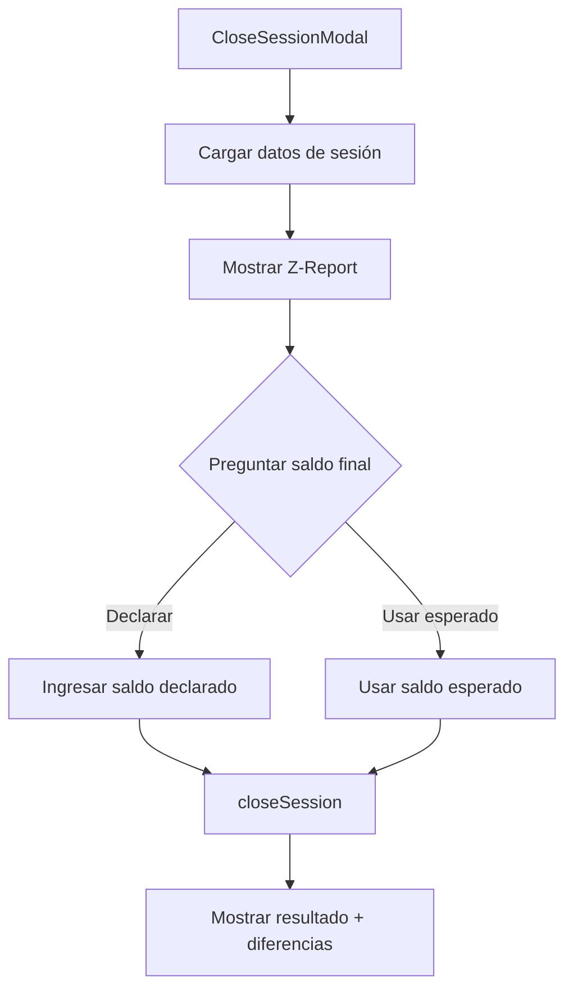

# 4. Caja (Cash Register)

## Descripción General

El módulo de caja gestiona **sesiones de trabajo** donde se registran todas las operaciones de efectivo. Cada usuario debe abrir una sesión antes de poder procesar ventas, y al cerrarla se genera un **reporte Z** con el resumen de la jornada.

## Modelos de Datos

```prisma
model CashBox {
  id         String   @id @default(cuid())
  name       String   @default("Caja Principal")
  total      Float    @default(0)
  businessId String
  users      User[]
  sessions   CashboxSession[]
}

model CashboxSession {
  id         String   @id @default(cuid())
  cashboxId  String
  userId     String
  businessId String
  
  startTime      DateTime      @default(now())
  endTime        DateTime?
  initialBalance Float         @default(0)
  finalBalance   Float?
  status         SessionStatus @default(OPEN)  // OPEN | CLOSED
  
  zReport Json?  // Reporte Z al cierre
  
  orders        Order[]
  cashMovements CashMovement[]
}

model CashMovement {
  id         String   @id @default(cuid())
  total      Float    @default(0)
  seller     String?
  paidMethod String?   // "Efectivo", "Tarjeta", "Devolución", etc.
  date       DateTime @default(now())
  businessId String
  orderId    String?
  cashboxSessionId String?
}
```

## Flujo Completo



## Server Actions

### `openSession(initialBalance: number)`

Abre una nueva sesión de caja para el usuario autenticado.

**Validaciones:**
1. Usuario tiene `cashboxId` asignado
2. No existe otra sesión OPEN para este usuario
3. Feature gate `hasMultiCashbox` si ya hay sesiones abiertas en el negocio

```typescript
export const openSession = async (initialBalance: number) => {
  await assertWritePermission();
  const session = await auth();
  
  // 1. Verificar caja asignada
  const assignedCashboxId = user.cashboxId || db user cashboxId;
  if (!assignedCashboxId) return { error: "No tienes una caja asignada." };
  
  // 2. Verificar si ya hay sesión abierta
  const existing = await db.cashboxSession.findFirst({
    where: { userId, status: "OPEN" }
  });
  if (existing) return { error: "Ya existe una sesión abierta." };
  
  // 3. Crear sesión
  const newSession = await db.cashboxSession.create({
    data: { userId, cashboxId, businessId, initialBalance, status: "OPEN" }
  });
};
```

### `closeSession(finalBalance?: number)`

Cierra la sesión activa y genera el reporte Z.

**Proceso de cierre:**



### Reporte Z

```typescript
const zReport = {
  totalSales,             // Suma de todas las ventas
  totalDiscounts,         // Suma de descuentos aplicados
  totalReturns,           // Suma de devoluciones
  netTotal,               // Ventas - Devoluciones
  orderCount,             // Cantidad de transacciones
  returnCount,            // Cantidad de devoluciones
  paymentMethods: {       // Desglose por método de pago
    Efectivo: 45000,
    Tarjeta: 23000,
    Transferencia: 12000,
  },
  expectedFinalBalance,   // initialBalance + efectivo - devoluciones
  declaredFinalBalance,   // Lo que declara el usuario
  difference,             // Diferencia (debe ser 0)
};
```

### `getActiveSession()`

Retorna la sesión activa del usuario actual (si existe):

```typescript
const activeSession = await db.cashboxSession.findFirst({
  where: { userId, status: "OPEN" },
  include: { cashbox: true },
});
```

## Componentes UI

### SessionManager

Barra de estado que muestra si hay sesión abierta y permite abrir/cerrar:



### OpenSessionModal

Solicita el **saldo inicial** de la caja al abrir:

```typescript
// El usuario declara cuánto efectivo hay en la caja al empezar
const result = await openSession(initialBalance);
```

### CloseSessionModal

Muestra el **reporte Z** y solicita confirmación:



## CashMovement

Cada transacción que involucra efectivo registra un `CashMovement`:

| Campo | Descripción | Ejemplo |
|-------|-------------|---------|
| `total` | Monto (positivo = ingreso, negativo = egreso) | `45000` |
| `seller` | Vendedor que realizó la operación | `"Juan"` |
| `paidMethod` | Método de pago | `"Efectivo"` |
| `orderId` | Venta asociada (opcional) | `"abc123"` |
| `cashboxSessionId` | Sesión de caja | `"xyz789"` |

Los movimientos se crean durante `processSaleAction` y `processReturnAction`, limitados al método **Efectivo** (otros métodos no generan movimientos de caja).
