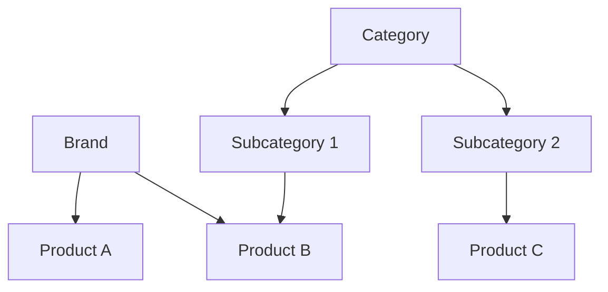
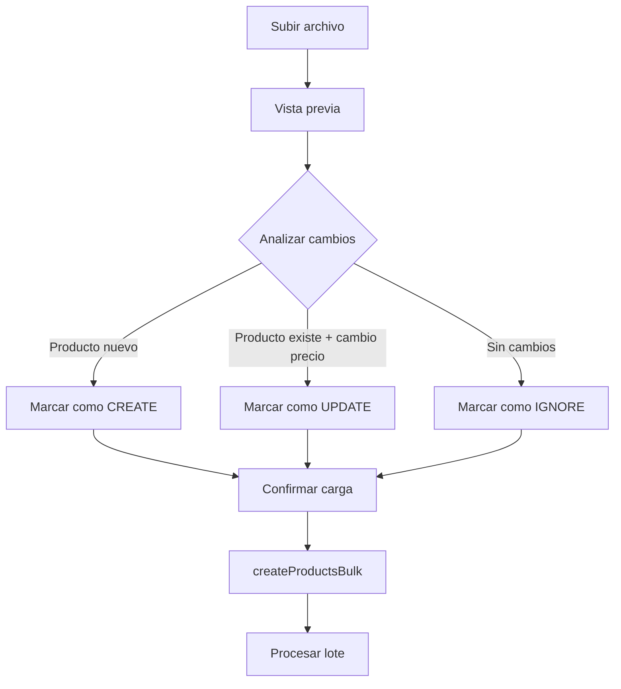

# 5. Stock y Productos

## Descripción General

Gestión completa de productos, proveedores, marcas, categorías y subcategorías. Soporta desde operaciones individuales hasta carga masiva por Excel con preview y fórmulas de precio automáticas.

## Rutas

```
/(protected)/stock/
  ├── productDashboard/   → Dashboard de productos (CRUD + tabla)
  └── bulk-update/        → Actualización masiva de precios/stock
```

## Modelo de Producto

```prisma
model Product {
  id          String  @id @default(cuid())
  code        String?    // Código de barras / SKU
  description String?    // Nombre del producto
  
  // Clasificación
  brandId     String?
  brand       Brand?
  categoryId  String?
  category    Category?
  subCategoryId String?
  subCategory   Subcategory?
  
  // Precios
  price     Float  @default(0)  // Precio de costo
  salePrice Float  @default(0)  // Precio de venta
  gain      Float  @default(0)  // Margen de ganancia (%)
  
  // Stock
  amount Float  @default(0)
  unit   String?  // "unidades", "kg", "litros", etc.
  
  // Imágenes
  image     String?
  imageName String?
  images    ProductImage[]
  
  // Configuración
  client_bonus Float @default(0)
  catalog       Boolean @default(true)  // Visible en catálogo público
  details       String?                  // Descripción extendida
  
  // Relaciones
  supplierId String?
  supplier   Supplier?
  businessId String
  
  // Rankings
  rankings ProductRanking[]
}
```

## Clasificación Jerárquica



## CRUD de Productos

### Crear Producto

```typescript
export const createProduct = async (data: Product) => {
  // Auth + BusinessId
  const product = await db.product.create({
    data: {
      code: data.code,
      description: data.description,
      brand: data.brandId ? { connect: { id: data.brandId } } : undefined,
      category: data.categoryId ? { connect: ... } : undefined,
      subCategory: data.subCategoryId ? { connect: ... } : undefined,
      price: parseFloat(data.price),
      salePrice: parseFloat(data.price) * (1 + data.gain * 0.01),  // ← fórmula
      gain: parseFloat(data.gain),
      amount: parseFloat(data.amount),
      unit: data.unit,
      catalog: data.catalog ?? true,
      business: { connect: { id: businessId } },
    },
  });
  await pusherServer.trigger(`movements-${businessId}`, "refresh", { type: "product-created" });
};
```

### Actualizar Producto

```typescript
export const updateProduct = async (id: string, data: UpdateProductInput) => {
  // Actualiza campos + manejo de imágenes (Firebase Storage)
  // Si se actualiza price y gain → recalcula salePrice automáticamente
  // Soporta delete/create de imágenes múltiples
};
```

### ProductRanking (Ranking Mensual)

```prisma
model ProductRanking {
  productId  String
  businessId String
  month      Int    // 1-12
  year       Int
  totalSold   Float @default(0)  // Unidades vendidas
  totalIncome Float @default(0)  // Ingreso generado
  
  @@unique([productId, month, year, businessId])
}
```

Se actualiza con `upsert` en cada venta:

```typescript
await db.productRanking.upsert({
  where: { productId_month_year_businessId: { productId, month, year, businessId } },
  update: {
    totalSold: { increment: item.amount },
    totalIncome: { increment: item.amount * item.salePrice },
  },
  create: { productId, month, year, businessId, totalSold: item.amount, ... },
});
```

## Carga Masiva (Excel/CSV)



### Parámetros de Carga

```typescript
const result = await createProductsBulk(
  productsData,      // Array de productos desde el archivo
  updateExisting,    // ¿Actualizar existentes?
  updateOnly,        // ¿Solo actualizar existentes?
  discount,          // Descuento del proveedor (%)
  iva,               // IVA a aplicar (%)
  gain,              // Margen de ganancia deseado (%)
  supplierId         // Proveedor asignado
);
```

### Fórmula de Precios

Cuando se especifican `discount`, `iva` y `gain`, el sistema calcula automáticamente:

```typescript
costPrice = filePrice * (1 - discount/100) * (1 + iva/100);
salePrice = costPrice * (1 + gain/100);
```

Si se especifica un `supplierId` con fórmula, los valores se guardan en el proveedor:

```typescript
await db.supplier.update({
  where: { id: supplierId },
  data: { discount, iva, gain }  // ← se persisten para futuras cargas
});
```

### Preview antes de Cargar

```typescript
export const previewProductsBulk = async (productsData, updateExisting, updateOnly, ...) => {
  // Compara códigos contra DB
  // Clasifica cada uno como: create | update | ignore
  return {
    preview: {
      createdCount,
      updatedCount,
      ignoredCount,
      items: [{ code, description, status }, ...]
    }
  };
};
```

## Operaciones Bulk

### `bulkUpdatePrices(productIds, percentage)`

Actualiza precios de venta de múltiples productos por porcentaje:

```typescript
// Ejemplo: aumentar 15% el precio de venta
await bulkUpdatePrices(["id1", "id2", "id3"], 15);
```

### `bulkUpdateAmounts(productIds, amountChange, mode)`

Actualiza stock de múltiples productos:

| Mode | Comportamiento |
|------|---------------|
| `set` | Establece cantidad fija |
| `add` | Incrementa stock |
| `subtract` | Decrementa stock |

### `toggleProductCatalogAction(productId, catalog)`

Activa/desactiva visibilidad en catálogo público.

## Búsqueda y Filtros

### `getProductsPaginated(params)`

```typescript
const result = await getProductsPaginated({
  page: 1,
  pageSize: 25,
  search: "termo",
  categoryId: "cat123",
  brandId: "brand456",
  unit: "unidades",
});
// → { products: [...], total: 150, page: 1, pageSize: 25, totalPages: 6 }
```

### `getProductsBySearch(query)`

Búsqueda rápida (top 20) para autocompletado en facturación:

```typescript
const products = await getProductsBySearch("term");
// Busca por code o description (ILIKE) en el businessId actual
```

## Proveedores (Suppliers)

```prisma
model Supplier {
  id       String @id @default(cuid())
  name     String
  email    String?
  phone    String?
  discount Float  @default(0)  // Descuento habitual (%)
  iva      Float  @default(0)  // IVA (%)
  gain     Float  @default(0)  // Margen habitual (%)
  businessId String
  products   Product[]
}
```

Los proveedores almacenan su fórmula de precio por defecto, que se aplica en las cargas masivas.

## Movimientos de Stock

```prisma
model StockMovement {
  id        String       @id @default(cuid())
  type      MovementType  // SALE | RETURN | ADJUSTMENT | PURCHASE
  quantity  Float         // Negativo = salida, Positivo = entrada
  productId String
  orderId   String?       // Venta asociada
  businessId String
  reason    String?       // Explicación del movimiento
}
```

### Tipos de Movimiento

| Type | Signo | Trigger |
|------|-------|---------|
| `SALE` | Negativo | Venta confirmada |
| `RETURN` | Positivo | Devolución |
| `ADJUSTMENT` | Ambos | Edición de venta |
| `PURCHASE` | Positivo | Compra a proveedor |

## Server Actions

| Action | Función |
|--------|---------|
| `createProduct` | Crear producto individual |
| `updateProduct` | Actualizar producto + imágenes |
| `deleteProduct` | Eliminar producto |
| `getProducts` | Todos los productos |
| `getProductsPaginated` | Búsqueda paginada con filtros |
| `getProductByCode` | Buscar por código de barras |
| `getProductsBySearch` | Búsqueda rápida (top 20) |
| `getProductsFiltered` | Búsqueda sin paginación |
| `previewProductsBulk` | Preview de carga masiva |
| `createProductsBulk` | Ejecutar carga masiva |
| `bulkUpdatePrices` | Actualizar precios por % |
| `bulkUpdateAmounts` | Actualizar stock masivo |
| `toggleProductCatalogAction` | Visibilidad en catálogo |
| `createSupplier` | Crear proveedor |
| `getSuppliers` | Listar proveedores |
| `createBrand` | Crear marca |
| `getBrands` | Listar marcas |
| `createCategory` | Crear categoría |
| `getCategories` | Listar categorías |
