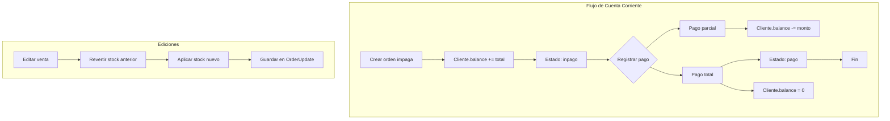
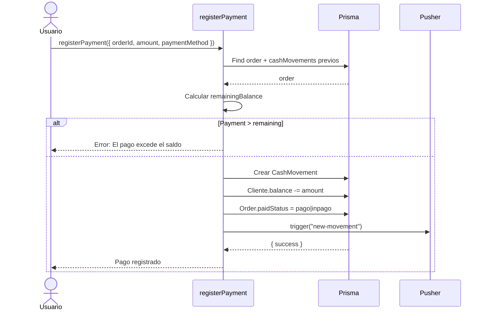
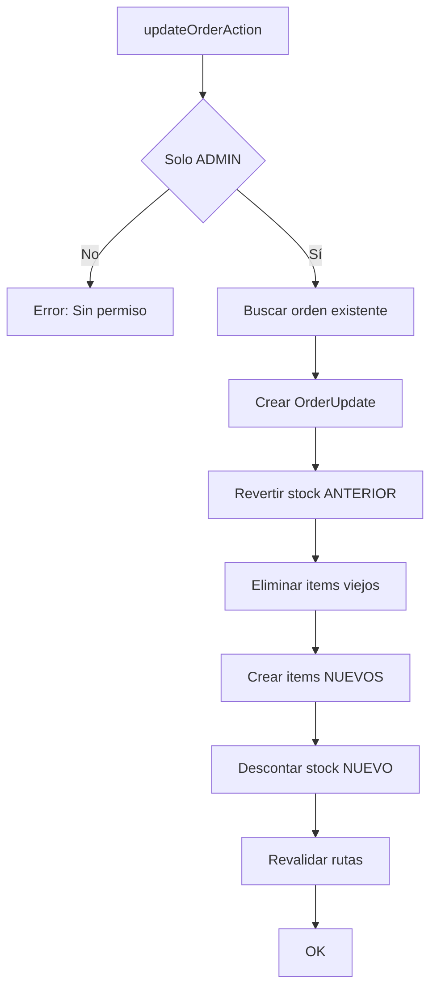

# 6. Ventas y Cuenta Corriente

## Descripción General

El módulo de Ventas maneja el historial completo de transacciones, edición de ventas, devoluciones, y cuenta corriente de clientes (órdenes impagas con tracking de pagos parciales y versión histórica).

## Rutas

```
/(protected)/
  ├── sales/[id]/         → Detalle de venta individual
  ├── account-ledger/     → Cuenta corriente (libro de deudores)
  └── searchBill/         → Búsqueda de facturas (ver módulo aparte)
```

## Modelo de Orden (Order)

```prisma
model Order {
  id         String      @id @default(cuid())
  date       DateTime    @default(now())
  total      Float       @default(0)
  status     OrderStatus // pendiente | confirmado | entregado | consignacion
  paidStatus PaidStatus  // pago | inpago
  seller     String?
  
  // Métodos de pago
  paymentMethod  String? @default("Efectivo")
  paymentMethod2 String?
  totalMethod2   Float?  @default(0)
  
  // Descuentos
  discountPercentage Float @default(0)
  discountAmount     Float @default(0)
  
  // Cliente
  clientId String?
  client   Client?
  
  // Factura electrónica
  clientIvaCondition   String?
  clientDocumentNumber String?
  CAE                  Json?
  
  // Sesión de caja
  cashboxSessionId String?
  
  // Relaciones
  items          OrderItem[]
  returns        SaleReturn[]
  stockMovements StockMovement[]
  updates        OrderUpdate[]   // Historial de ediciones
  cashMovements  CashMovement[]
}
```

## Cuenta Corriente (Account Ledger)



### Creación de Órdenes Impagas

```typescript
export const createUnpaidOrder = async (input) => {
  await requireFeature("hasClientLedger");  // Solo PRO+
  
  // Transacción:
  // 1. Validar stock de todos los productos
  // 2. Crear Order (status: confirmado, paidStatus: inpago)
  // 3. Decrementar stock
  // 4. Crear StockMovements (SALE)
  // 5. Actualizar ProductRanking
  // 6. Cliente.balance += total (incrementa deuda)
};
```

### Registro de Pagos (Parciales y Totales)

```typescript
export const registerPayment = async (input) => {
  // 1. Obtener orden + movimientos previos
  // 2. Calcular total pagado antes
  // 3. Validar que el pago no exceda el saldo restante
  // 4. Crear CashMovement
  // 5. Cliente.balance -= monto (reduce deuda)
  // 6. Si remainingBalance <= 0 → paidStatus = "pago"
};
```



## Edición de Ventas

La edición de ventas es una operación **restringida a ADMINs** que mantiene un historial completo de cambios.



### OrderUpdate — Historial de Versiones

```prisma
model OrderUpdate {
  id String @id @default(cuid())
  
  orderId String
  businessId String
  updatedById String    // Quién hizo el cambio
  updatedBy   User
  
  type    OrderUpdateType
  message String?        // Mensaje opcional para UI
  changes Json?          // Diff de los cambios
  snapshot Json?         // Snapshot completo (cada 10 versiones)
  version Int            // Número de versión secuencial
  
  @@unique([orderId, version])
}
```

**Snapshots:** Cada 10 versiones se guarda un snapshot completo de la orden para poder revertir cambios fácilmente.

```typescript
if (version % 10 === 0) {
  snapshot = {
    id: order.id,
    total: order.total,
    status: order.status,
    items: order.items.map(i => ({
      productId, code, description, quantity, price, subTotal
    }))
  };
}
```

### `getSaleHistoryAction(orderId)`

Obtiene el historial completo de ediciones de una venta:

```typescript
const updates = await db.orderUpdate.findMany({
  where: { orderId, order: { businessId } },
  include: { updatedBy: { select: { name, email } } },
  orderBy: { date: "desc" },
});
// → [{ version: 1, type: "ITEMS_UPDATED", changes: {...}, updatedBy: {...} }, ...]
```

## Devoluciones (Returns)

Vea [Facturación → Devoluciones](./03-billing.md#devoluciones-returns) para el flujo completo.

## Cancelación de Órdenes Impagas

```typescript
export const cancelUnpaidOrder = async (input) => {
  // Transacción:
  // 1. Verificar que no esté pagada
  // 2. Revertir stock (product.amount += quantity)
  // 3. Revertir ProductRanking
  // 4. Cliente.balance -= total (reduce deuda)
  // 5. Eliminar StockMovements + CashMovements asociados
  // 6. Eliminar Order (cascada a OrderItem)
};
```

## Server Actions del Módulo

| Action | Función | Rol Requerido |
|--------|---------|---------------|
| `createUnpaidOrder` | Crear orden impaga | ADMIN+ |
| `registerPayment` | Registrar pago parcial/total | USER+ |
| `cancelUnpaidOrder` | Cancelar orden impaga | ADMIN+ |
| `getUnpaidOrders` | Listar órdenes | USER+ |
| `getClientUnpaidOrder` | Órdenes de un cliente | USER+ |
| `addItemsToOrder` | Agregar items a orden existente | ADMIN+ |
| `updateOrderItem` | Modificar item de orden | ADMIN+ |
| `removeOrderItem` | Eliminar item de orden | ADMIN+ |
| `updateOrderStatus` | Cambiar estado de orden | ADMIN+ |
| `updateOrderPaidStatus` | Marcar como pago/inpago manual | ADMIN+ |
| `updateOrderAction` | Editar venta completa (con historial) | ADMIN+ |
| `getSaleHistoryAction` | Obtener historial de ediciones | USER+ |
| `processSaleAction` | Procesar venta (efectivo + caja) | USER+ |
| `processReturnAction` | Procesar devolución | ADMIN+ |
