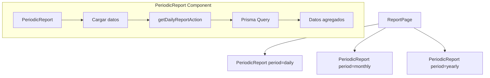
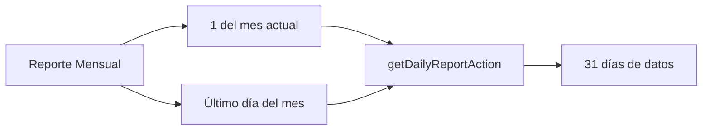
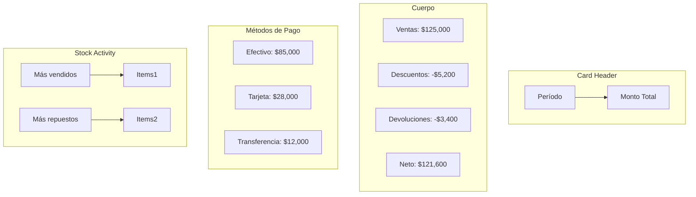

# 7. Reportes

## Descripción General

El módulo de reportes genera resúmenes periódicos de actividad: ventas, descuentos, devoluciones, métodos de pago y actividad de stock. Soporta períodos **diario**, **mensual** y **anual**.

## Ruta

```
/(protected)/report → Página de reportes
```

## Arquitectura



## Server Action

### `getDailyReportAction(startDate, endDate?)`

Consulta principal que obtiene todos los datos agregados:

```typescript
export const getDailyReportAction = async (startDate: Date, endDate?: Date) => {
  const start = new Date(startDate);
  start.setHours(0, 0, 0, 0);
  const end = endDate ? new Date(endDate) : new Date(startDate);
  end.setHours(23, 59, 59, 999);
  
  // 3 consultas en paralelo
  const [orders, returns, stockMovements] = await Promise.all([
    db.order.findMany({ where: { businessId, date: { gte: start, lte: end }, paidStatus: "pago" } }),
    db.saleReturn.findMany({ where: { businessId, date: { gte: start, lte: end } } }),
    db.stockMovement.findMany({ where: { businessId, date: { gte: start, lte: end } }, include: { product: true } }),
  ]);
  
  // Cálculos...
};
```

## Estructura del Reporte

```typescript
{
  totalSales: 125000,      // Suma de todas las ventas
  totalDiscounts: 5200,    // Suma de descuentos aplicados
  totalReturns: 3400,      // Suma de devoluciones
  netTotal: 121600,        // Ventas - Devoluciones
  orderCount: 45,          // Cantidad de transacciones
  returnCount: 2,          // Cantidad de devoluciones
  paymentMethods: {         // Desglose por método de pago
    Efectivo: 85000,
    Tarjeta: 28000,
    Transferencia: 12000,
  },
  stockMovementCount: 180,  // Movimientos de stock
  stockActivity: {           // Actividad de stock
    outs: [
      { productId, code, description: "Termo 1L", quantity: 5 },
      ...
    ],
    ins: [
      { productId, code, description: "Yerba 1kg", quantity: 20 },
      ...
    ],
  },
}
```

## Períodos

### Diario

`period="daily"` - Reporte del día actual:

```typescript
<PeriodicReport session={session} period="daily" />
// startDate = hoy 00:00:00, endDate = hoy 23:59:59
```

### Mensual

`period="monthly"` - Reporte del mes actual:



### Anual

`period="yearly"` - Reporte del año actual:

```typescript
// startDate = 1 de enero 00:00:00
// endDate = 31 de diciembre 23:59:59
```

## Visualización del Reporte



## Stock Activity

El reporte incluye análisis de movimiento de stock:

```typescript
// Clasifica movimientos como "outs" (ventas) e "ins" (devoluciones/compras)
const outsMap = new Map<string, StockActivityItem>();
const insMap = new Map<string, StockActivityItem>();

stockMovements.forEach(sm => {
  if (sm.quantity === 0) return;
  const isOut = sm.quantity < 0;
  const targetMap = isOut ? outsMap : insMap;
  
  targetMap.set(sm.productId, {
    productId: sm.productId,
    quantity: (existing?.quantity || 0) + Math.abs(sm.quantity),
    // ...
  });
});
```

## Revalidación

Cada operación de venta, devolución o edición revalida la ruta de reportes:

```typescript
revalidatePath("/report");
```

Esto asegura que los reportes siempre muestren datos actualizados (al ser Server Components, se renderizan del lado del servidor en cada request).
