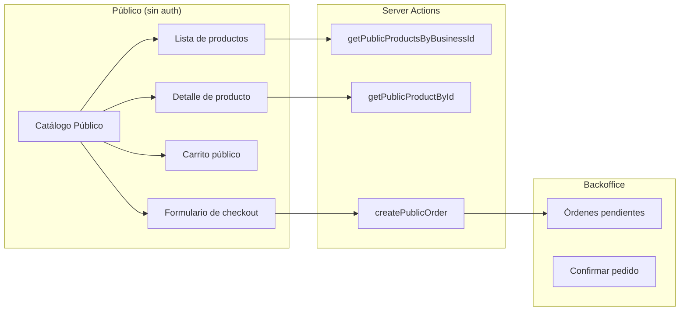
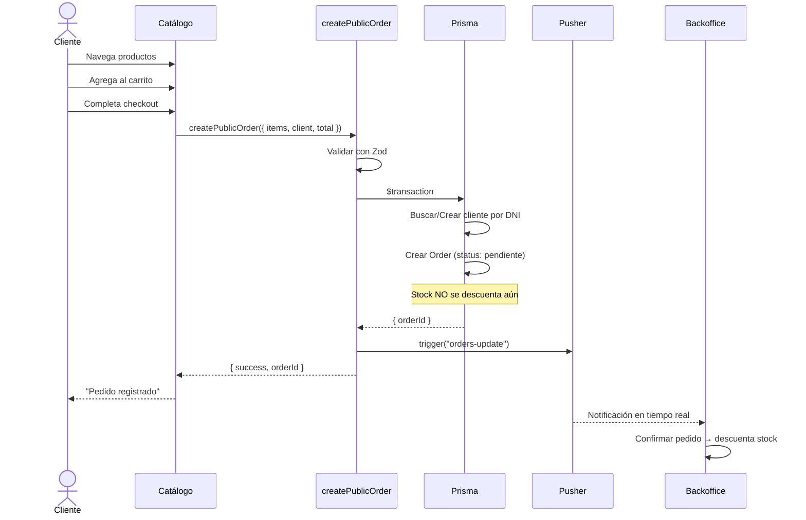
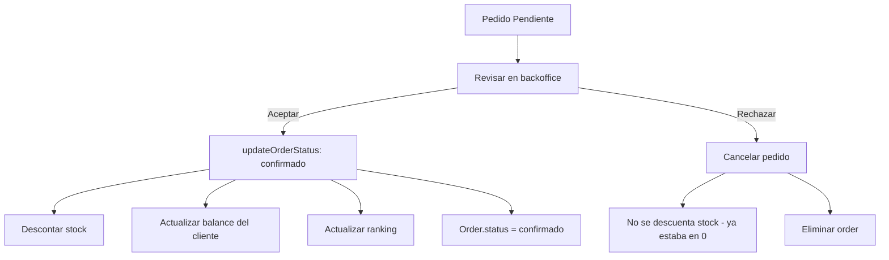
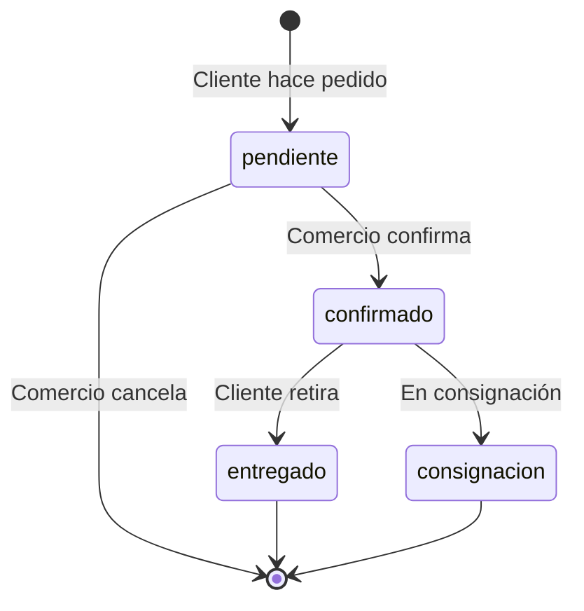

# 8. Catálogo Público

## Descripción General

El catálogo público permite a los clientes **ver productos y hacer pedidos online** sin necesidad de autenticarse. Es una feature Enterprise que debe estar habilitada en el plan del negocio.

## Arquitectura



## Productos Públicos

```typescript
interface PublicProduct {
  id: string;
  code: string | null;
  description: string | null;
  brand: string | null;
  category: string | null;
  salePrice: number;
  unit: string | null;
  image: string | null;      // Imagen principal
  images: string[];           // Imágenes adicionales
  amount: number;             // Stock disponible
  details: string | null;     // Descripción extendida
  catalog: boolean;           // Debe ser true para aparecer
}
```

### Filtros de Visibilidad

Los productos públicos se filtran con:

```typescript
const products = await db.product.findMany({
  where: {
    businessId,
    salePrice: { gt: 0 },  // Debe tener precio
    catalog: true,          // Marcado como público
  },
});
```

### Feature Gate

```typescript
const features = await db.businessFeatures.findUnique({
  where: { businessId }
});
if (!features?.hasPublicCatalog) {
  throw new Error("El catálogo público no está habilitado.");
}
```

## Flujo de Pedido Público



### Validación Zod del Checkout

```typescript
const createPublicOrderSchema = z.object({
  businessId: z.string(),
  client: z.object({
    dni: z.string().min(1, "El DNI es obligatorio"),
    name: z.string().min(1, "El nombre es obligatorio"),
    phone: z.string().optional(),
    email: z.string().email().optional().or(z.literal('')),
    address: z.string().optional(),
  }).refine((data) => data.phone || data.email, {
    message: "Debe proveer un teléfono o correo electrónico",
  }),
  items: z.array(
    z.object({
      productId: z.string(),
      price: z.number(),
      quantity: z.number().min(0.01),
      subTotal: z.number(),
    })
  ).min(1, "Debe seleccionar al menos un producto"),
  total: z.number().min(0),
});
```

### Creación de Orden Pública

```typescript
export const createPublicOrder = async (input) => {
  const result = await db.$transaction(async (tx) => {
    // 1. Buscar o crear cliente por DNI (como ID)
    const existingClient = await tx.client.findUnique({ where: { id: client.dni } });
    
    if (existingClient) {
      // Actualizar datos del cliente
      dbClient = await tx.client.update({ where: { id: client.dni }, data: { ... } });
    } else {
      // Crear nuevo cliente con balance = 0
      dbClient = await tx.client.create({ id: client.dni, balance: 0, ... });
    }
    
    // 2. Crear Order en estado "pendiente"
    // Stock NO se descuenta — el comercio confirma después
    const newOrder = await tx.order.create({
      data: {
        clientId: dbClient.id,
        status: "pendiente",
        paidStatus: "inpago",
        items: { create: items.map(...) },
      },
    });
    
    return newOrder;
  });
  
  // Notificar al comercio
  await pusherServer.trigger(`orders-${businessId}`, "orders-update", {});
};
```

## Flujo de Confirmación (Backoffice)



## Componentes del Catálogo

| Componente | Descripción |
|------------|-------------|
| `ProductCard` | Tarjeta de producto con imagen, precio y stock |
| `ProductDetail` | Vista detallada del producto con imágenes múltiples |
| `ProductSelector` | Selector de cantidad para agregar al carrito |
| `PublicCart` | Carrito de compras público |
| `CheckoutForm` | Formulario de datos del cliente |
| `OrderButtonModal` | Modal de confirmación de pedido |

## Estados del Pedido Público


