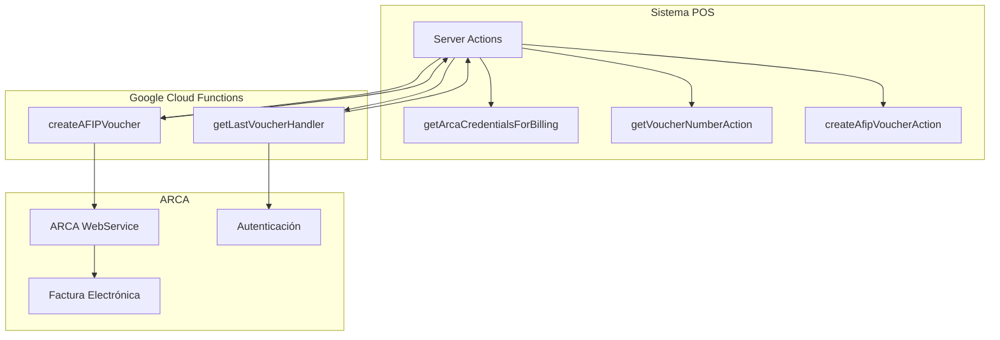
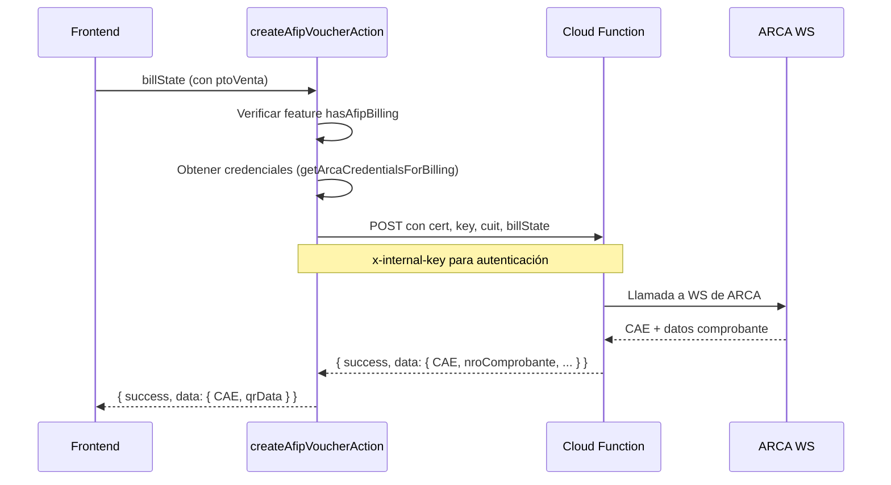
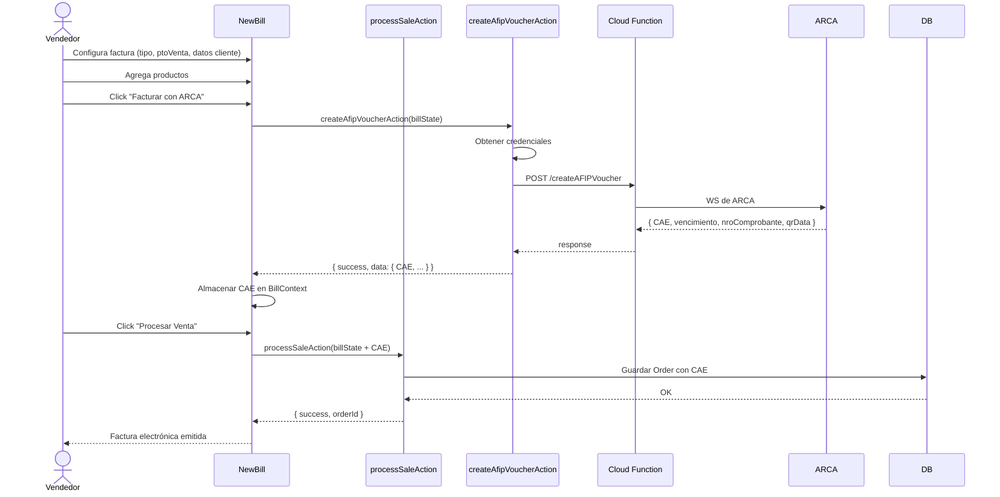

# 9. ARCA / AFIP — Factura Electrónica

## Descripción General

Integración con **ARCA** (ex AFIP) para la generación de comprobantes electrónicos (Factura A, B, C, etc.) y obtención de CAE. La integración se realiza mediante **Google Cloud Functions** que encapsulan la comunicación con los servicios de ARCA.

> **Nota:** ARCA es el organismo recaudador argentino. AFIP fue renombrado a ARCA. El código usa ambos nombres por razones históricas.

## Arquitectura



## Configuración del Negocio

### Datos ARCA

```prisma
model Business {
  // ... otros campos ...
  
  cuit              String?         // CUIT del negocio
  razonSocial       String?         // Razón social
  inicioActividades DateTime?       // Fecha de inicio
  condicionIva      IvaCondition    // MONOTRIBUTO | RESPONSABLE_INSCRIPTO
  address           String?         // Domicilio fiscal
  cert              String? @db.Text // Certificado encriptado
  key               String? @db.Text // Clave privada encriptada
  ptoVenta          Int[] @default([]) // Puntos de venta habilitados
}
```

### Campos de Configuración (Zod)

```typescript
const ArcaFieldsSchema = z.object({
  cuit: z.string().length(11, "CUIT debe tener 11 dígitos"),
  razonSocial: z.string().min(1, "Razón social requerida"),
  inicioActividades: z.date(),
  condicionIva: z.enum(["RESPONSABLE_INSCRIPTO", "MONOTRIBUTO"]),
  cert: z.string().optional(),
  key: z.string().optional(),
  ptoVenta: z.array(z.number()),
});
```

### Encriptación

Certificados y claves se almacenan **encriptados** en la base de datos:

```typescript
import { encrypt } from "@/lib/encryption";

const updateData = { ...arcaFields };
if (cert) updateData.cert = encrypt(cert);
if (key) updateData.key = encrypt(key);

await db.business.update({ where: { id: businessId }, data: updateData });
```

## Server Actions

### `getBusinessArcaData(businessId)`

Obtiene datos ARCA de un negocio (solo ADMIN/SUPER_ADMIN de ese negocio).

### `updateBusinessArcaData(businessId, values)`

Actualiza datos ARCA, encriptando cert y key si se proporcionan.

### `getArcaCredentialsForBilling()`

Recupera credenciales desencriptadas para el proceso de facturación:

```typescript
export const getArcaCredentialsForBilling = async () => {
  const business = await db.business.findUnique({
    where: { id: businessId },
    select: { cuit: true, cert: true, key: true },
  });
  
  if (!business || !business.cuit || !business.cert || !business.key) {
    return { error: "Credenciales de ARCA incompletas" };
  }
  
  return { success: { cuit: business.cuit, cert: business.cert, key: business.key } };
};
```

### `createAfipVoucherAction(billState)`

Crea un comprobante electrónico llamando a la Cloud Function:



### `getVoucherNumberAction(puntoVenta, tipoFactura)`

Obtiene el último número de comprobante usado:

```typescript
const payload = {
  action: "getLastVoucher",
  encryptedCert: business.cert,
  encryptedKey: business.key,
  arca: { cuit: business.cuit },
  puntoVenta,
  tipoFactura,  // 1=Factura A, 6=Factura B, 11=Factura C, etc.
};

const response = await fetch(`${cloudFunctionUrl}/getLastVoucherHandler`, {
  method: "POST",
  headers: { "Content-Type": "application/json", "x-internal-key": apiKey },
  body: JSON.stringify(payload),
});
```

## CAE (Código de Autorización Electrónico)

```typescript
interface CAE {
  CAE: string;              // Código de autorización
  nroComprobante: number;   // Número de comprobante
  vencimiento: string;      // Fecha de vencimiento del CAE
  qrData: string;           // Datos para código QR (RG 4958)
}
```

El CAE se almacena como JSON en la orden:

```prisma
model Order {
  CAE Json?  // { CAE, nroComprobante, vencimiento, qrData }
}
```

## Flujo de Factura Electrónica Completo



## Seguridad

- **x-internal-key**: Las Cloud Functions usan una API key compartida
- **Certificados encriptados**: Se almacenan en DB usando `encrypt()` y se envían directamente a CF sin desencriptar en el frontend
- **Feature gate**: `hasAfipBilling` solo disponible en plan Enterprise
- **Autenticación**: Solo ADMIN/SUPER_ADMIN pueden configurar datos ARCA

## Variables de Entorno

```env
# URL de las Cloud Functions
NEXT_PUBLIC_AFIP_FUNCTION_URL=http://localhost:5001/.../createAFIPVoucher
NEXT_PUBLIC_CLOUD_FUNCTION_URL=https://...cloudfunctions.net

# API Keys internas
INTERNAL_AFIP_API_KEY=xxx
AFIPSDK_API_KEY=xxx
```
