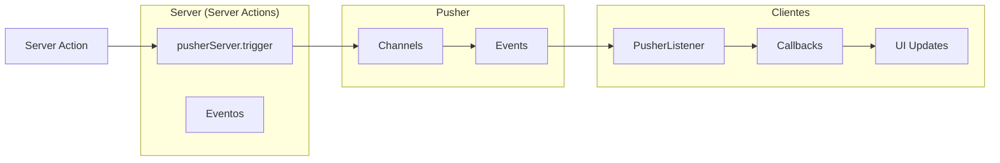

# 10. Tiempo Real (Pusher)

## Descripción General

El sistema usa **Pusher** (WebSockets) para actualizaciones en tiempo real. Cuando ocurre un evento (nueva venta, movimiento de caja, cambio de stock), el servidor notifica a todos los clientes conectados del mismo negocio.

## Arquitectura



## Configuración

### Server (`/src/lib/pusher-server.ts`)

```typescript
import Pusher from "pusher";

export const pusherServer = new Pusher({
  appId: process.env.PUSHER_APP_ID!,
  key: process.env.NEXT_PUBLIC_PUSHER_KEY!,
  secret: process.env.PUSHER_SECRET!,
  cluster: process.env.NEXT_PUBLIC_PUSHER_CLUSTER!,
  useTLS: true,
});
```

### Client (`/src/lib/pusher-client.ts`)

```typescript
import Pusher from "pusher-js";

export const pusherClient = new Pusher(process.env.NEXT_PUBLIC_PUSHER_KEY!, {
  cluster: process.env.NEXT_PUBLIC_PUSHER_CLUSTER!,
});
```

## Canales y Eventos

| Canal | Evento | Trigger | Escucha |
|-------|--------|---------|---------|
| `orders-{businessId}` | `orders-update` | `processSaleAction`, `processReturnAction`, `updateOrderAction`, `createPublicOrder`, `createUnpaidOrder`, `cancelUnpaidOrder`, `addItemsToOrder` | AccountLedger, Ventas |
| `movements-{businessId}` | `new-movement` | `processSaleAction`, `createMovement`, `registerPayment` | CashRegister |
| `movements-{businessId}` | `refresh` | `createProduct`, `updateProduct`, `deleteProduct` | Stock |

## Patrón de Uso

### Server → Evento

```typescript
// En cualquier Server Action que modifique datos relevantes
await pusherServer.trigger(
  `orders-${businessId}`,
  "orders-update",
  {}  // Payload (puede contener datos)
);
```

### Client → Escucha

```typescript
// Ejemplo: PusherListener en AccountLedger
"use client";
import { pusherClient } from "@/lib/pusher-client";
import { useEffect } from "react";

export const PusherListener = ({ businessId }: { businessId: string }) => {
  useEffect(() => {
    const channel = pusherClient.subscribe(`orders-${businessId}`);
    
    channel.bind("orders-update", () => {
      // Recargar datos
      window.location.reload();
    });
    
    return () => {
      channel.unbind_all();
      channel.unsubscribe();
    };
  }, [businessId]);
  
  return null;  // Componente invisible
};
```

## Componentes que Escuchan

### `PusherListener` (Account Ledger)

```typescript
// src/app/(protected)/account-ledger/PusherListener.tsx
// Escucha "orders-update" para refrescar la lista de cuentas corrientes
```

### Otros Componentes

Actualmente, la mayoría de los componentes usan `revalidatePath` en Server Components (RSC) para refrescar datos automáticamente. Pusher es un complemento para cuando hay múltiples usuarios conectados simultáneamente.

## Revalidación + Pusher

El patrón combinado asegura consistencia:

```mermaid
flowchart LR
    SA[Server Action] -->|1. DB| DB[(PostgreSQL)]
    SA -->|2. Pusher| WS[WebSocket]
    SA -->|3. revalidatePath| Next[Next.js Cache]
    
    WS -->|Cliente A| RefreshA[Recarga UI]
    Next -->|Cliente B (nuevo request)| Fetch[Fetch nuevos datos]
    
    RefreshA --> Fetch
```

## Variables de Entorno

```env
NEXT_PUBLIC_PUSHER_KEY=
NEXT_PUBLIC_PUSHER_CLUSTER=
PUSHER_APP_ID=
PUSHER_SECRET=
```
