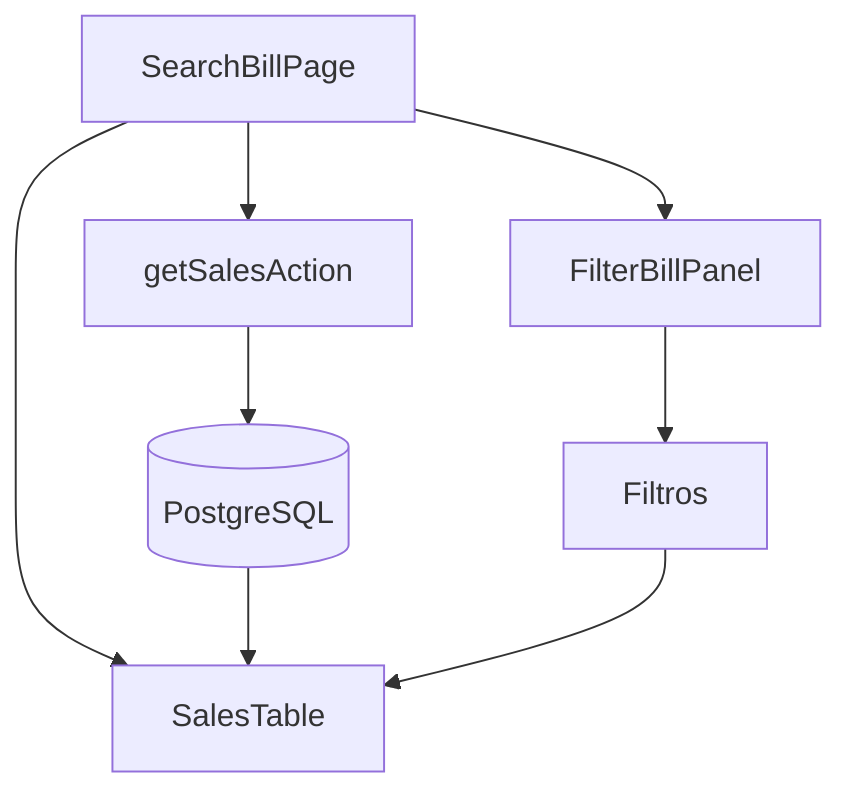
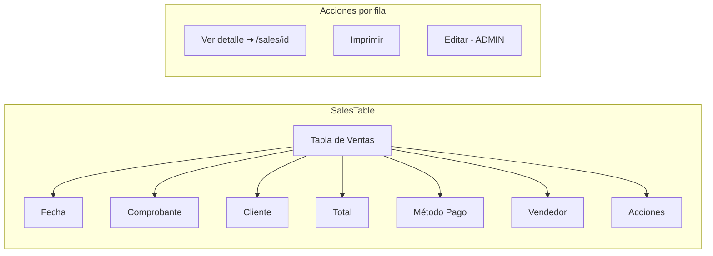

# 11. Búsqueda de Facturas

## Descripción General

El módulo de búsqueda permite encontrar facturas históricas usando múltiples filtros. Está diseñado para consultar rápidamente ventas pasadas, ver detalles y acceder a acciones como edición o impresión.

## Ruta

```
/(protected)/searchBill → Página de búsqueda
```

## Arquitectura



## Server Actions

### `getSalesAction()`

Obtiene las últimas 1100 ventas pagas del negocio:

```typescript
export const getSalesAction = async (): Promise<BillState[]> => {
  const orders = await db.order.findMany({
    where: { businessId, paidStatus: "pago" },
    include: { items: true, client: true },
    orderBy: { date: "desc" },
    take: 1100,
  });
  
  // Mapea Order[] → BillState[]
  return orders.map(order => ({
    id: order.id,
    products: order.items.map(item => ({...})),
    total: order.total + order.discountAmount,
    totalWithDiscount: order.total,
    client: order.client?.name,
    seller: order.seller,
    discount: order.discountPercentage,
    date: order.date,
    paidMethod: order.paymentMethod,
    CAE: order.CAE,
    // ... más campos
  }));
};
```

### `getSaleByIdAction(id)`

Obtiene una venta específica por ID:

```typescript
export const getSaleByIdAction = async (id: string) => {
  const order = await db.order.findUnique({
    where: { id, businessId },
    include: { items: true, client: true },
  });
  // → BillState | null
};
```

## Filtros

### FilterBillPanel

Panel de filtros con los siguientes campos:

| Filtro | Tipo | Descripción |
|--------|------|-------------|
| Fecha desde | Date | Inicio del rango |
| Fecha hasta | Date | Fin del rango |
| Cliente | Text | Busca por nombre de cliente |
| Vendedor | Select | Filtra por vendedor (cargado de `getUniqueSellersAction`) |
| Método de pago | Select | Efectivo, Tarjeta, etc. |
| Monto mínimo | Number | Filtro de importe |
| Monto máximo | Number | Filtro de importe |
| Tipo de comprobante | Select | Factura A/B/C, Remito, etc. |

## SalesTable



## Detalle de Venta

```
/(protected)/sales/[id] → Página de detalle
```

Muestra:

- **Información general**: fecha, comprobante, vendedor
- **Datos del cliente**: nombre, documento, condición IVA
- **Productos**: tabla con código, descripción, cantidad, precio, subtotal
- **Totales**: subtotal, descuento, total final
- **Métodos de pago**: desglose si es dos métodos
- **CAE**: si es factura electrónica, muestra CAE + QR
- **Historial de ediciones**: lista de cambios (si fue editada)
- **Acciones**: editar (ADMIN), imprimir, devolución

## Historial de Ediciones

```typescript
// En el detalle, si la venta fue editada:
const history = await getSaleHistoryAction(orderId);

// Muestra:
// v1: Creada por Juan
// v2: Editada por Admin → cambió cantidad de "Termo 1L" de 2 a 3
// v3: Editada por Admin → agregó "Yerba 1kg"
```

## Server Actions del Módulo

| Action | Uso |
|--------|-----|
| `getSalesAction` | Lista principal (top 1100) |
| `getSaleByIdAction` | Detalle individual |
| `getUniqueSellersAction` | Vendedores para filtro |
| `getSaleHistoryAction` | Historial de ediciones |
