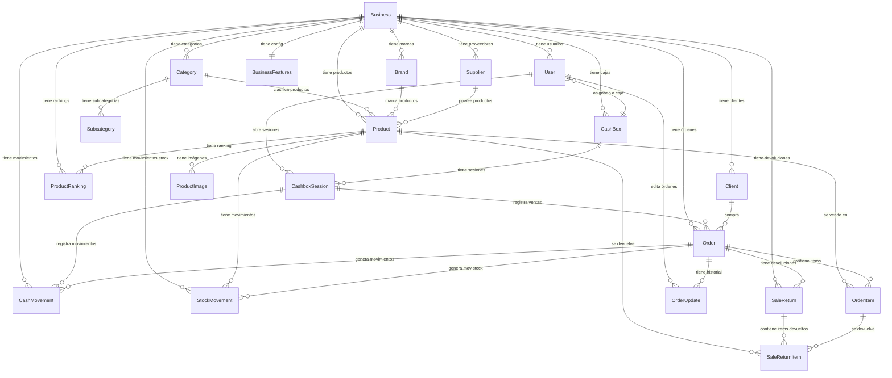
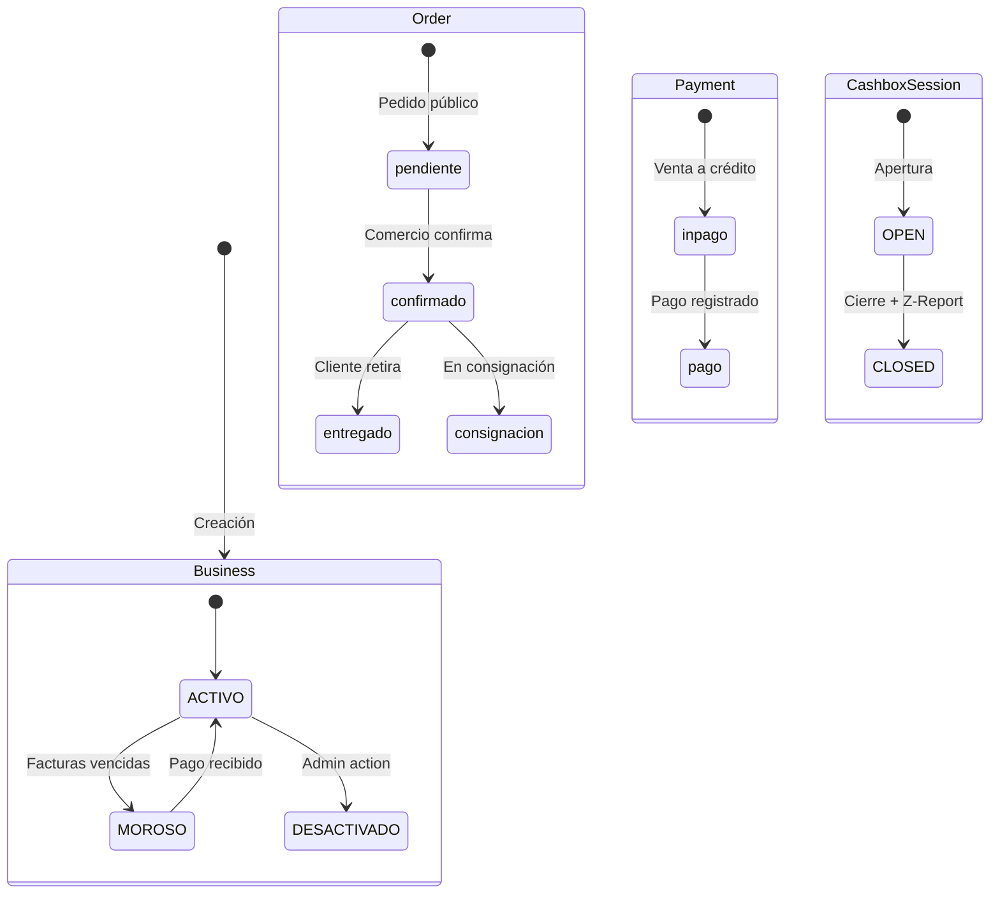

# 12. Modelos de Datos

## Relaciones Completas



## Diagrama de Estados



## Modelos Detallados

### Business

```prisma
model Business {
  id   String  @id @default(cuid())
  name String
  slug String  @unique
  logo String?
  
  userId String? @unique  // Owner
  users  User[]   @relation("BusinessUsers")
  
  // Multi-tenancy relations
  products        Product[]
  suppliers       Supplier[]
  categories      Category[]
  subcategories   Subcategory[]
  brands          Brand[]
  clients         Client[]
  cashBoxes       CashBox[]
  cashboxSessions CashboxSession[]
  orders          Order[]
  cashMovements   CashMovement[]
  saleReturns     SaleReturn[]
  stockMovements  StockMovement[]
  rankings        ProductRanking[]
  orderUpdates    OrderUpdate[]
  
  // ARCA Fields
  cuit              String?
  razonSocial       String?
  inicioActividades DateTime?
  condicionIva      IvaCondition      @default(MONOTRIBUTO)
  address           String?
  cert              String? @db.Text
  key               String? @db.Text
  ptoVenta          Int[]   @default([])
  
  // Business Status
  accountStatus   BusinessStatus @default(ACTIVO)
  lastPaymentDate DateTime?
  
  // Features & Limits
  features BusinessFeatures?
}
```

### Order (completo)

```prisma
model Order {
  id         String   @id @default(cuid())
  date       DateTime @default(now())
  total      Float    @default(0)
  status     OrderStatus @default(confirmado)
  paidStatus PaidStatus  @default(inpago)
  seller     String?
  
  // Payments
  paymentMethod  String? @default("Efectivo")
  paymentMethod2 String?
  totalMethod2   Float?
  
  // Discounts
  discountPercentage Float @default(0)
  discountAmount     Float @default(0)
  
  // Client
  clientId String?
  client   Client? @relation(fields: [clientId], references: [id])
  
  // Multi-tenant
  businessId String
  business   Business @relation(fields: [businessId], references: [id])
  
  // ARCA
  clientIvaCondition   String?
  clientDocumentNumber String?
  CAE                  Json?
  
  // Cashbox
  cashboxSessionId String?
  cashboxSession   CashboxSession? @relation(fields: [cashboxSessionId], references: [id])
  
  // Relations
  items          OrderItem[]
  returns        SaleReturn[]
  stockMovements StockMovement[]
  updates        OrderUpdate[]
  cashMovements  CashMovement[]
  
  @@index([businessId, date])
}
```

### OrderUpdate (Historial)

```prisma
model OrderUpdate {
  id String @id @default(cuid())
  
  orderId String
  order   Order  @relation(fields: [orderId], references: [id], onDelete: Cascade)
  
  businessId String
  business   Business @relation(fields: [businessId], references: [id])
  
  updatedById String
  updatedBy   User   @relation(fields: [updatedById], references: [id])
  
  type    OrderUpdateType
  message String?
  changes Json?    // Diff detallado
  snapshot Json?   // Snapshot completo (cada 10 versiones)
  version Int      // Versión secuencial
  
  @@unique([orderId, version])
  @@index([businessId, date])
}

enum OrderUpdateType {
  ORDER_CREATED
  ITEMS_ADDED
  ITEMS_REMOVED
  ITEMS_UPDATED
  STATUS_CHANGED
  PAYMENT_UPDATED
  DISCOUNT_CHANGED
  CLIENT_CHANGED
}
```

### BusinessFeatures (Feature Gates)

```prisma
model BusinessFeatures {
  id         String   @id @default(cuid())
  businessId String   @unique
  business   Business @relation(fields: [businessId], references: [id], onDelete: Cascade)
  
  plan Plan @default(BASIC)  // BASIC | PRO | ENTERPRISE
  
  // Feature Toggles
  hasAfipBilling   Boolean @default(false)  // ENTERPRISE
  hasPublicCatalog Boolean @default(false)  // ENTERPRISE
  hasClientLedger  Boolean @default(false)  // PRO+
  hasMultiCashbox  Boolean @default(false)  // PRO+
  
  // Limits
  maxUsers    Int @default(1)
  maxProducts Int @default(100)
}
```

## Convenciones de Nomenclatura

### IDs
- Todos los IDs usan `cuid()` (generados por Prisma)
- Excepción: `Client.id` puede ser el DNI del cliente (en pedidos públicos)

### Fechas
- `date` / `creation_date` / `createdAt`: creación del registro
- `last_update` / `updatedAt`: última modificación
- `startTime` / `endTime`: para sesiones

### Montos
- Todos los montos son `Float` (PostgreSQL real)
- Siempre positivos excepto `CashMovement.total` (negativo = egreso)
- `StockMovement.quantity`: negativo = salida, positivo = entrada

### Enums
- `OrderStatus`: pendiente, confirmado, entregado, consignacion
- `PaidStatus`: pago, inpago
- `SessionStatus`: OPEN, CLOSED
- `MovementType`: SALE, RETURN, ADJUSTMENT, PURCHASE
- `IvaCondition`: RESPONSABLE_INSCRIPTO, MONOTRIBUTO
- `UserRole`: SUPER_ADMIN, ADMIN, USER
- `BusinessStatus`: ACTIVO, MOROSO, DESACTIVADO
