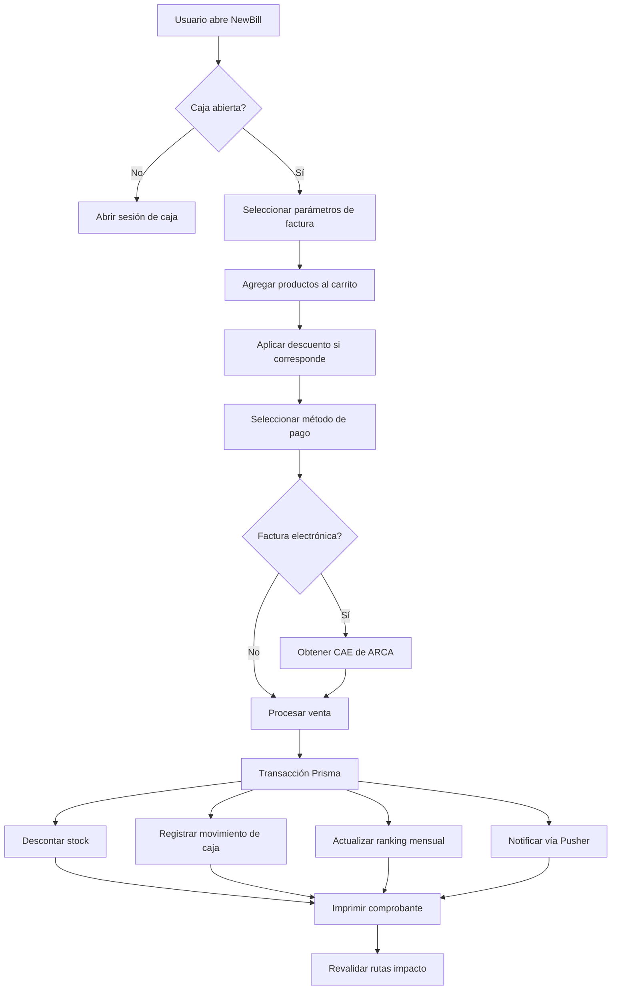

# POS Template — Documentación del Sistema

> Sistema de Punto de Venta moderno construido con Next.js 15, TypeScript, Prisma + PostgreSQL y NextAuth.js.

## Índice de Módulos

| # | Módulo | Descripción |
|---|--------|-------------|
| 1 | [Arquitectura General](./01-architecture.md) | Stack, estructura de carpetas, patrones, flujo de datos |
| 2 | [Autenticación y Autorización](./02-auth.md) | NextAuth.js, roles, gates, plan-based features |
| 3 | [Facturación (Billing)](./03-billing.md) | Creación de facturas, carrito, medios de pago, descuentos |
| 4 | [Caja (Cash Register)](./04-cash-register.md) | Sesiones de caja, apertura/cierre, reporte Z |
| 5 | [Stock y Productos](./05-stock.md) | CRUD de productos, proveedores, marcas, categorías, carga masiva |
| 6 | [Ventas y Cuenta Corriente](./06-sales-ledger.md) | Historial de ventas, edición, devoluciones, cuenta corriente |
| 7 | [Reportes](./07-reports.md) | Reportes diarios, mensuales, anuales, ranking de productos |
| 8 | [Catálogo Público](./08-public-catalog.md) | Catálogo online, pedidos públicos, checkout |
| 9 | [ARCA / AFIP (Factura Electrónica)](./09-arca-afip.md) | Integración con ARCA, generación de CAE, comprobantes electrónicos |
| 10 | [Tiempo Real (Pusher)](./10-realtime.md) | WebSockets, eventos, actualizaciones en vivo |
| 11 | [Búsqueda de Facturas](./11-search-bills.md) | Filtros avanzados, búsqueda histórica |
| 12 | [Modelos de Datos](./12-data-models.md) | Esquema Prisma completo con relaciones |

## Convenciones del Proyecto

### Stack Tecnológico

| Capa | Tecnología |
|------|-----------|
| **Framework** | Next.js 15 (App Router) |
| **Lenguaje** | TypeScript (strict mode) |
| **Estilos** | Tailwind CSS v4 + Radix UI primitives |
| **ORM** | Prisma 6 + PostgreSQL |
| **Auth** | NextAuth.js v5 (Auth.js) |
| **Validación** | Zod + React Hook Form |
| **Tiempo Real** | Pusher (WebSockets) |
| **Estado** | React Context + useReducer |
| **Imágenes** | Firebase Storage |

### Estructura de Archivos

```
src/
├── actions/           # Server Actions (mutaciones)
├── app/               # App Router (páginas y layouts)
│   ├── (protected)/   # Rutas protegidas (requieren auth)
│   ├── admin/         # Panel de administración
│   ├── api/           # API Routes
│   ├── auth/          # Páginas de autenticación
│   └── superadmin/    # Panel superadmin
├── components/        # Componentes React
│   ├── ui/            # Primitivas UI (Radix-based)
│   ├── Billing/       # Componentes de facturación
│   ├── stock/         # Gestión de stock
│   ├── cashbox/       # Sesiones de caja
│   └── ...
├── context/           # React Context providers
├── lib/               # Utilidades (db, auth, pusher, print)
├── models/            # Tipos e interfaces TypeScript
├── schemas/           # Esquemas de validación Zod
└── services/          # Servicios externos (Firebase)
```

### Principios Clave

- **Server Actions** para todas las mutaciones de datos
- **Server Components por defecto**, `"use client"` solo cuando es necesario
- **Transacciones Prisma** para operaciones multi-paso
- **Multi-tenancy** por `businessId` en todas las consultas
- **Feature Gates** basados en plan del negocio
- **Pusher** para actualizaciones en tiempo real (órdenes, movimientos)
- **Revalidation** con `revalidatePath` después de mutaciones

### Flujo de una Venta Típica



---
