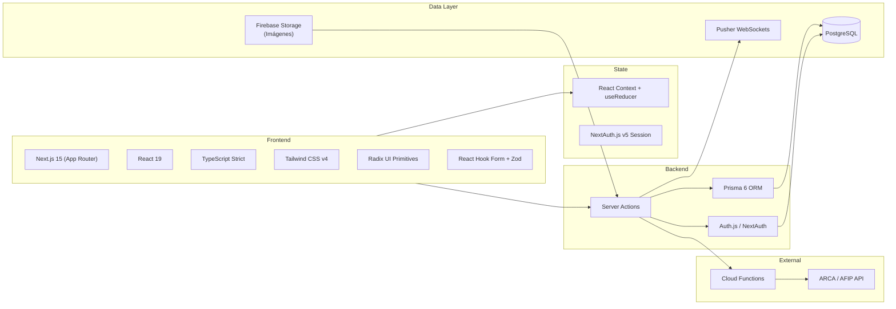
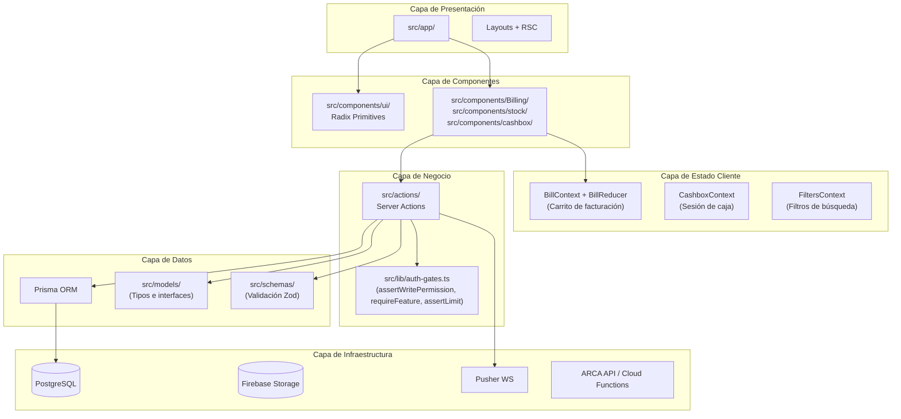
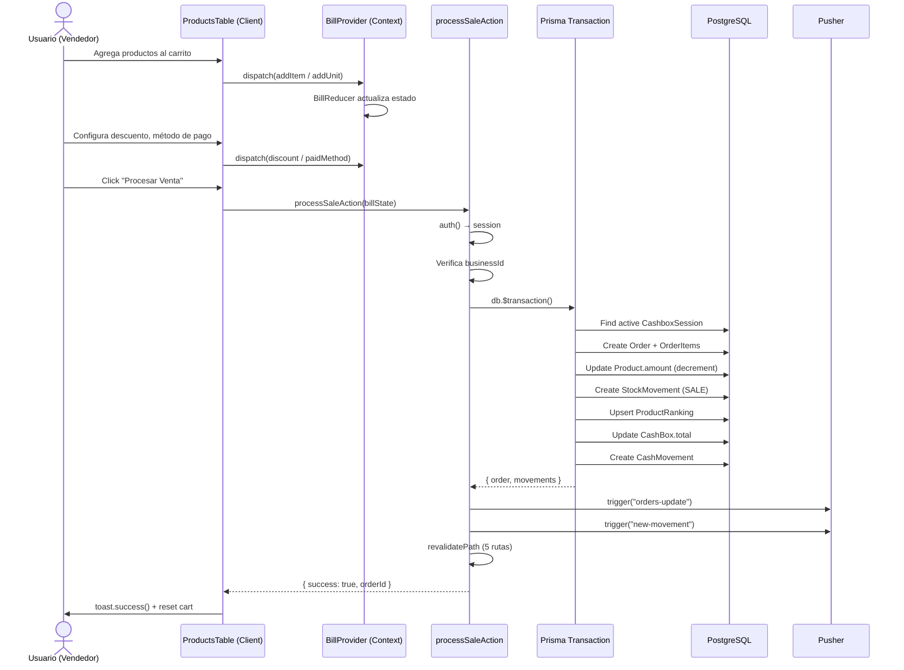
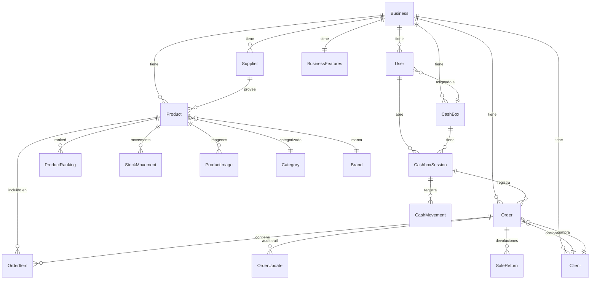
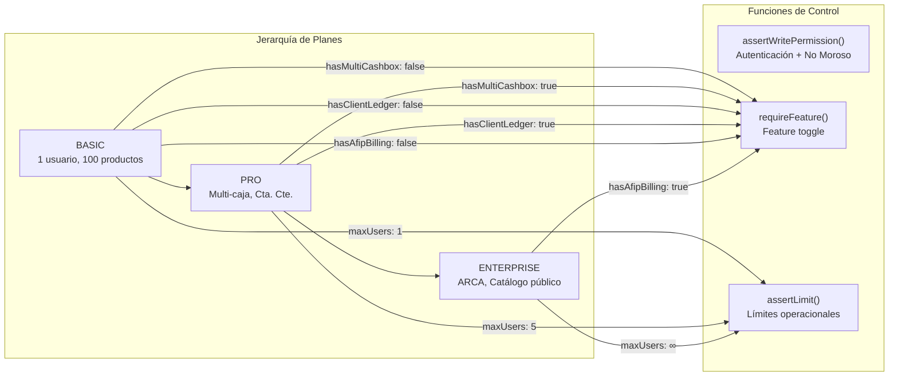
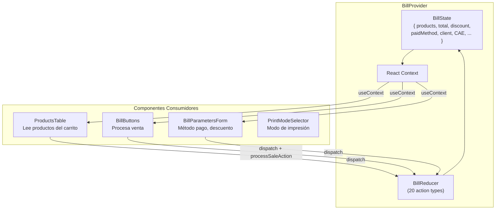
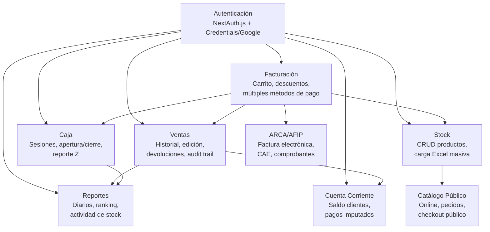
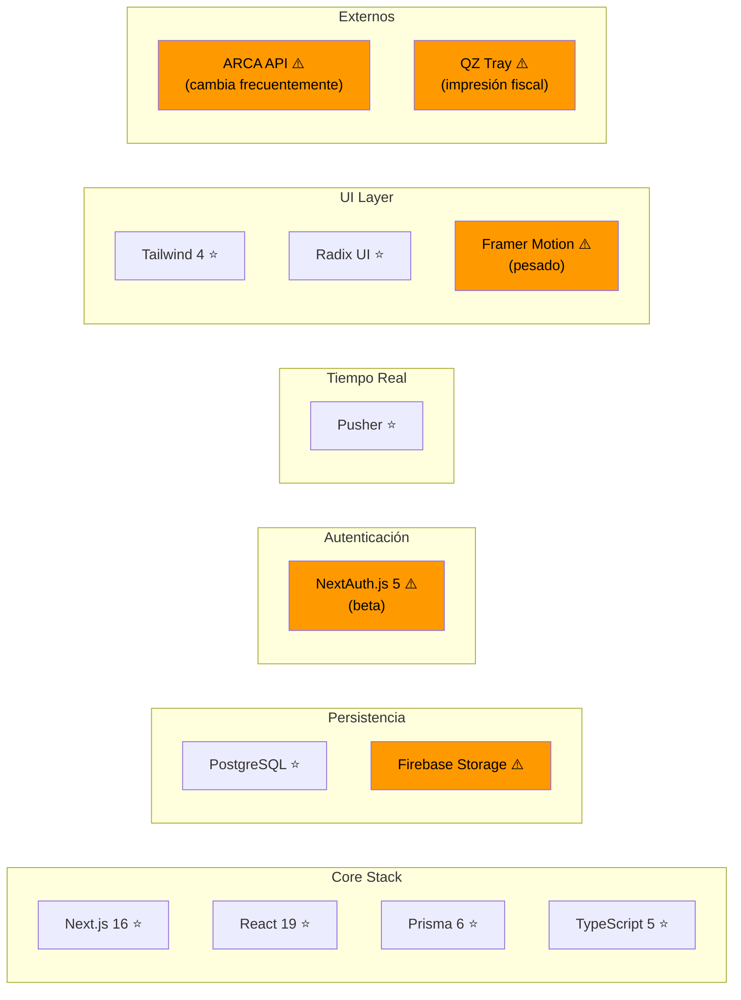

# 1. Arquitectura Actual — Análisis Detallado

> Basado en exploración del código base: Server Actions, Prisma schema, componentes, contextos, y flujos de datos.

---

## 1.1 Stack Tecnológico

### Observaciones Clave

- **Server Actions** como única fuente de mutaciones — no hay API Routes tradicionales
- **React Server Components** por defecto, `"use client"` solo para interactividad
- **Prisma transaccional** con `$transaction()` para operaciones multi-paso
- **Firebase** solo para Storage (imágenes) — el ORM principal es Prisma/PostgreSQL

---

## 1.2 Arquitectura por Capas

### Flujo de Datos por Capa

| Capa | Responsabilidad | Archivos Clave |
|------|-----------------|----------------|
| **Presentación** | Páginas, layouts, metadata | `src/app/` |
| **Componentes** | UI interactiva, formularios, tablas | `src/components/` |
| **Estado Cliente** | Carrito, sesión de caja, filtros | `src/context/` |
| **Negocio** | Toda la lógica de datos | `src/actions/` (19 archivos) |
| **Datos** | ORM, tipos, validación | `src/lib/db.ts`, `prisma/schema.prisma` |

---

## 1.3 Flujo de una Venta

El flujo más complejo del sistema es `processSaleAction` en `sales.ts`:

### Lo que Funciona Bien en Este Flujo

- ✅ **Atomicidad**: Todo en una sola transacción Prisma
- ✅ **Multi-tenancy**: businessId en cada query
- ✅ **Sesión de caja obligatoria**: No se puede vender sin sesión abierta
- ✅ **Stock tracking**: StockMovement por cada ítem, causa y efecto
- ✅ **Ranking mensual**: Upsert por producto/mes/año
- ✅ **Push en tiempo real**: Pusher notifica a otros clientes

### Lo que Podría Mejorar

- ⚠️ **5 revalidatePath() calls** — agresivo, invalida cachés innecesariamente
- ⚠️ **Sin caché de sesión**: Cada action llama a `auth()` → query a DB
- ⚠️ **Sin optimistic updates**: Usuario espera roundtrip completo

---

## 1.4 Modelo de Datos — Relaciones Principales

---

## 1.5 Feature Gates (Auth Gates)

El sistema implementa un control de acceso por plan mediante tres funciones en `src/lib/auth-gates.ts`:

### Mapeo Plan → Features

| Feature | BASIC | PRO | ENTERPRISE |
|---------|-------|-----|------------|
| Facturación simple | ✅ | ✅ | ✅ |
| Multi-caja | ❌ | ✅ | ✅ |
| Cuenta Corriente | ❌ | ✅ | ✅ |
| ARCA/AFIP | ❌ | ❌ | ✅ |
| Catálogo público | ❌ | ❌ | ✅ |
| Máx. usuarios | 1 | 5 | ∞ |
| Máx. productos | 100 | 1000 | ∞ |

---

## 1.6 Manejo de Estado (Client-side)

### Observaciones sobre el Estado

- **20 funciones dispatch individuales** en BillProvider — cada una es un wrapper de `dispatch`
- El patrón **useReducer** es correcto para estado complejo como un carrito
- No hay persistencia del carrito (se pierde al refrescar) — puede ser intencional
- **PrintMode** y **qzTrayActive** se persisten en localStorage
- **onOrderResetRef** permite que componentes hijos registren callbacks de reset

---

## 1.7 Módulos del Sistema

### Tamaño Relativo de Módulos

| Módulo | Archivos | SLOC Aprox | Server Actions |
|--------|----------|------------|----------------|
| Stock | 15+ | ~2500 | `stock.ts` (854 lines) |
| Ventas | 5 | ~1500 | `sales.ts` (749 lines) |
| Facturación | 10 | ~1200 | Context + Reducer |
| Caja | 4 | ~500 | `cashbox.ts` (290 lines) |
| Cuenta Corriente | 3 | ~400 | `clients.ts` |
| Reportes | 3 | ~350 | `sales.ts` (compartido) |
| ARCA/AFIP | 2 | ~400 | `arca.ts`, `afip.ts` |
| Catálogo Público | 4 | ~300 | `catalog.ts` |

---

## 1.8 Dependencias Externas — Mapa de Riesgo

**Leyenda:** ⭐ = Estable / ⚠️ = Riesgo

### Dependencias con Riesgo

| Dependencia | Riesgo | Motivo |
|-------------|--------|--------|
| **NextAuth.js v5** | Alto | Aún en beta, breaking changes frecuentes |
| **Firebase Storage** | Medio | Vendor lock-in, configuración de reglas crítica |
| **Framer Motion** | Bajo | Bundle size pesado, considerar alternativas ligeras |
| **ARCA/AFIP API** | Alto | Cambia con cada gestión gubernamental |
| **QZ Tray** | Medio | Software de escritorio, actualizaciones manuales |
