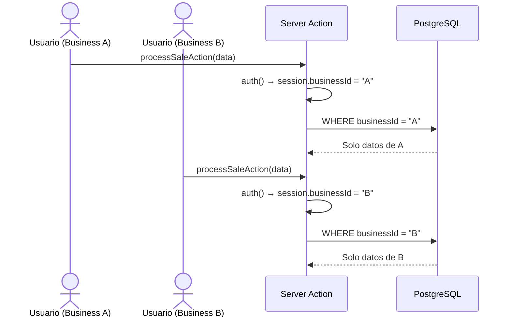
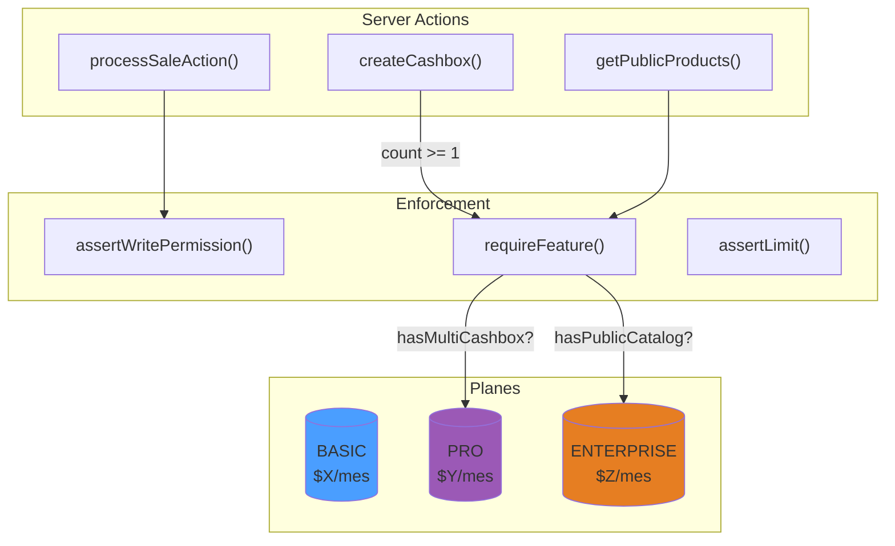
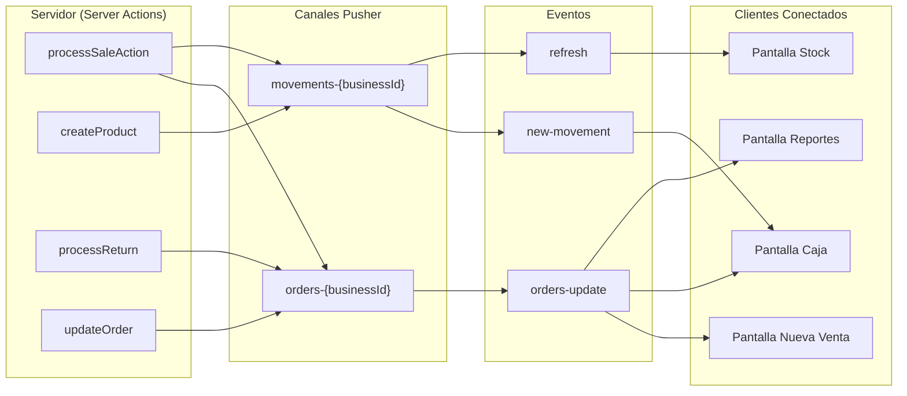
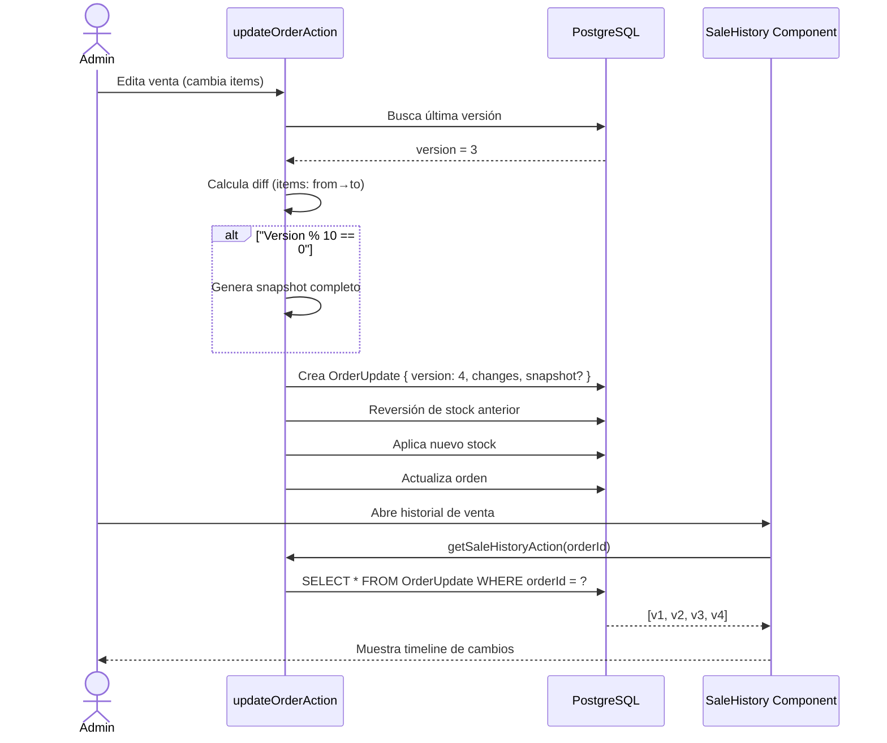
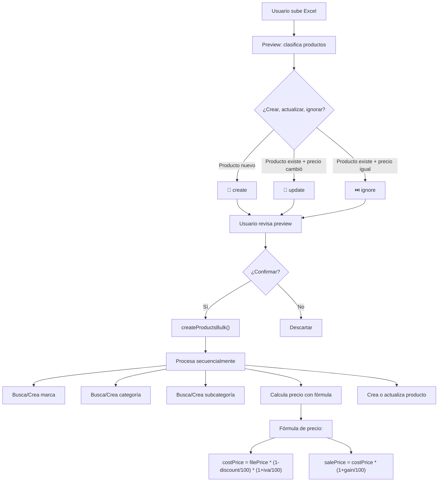
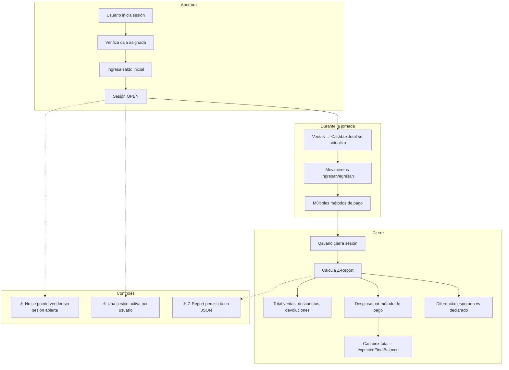

# 2. Fortalezas del Proyecto (Pros)

> **Lo que el proyecto hace bien.** Cada fortaleza incluye evidencia del código base y diagramas donde aplica.

---

## 2.1 Multi-tenancy Correctamente Aislado

Cada `Business` es un tenant independiente. **TODAS** las consultas a base de datos filtran por `businessId`.

### Evidencia (en `sales.ts`, `stock.ts`, `cashbox.ts`, etc.)

```typescript
// Patrón consistente en TODAS las Server Actions:
const session = await auth();
const businessId = session?.user?.businessId;
if (!businessId) return { error: "No autorizado" };

// Toda query incluye businessId en el WHERE:
const products = await db.product.findMany({
  where: { businessId },  // ← SIEMPRE presente
});
```

### Flujo Multi-tenant



**Impacto:** ✅ CRÍTICO — Aislación completa de datos entre comercios.

---

## 2.2 Transacciones Atómicas con Prisma

Todas las operaciones multi-paso usan `db.$transaction()` garantizando atomicidad.

### Evidencia (en `sales.ts`)

```typescript
const result = await db.$transaction(async (tx) => {
  // 1. Verificar sesión de caja activa
  const activeSession = await tx.cashboxSession.findFirst({ ... });
  
  // 2. Crear orden + items
  const order = await tx.order.create({ data: { ..., items: { create: ... } } });
  
  // 3. Descontar stock + crear movimientos
  for (const item of billState.products) {
    await tx.product.update({ where: { id: item.id }, data: { amount: { decrement: item.amount } } });
    await tx.stockMovement.create({ ... });
    await tx.productRanking.upsert({ ... });
  }
  
  // 4. Actualizar caja + movimiento
  await tx.cashBox.update({ ... });
  await tx.cashMovement.create({ ... });
  
  return { order, movements };
}); // ← Si algo falla, TODO se revierte
```

### Operaciones que Usan Transacciones

| Operación | Archivo | Pasos en TX |
|-----------|---------|-------------|
| Procesar venta | `sales.ts` | 7+ (order, items, stock, ranking, caja, movimientos) |
| Procesar devolución | `sales.ts` | 6+ (return, stock, caja, movimientos) |
| Editar venta | `sales.ts` | 10+ (revertir stock, actualizar order, descontar nuevo stock) |
| Carga masiva Excel | `stock.ts` | N productos × 3 operaciones c/u |

**Impacto:** ✅ ALTO — Integridad referencial garantizada en operaciones críticas.

---

## 2.3 Feature Gates por Plan (SaaS-ready)

El modelo de negocio está preparado para **multi-tenancy con monetización por plan**.

### Evidencia (en `auth-gates.ts`)

```typescript
export const assertWritePermission = async () => {
  // Verifica: autenticado + cuenta NO morosa
};

export const requireFeature = async (featureName: string) => {
  // Verifica: el plan del negocio tiene este feature habilitado
};

export const assertLimit = async (limitName: string, value: number) => {
  // Verifica: no se excedió el límite operacional del plan
};
```

### Sistema de Planes



**Impacto:** ✅ ALTO — El sistema ya está preparado para modelo SaaS con diferentes planes.

---

## 2.4 Real-time con Pusher

WebSockets implementados correctamente para actualizaciones en vivo.

### Evidencia (en `sales.ts`, `stock.ts`)

```typescript
// Después de procesar venta:
await pusherServer.trigger(`orders-${businessId}`, "orders-update", {});
await pusherServer.trigger(`movements-${businessId}`, "new-movement", movement);

// Después de CRUD de productos:
await pusherServer.trigger(`movements-${businessId}`, "refresh", { type: "product-created" });
```

### Eventos Pusher



**Canales por Business:** Cada business tiene sus propios canales (`orders-{id}`, `movements-{id}`), manteniendo el aislamiento multi-tenant incluso en tiempo real.

**Impacto:** ✅ ALTO — Experiencia multi-pantalla coherente sin polling.

---

## 2.5 Audit Trail de Órdenes con Versioning

El modelo `OrderUpdate` mantiene un historial completo de cambios en las órdenes.

### Evidencia (Prisma schema)

```prisma
model OrderUpdate {
  id          String
  orderId     String
  businessId  String
  updatedById String
  type        OrderUpdateType  // Enum con 8 tipos de cambios
  message     String?          // Mensaje opcional para UI
  changes     Json?            // Diff estructurado de cambios
  snapshot    Json?            // Snapshot completo cada 10 versiones
  version     Int              // Versión secuencial por orden
  date        DateTime
  
  @@unique([orderId, version]) // Garantiza versiones secuenciales
}
```

### Flujo de Versioning



**Tipos de cambios trackeados:**

| Tipo | Descripción |
|------|-------------|
| `ORDER_CREATED` | Creación inicial |
| `ITEMS_ADDED` | Producto agregado |
| `ITEMS_REMOVED` | Producto quitado |
| `ITEMS_UPDATED` | Cantidad/precio modificado |
| `STATUS_CHANGED` | Estado (pendiente/entregado) |
| `PAYMENT_UPDATED` | Método de pago modificado |
| `DISCOUNT_CHANGED` | Descuento ajustado |
| `CLIENT_CHANGED` | Cliente reasignado |

**Impacto:** ✅ ALTO — Trazabilidad completa de cambios, crítico para entornos fiscales.

---

## 2.6 Arquitectura Server Actions Limpia

Separación clara de responsabilidades con Server Actions modulares.

### Estructura

```
src/actions/
├── billing.ts        # Operaciones de facturación
├── cashbox.ts        # Sesiones de caja
├── catalog.ts        # Catálogo público
├── clients.ts        # Cuenta corriente
├── sales.ts          # Ventas (la más compleja)
├── stock.ts          # Productos y stock
├── brands.ts         # Marcas
├── categories.ts     # Categorías
├── subcategories.ts  # Subcategorías
├── orders.ts         # Órdenes de compra
├── public-orders.ts  # Pedidos públicos
├── movements.ts      # Movimientos
├── afip.ts / arca.ts # Factura electrónica
├── business.ts       # Configuración del negocio
├── superadmin.ts     # Panel superadmin
├── voucher.ts        # Comprobantes
├── unpaid-orders.ts  # Pagos pendientes
└── seed-debts.ts     # Script de siembra
```

**Cada archivo** exporta Server Actions específicas de su dominio, con patrón consistente:

```typescript
"use server";

import { db } from "@/lib/db";
import { auth } from "../../auth";
import { revalidatePath } from "next/cache";

export const actionName = async (params) => {
  // 1. Autenticación
  const session = await auth();
  if (!session?.user?.businessId) return { error: "No autorizado" };

  try {
    // 2. Lógica de negocio
    // ...
    return { success: true, ...data };
  } catch (error) {
    // 3. Error handling
    console.error("...", error);
    return { error: "..." };
  }
};
```

**Impacto:** ✅ MEDIO — Código predecible y fácil de mantener, aunque algunos archivos son muy grandes (stock.ts: 854 lines, sales.ts: 749 lines).

---

## 2.7 Carga Masiva Inteligente con Preview

El sistema de carga por Excel tiene **previsualización** con detección de cambios.

### Evidencia (en `stock.ts`)

```typescript
export const previewProductsBulk = async (...): Promise<PreviewProductsBulkResult> => {
  // 1. Busca productos existentes por código
  const existingProducts = await db.product.findMany({ where: { code: { in: codes } } });
  
  // 2. Clasifica cada producto: create / update / ignore
  // 3. Compara precios con tolerancia < 0.001
  // 4. Retorna preview con conteos
  
  return {
    preview: { createdCount, updatedCount, ignoredCount, items }
  };
};
```

### Flujo de Carga Masiva



**Características destacadas:**

- ✅ **Preview antes de ejecutar** — el usuario sabe qué va a pasar
- ✅ **Detección de cambios** con tolerancia (< 0.001)
- ✅ **Modo "Solo actualizar"** — no crea productos nuevos
- ✅ **Fórmula de precio** configurable (descuento → IVA → ganancia)
- ✅ **Creación automática** de marcas/categorías si no existen

**Impacto:** ✅ ALTO — UX madura para una operación crítica como carga de productos.

---

## 2.8 Manejo de Sesiones de Caja (Z-Report)

El sistema de caja tiene un flujo completo con reporte Z al cierre.

### Evidencia (en `cashbox.ts`)

```typescript
const zReport = {
  totalSales,
  totalDiscounts,
  totalReturns,
  netTotal: totalSales - totalReturns,
  orderCount: orders.length,
  returnCount: returns.length,
  paymentMethods,         // Desglose por método de pago
  expectedFinalBalance,   // Lo que debería haber
  declaredFinalBalance,   // Lo que el usuario declara
  difference,             // Diferencia (sobrante/faltante)
};
```

### Flujo de Sesión de Caja



**Impacto:** ✅ ALTO — Control financiero completo, esencial para un POS.

---

## 2.9 Factura Electrónica ARCA/AFIP

Integración completa con el organismo fiscal argentino para emisión de comprobantes electrónicos.

| Capacidad | Estado |
|-----------|--------|
| Obtención de CAE | ✅ Implementado |
| Múltiples puntos de venta | ✅ Configurable por business |
| Tipos de comprobante | ✅ Factura A, B, C, etc. |
| Condiciones IVA | ✅ RI, Monotributo |
| QR de factura | ✅ Generado |
| Cloud Functions | ✅ Procesamiento async |

**Impacto:** ✅ CRÍTICO — Diferenciador clave del producto en el mercado argentino.

---

## 2.10 Testing con Vitest

El proyecto tiene tests unitarios con Vitest + Testing Library.

### Estructura de Tests

```
src/__tests__/
├── actions/           # Tests de Server Actions
│   ├── processSaleAction.test.ts
│   ├── getProductsPaginated.test.ts
│   ├── catalog.test.ts
│   └── ...
├── components/        # Tests de componentes
│   ├── ProductCard.test.tsx
│   ├── ProductForm.test.tsx
│   ├── CatalogPage.test.tsx
│   └── ...
├── schemas/           # Tests de validación Zod
│   └── product.test.ts
└── utils/             # Tests de utilidades
    └── date-utils.test.ts
```

### Stack de Testing

| Herramienta | Uso |
|-------------|-----|
| **Vitest** | Test runner |
| **@testing-library/react** | Renderizado de componentes |
| **@testing-library/jest-dom** | Matchers DOM |
| **happy-dom / jsdom** | Entorno DOM simulado |

**Impacto:** ✅ MEDIO — Buen punto de partida, falta coverage de integración y E2E.

---

## 2.11 Documentación Excelente

La carpeta `docs/` contiene documentación técnica detallada de todos los módulos:

| Documento | Contenido |
|-----------|-----------|
| `01-architecture.md` | Stack, capas, flujo de datos, multi-tenancy |
| `02-auth.md` | NextAuth, roles, feature gates, códigos de error |
| `03-billing.md` | Facturación, carrito, métodos de pago |
| `04-cash-register.md` | Sesiones de caja, Z-Report |
| `05-stock.md` | Productos, proveedores, carga masiva |
| `06-sales-ledger.md` | Ventas, edición, devoluciones |
| `README.md` | Índice completo con diagramas de flujo |

**Impacto:** ✅ ALTO — Código documentado, onboarding facilitado.

---

## Resumen de Fortalezas

| # | Fortaleza | Impacto | Archivos Clave |
|---|-----------|---------|----------------|
| 1 | Multi-tenancy aislado | 🔴 Crítico | Todas las Server Actions |
| 2 | Transacciones atómicas | 🟠 Alto | `sales.ts` |
| 3 | Feature gates SaaS-ready | 🟠 Alto | `auth-gates.ts`, `useFeatures.ts` |
| 4 | Real-time con Pusher | 🟠 Alto | `sales.ts`, `stock.ts` |
| 5 | Audit trail con versioning | 🟠 Alto | `sales.ts`, `OrderUpdate` model |
| 6 | Server Actions limpias | 🟡 Medio | `src/actions/` |
| 7 | Carga masiva con preview | 🟠 Alto | `stock.ts` |
| 8 | Sesiones de caja + Z-Report | 🟠 Alto | `cashbox.ts` |
| 9 | Factura electrónica ARCA | 🔴 Crítico | `arca.ts`, `afip.ts` |
| 10 | Testing setup | 🟡 Medio | `src/__tests__/` |
| 11 | Documentación | 🟠 Alto | `docs/` |
