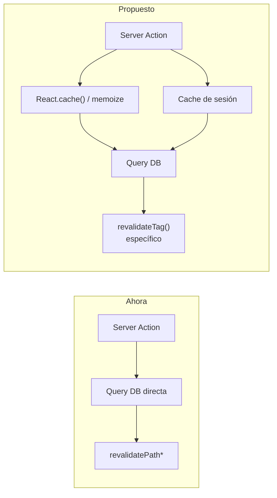
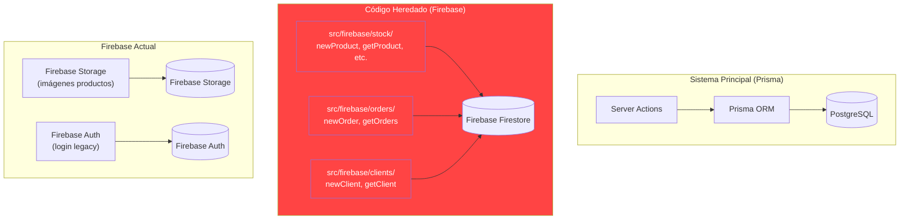
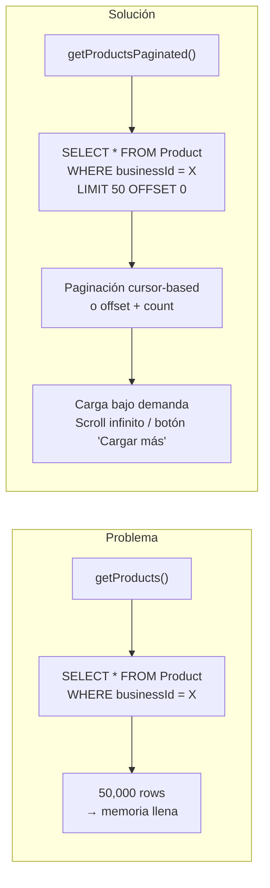
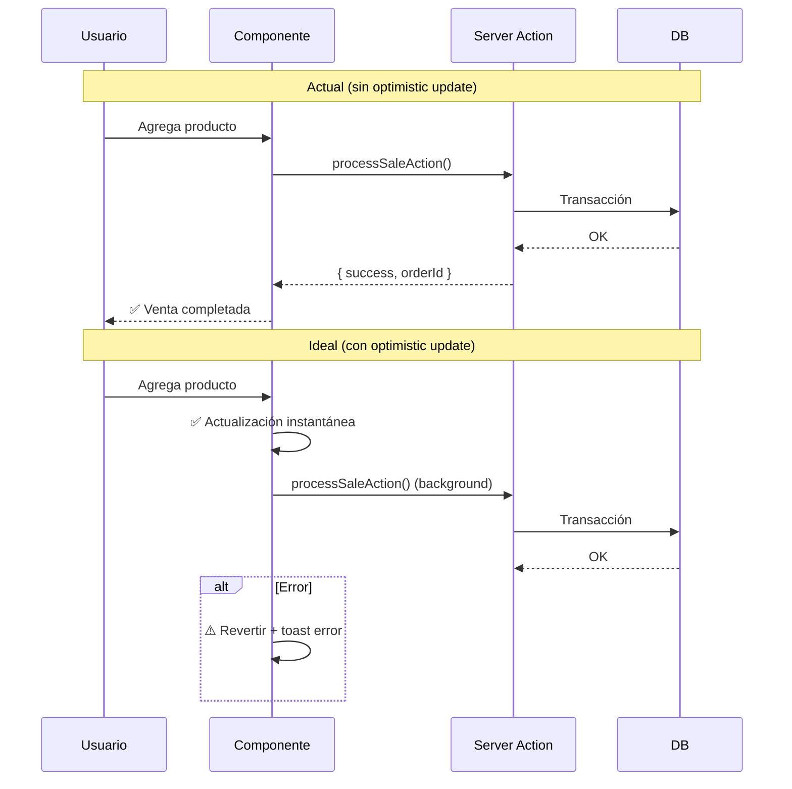
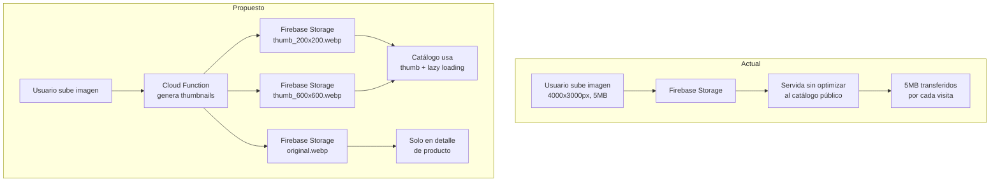
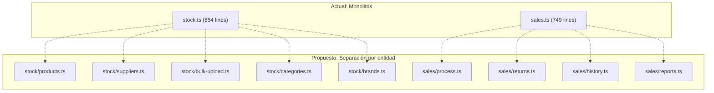
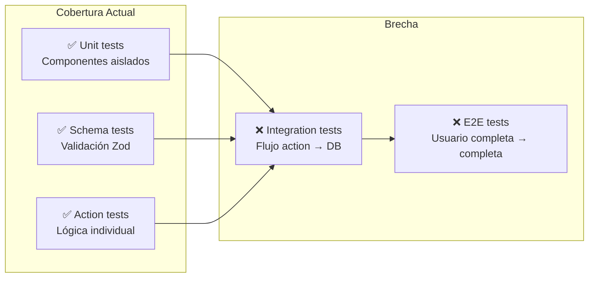

```mermaid
flowchart TD
    subgraph Actual["Actual (secuencial, N queries)"]
        A["Producto 1"] --> B["4-5 queries"]
        B --> C["Producto 2"]
        C --> D["4-5 queries"]
        D --> E["... 1000 productos"]
    end

    subgraph Propuesto["Propuesto (batch optimizado)"]
        F["Fase 1: Colectar"] --> G["Extraer todas las marcas,<br/>categorías del Excel"]
        G --> H["Fase 2: Batch lookup"] --> I["1 query: marcas existentes"]
        I --> J["1 query: categorías existentes"]
        J --> K["1 query: subcategorías existentes"]
        K --> L["Fase 3: Batch upsert"] --> M["Crear marcas faltantes en 1 query"]
        M --> N["Crear categorías faltantes en 1 query"]
        N --> O["Fase 4: Batch upsert productos"]
        O --> P["createMany + skipDuplicates<br/>o upsert por lotes de 100"]
    end
```

# 3. Debilidades y Riesgos (Cons)

> **Issues identificados en el código base.** Cada entrada incluye severidad, localización exacta, impacto y propuesta de mejora.

---

## 🔴 CRÍTICOS — Requieren Atención Inmediata

### C-01. Sin Estrategia de Caché en Server Actions

**Severidad:** 🔴 Crítico  
**Impacto:** Tiempos de carga lentos, DB sobrecargada, UX degradada  
**Localización:** Todas las Server Actions (`src/actions/`)

Cada Server Action:
1. Llama a `auth()` → JWT decode + DB query opcional para refrescar sesión
2. Hace queries directas a PostgreSQL sin caché
3. Llama a `revalidatePath()` de forma agresiva (hasta 5 paths por acción)

```typescript
// En processSaleAction (sales.ts:206-210):
revalidatePath("/stock");
revalidatePath("/cashRegister");
revalidatePath("/account-ledger");
revalidatePath("/report");
revalidatePath("/searchBill");
```

**Propuesta:**


**Acción:**
- Usar `React.cache()` para memoizar llamadas repetidas a `auth()` dentro de un mismo request
- Reemplazar `revalidatePath()` por `revalidateTag()` con tags específicos por dominio
- Implementar Data Cache de Next.js para queries de solo lectura

---

### C-02. Dual Firebase/Prisma — Inconsistencia de Data Sources

**Severidad:** 🔴 Crítico  
**Impacto:** Confusión arquitectónica, posibles inconsistencias  
**Localización:** `src/firebase/` completo, `src/lib/db.ts`, `prisma/schema.prisma`

El proyecto tiene **dos sistemas de persistencia**:

| Sistema | Propósito Actual | Código Heredado |
|---------|------------------|-----------------|
| **Prisma + PostgreSQL** | ORM principal | — |
| **Firebase Firestore** | — | `src/firebase/stock/`, `src/firebase/orders/`, `src/firebase/clients/` |



**Acción:**
- Auditar `src/firebase/` para determinar qué es legacy y qué está activo
- Eliminar código Firebase que duplica funcionalidad de Prisma
- Migrar cualquier funcionalidad activa a Prisma/PostgreSQL
- Mantener Firebase Storage exclusivamente para imágenes

---

### C-03. Server Actions Sin Paginación — Riesgo de Performace en Producción

**Severidad:** 🔴 Crítico  
**Impacto:** Timeouts, OOM, DB lock en negocios con miles de productos/ventas  
**Localización:**

```typescript
// stock.ts:574-588 — Sin paginación
export const getProducts = async () => {
  return await db.product.findMany({ where: { businessId } });
  // Si el negocio tiene 50,000 productos, esto mata la DB
};

// sales.ts:409-462 — Hardcoded take: 1100
export const getSalesAction = async () => {
  const orders = await db.order.findMany({
    where: { businessId, paidStatus: "pago" },
    take: 1100,  // ← hardcoded magic number
  });
};

// stock.ts:664-686 — Hardcoded take: 20
export const getProductsBySearch = async (query) => {
  const products = await db.product.findMany({
    take: 20,  // ← hardcoded
  });
};
```

**Propuesta:**



**Acción:**
- Eliminar `getProducts()` o reemplazarlo por `getProductsPaginated()` en todas las vistas
- Reemplazar `getSalesAction` con paginación cursor-based por fecha
- Mover magic numbers (`take: 20`, `take: 1100`) a constantes configurables

---

### C-04. Procesamiento Secuencial en Carga Masiva

**Severidad:** 🔴 Crítico  
**Impacto:** Carga de Excel extremadamente lenta para lotes grandes  
**Localización:** `src/actions/stock.ts:253-401`

```typescript
// createProductsBulk procesa secuencialmente con for...of:
for (const item of productsData) {
  // 1. Busca/Crea marca → DB query
  // 2. Busca/Crea categoría → DB query
  // 3. Busca/Crea subcategoría → DB query
  // 4. Busca producto existente → DB query
  // 5. Crea o actualiza producto → DB query
  // Total: ~4-5 queries por producto
}
// 1000 productos = 4000-5000 queries secuenciales
```

**Propuesta:**



**Acción:**
- Fase 1: Batch lookup de marcas/categorías existentes
- Fase 2: `createMany` para nuevas marcas/categorías
- Fase 3: Procesar productos en batches de 100 con `$transaction`
- Estimación: 5000 queries → ~50 queries

---

## 🟠 ALTOS — Planificar a Corto Plazo

### C-05. Sin Optimistic Updates en el Carrito

**Severidad:** 🟠 Alto  
**Impacto:** UX lenta, feedback no inmediato al usuario  
**Localización:** `src/context/BillProvider.tsx`, `src/components/Billing/`

Cada interacción con el carrito (agregar producto, cambiar cantidad) requiere roundtrip completo al servidor. No hay actualizaciones optimistas.



**Acción:**
- Actualizar el carrito en UI inmediatamente (estado local)
- Ejecutar Server Action en background
- En caso de error, revertir el estado y mostrar notificación
- Usar `useTransition` para mantener UI responsive

---

### C-06. Imágenes sin Optimización

**Severidad:** 🟠 Alto  
**Impacto:** Tiempos de carga altos, especialmente en catálogo público  
**Localización:** `next.config.ts`, `src/actions/stock.ts`, `src/firebase/config.ts`

```typescript
// next.config.ts — Configuración mínima de imágenes:
images: {
  remotePatterns: [
    { protocol: "https", hostname: "firebasestorage.googleapis.com" },
  ],
}
```

**Problemas:**
1. No se usa `next/image` con optimización para Firebase Storage
2. No hay generación de thumbnails al subir imágenes
3. Las imágenes se sirven en tamaño original
4. Sin lazy loading consistente en galerías



**Acción:**
- Configurar Cloud Function que genere thumbnails WebP al subir
- Usar `next/image` con los tamaños apropiados
- Implementar lazy loading con `loading="lazy"` nativo o IntersectionObserver
- Agregar blur placeholder mientras cargan

---

### C-07. N+1 Queries en Bulk Operations

**Severidad:** 🟠 Alto  
**Impacto:** Consultas innecesarias que degradan performance  
**Localización:** `src/actions/stock.ts:742-744`

```typescript
// bulkUpdatePrices — N+1: fetch individual por producto
const products = await Promise.all(
  productIds.map((id) => db.product.findUnique({ where: { id } }))
);

// Mismo patrón en bulkUpdateAmounts (línea 809):
const products = await Promise.all(
  productIds.map((id) => db.product.findUnique({ where: { id } }))
);
```

**Por qué es N+1:** Aunque usa `Promise.all()` para paralelizar, sigue siendo N queries individuales. Podría ser 1 query con `findMany({ where: { id: { in: productIds } } })`.

**Acción:**
```typescript
// ❌ Actual: N queries
const products = await Promise.all(
  productIds.map((id) => db.product.findUnique({ where: { id } }))
);

// ✅ Propuesto: 1 query
const products = await db.product.findMany({
  where: { id: { in: productIds }, businessId }
});
// Luego mapear products por id para acceso O(1)
const productMap = new Map(products.map(p => [p.id, p]));
```

---

### C-08. Archivos Action Demasiado Grandes

**Severidad:** 🟠 Alto  
**Impacto:** Mantenibilidad, merge conflicts, dificultad de testing  
**Localización:**

| Archivo | Líneas | Funciones |
|---------|--------|-----------|
| `src/actions/stock.ts` | 854 | 15+ funciones |
| `src/actions/sales.ts` | 749 | 10+ funciones |
| `src/actions/cashbox.ts` | 290 | 8 funciones |

**Propuesta de división:**



**Acción:** Dividir `stock.ts` y `sales.ts` en archivos por dominio, idealmente en subdirectorios (`src/actions/stock/`, `src/actions/sales/`).

---

### C-09. Type Safety Débil en Algunas Zonas

**Severidad:** 🟠 Alto  
**Impacto:** Bugs en runtime, pérdida de beneficios de TypeScript  
**Localización:**

```typescript
// cashbox.ts:127 — @ts-expect-error
// @ts-expect-error - NextAuth types might need update
const cashboxId = session?.user?.cashboxId;

// sales.ts:457 — type assertion forzada
return parsedSales as unknown as BillState[];

// sales.ts:508 — otro cast forzado
} as unknown as BillState;

// auth.ts:69 — any
session.user.business = token.business as any;
```

**Acción:**
- Extender los tipos de NextAuth en `src/types/next-auth.d.ts` en lugar de usar `@ts-expect-error`
- Eliminar `as unknown as` — arreglar los tipos de `BillState` para que coincidan con lo que retorna la DB
- Reemplazar `as any` con tipos concretos

---

### C-10. Sin E2E Testing

**Severidad:** 🟠 Alto  
**Impacto:** Flujos críticos (ventas, caja) sin validación integrada  
**Localización:** Falta de `tests/e2e/` o `playwright/`



**Acción:**
- Implementar Playwright para E2E
- Flujos críticos a testear: login → abrir caja → vender → cerrar caja → ver reporte
- Tests de integración con Prisma + test DB

---

## 🟡 MEDIOS — Mejora Continua

### C-11. BillProvider Verboso (20 dispatch functions)

**Severidad:** 🟡 Medio  
**Impacto:** Código boilerplate, difícil de escalar  
**Localización:** `src/context/BillProvider.tsx`

Cada acción del carrito tiene su propia función wrapper:

```typescript
const addItem = (product: Product) => { dispatch({ type: "addItem", payload: product }); };
const addUnit = (product: Product) => { dispatch({ type: "addUnit", payload: product }); };
const removeUnit = (product: Product) => { dispatch({ type: "removeUnit", payload: product }); };
const removeItem = (product: Product) => { dispatch({ type: "removeItem", payload: product }); };
// ... 16 más
```

**Acción:** Reemplazar con un `dispatch` genérico expuesto directamente:

```typescript
// En lugar de 20 funciones:
const dispatchWrapper = (action: BillAction) => dispatch(action);

// En lugar del context value gigante:
const values = { BillState, dispatch: dispatchWrapper };
```

---

### C-12. Error Handling Inconsistente

**Severidad:** 🟡 Medio  
**Impacto:** Dificultad para debuggear, UX de errores variable  
**Localización:** En toda la codebase

Tres patrones diferentes conviven:

```typescript
// Patrón A: throw FeatureAccessError (en auth-gates.ts)
throw new FeatureAccessError("...", "UNAUTHENTICATED");

// Patrón B: return { error: string } (en Server Actions)
return { error: "No autorizado" };
return { error: "Stock insuficiente" };

// Patrón C: return [] / return null silencioso (en getters)
const session = await auth();
if (!session?.user?.businessId) return [];  // ← sin error!
```

**Acción:** Unificar en un solo patrón. Recomendación:

```typescript
// Tipo unificado para todas las Server Actions
type ActionResult<T = void> = 
  | { success: true; data?: T; message?: string }
  | { success: false; error: string; code?: ErrorCode };
```

---

### C-13. Sin Estrategia de CORS/API Rate Limiting

**Severidad:** 🟡 Medio  
**Impacto:** Las Server Actions son públicas, pueden ser abusadas  
**Localización:** Catálogo público (`catalog.ts`), órdenes públicas (`public-orders.ts`)

Las Server Actions del catálogo público no tienen rate limiting:

```typescript
// catalog.ts:20 — Sin protección
export const getPublicProductsByBusinessId = async (businessId: string) => {
  // Cualquiera puede llamar esto sin autenticación
};
```

**Acción:**
- Implementar rate limiting con Upstash o similar
- Validar origin/referer en acciones públicas
- Agregar captcha en formularios públicos (pedidos, registro)

---

### C-14. Bundle Size Potencial

**Severidad:** 🟡 Medio  
**Impacto:** Tiempo de carga inicial alto  
**Localización:** `package.json`

Dependencias pesadas identificadas:

| Paquete | Peso Aprox | Alternativa |
|---------|-----------|-------------|
| `framer-motion` | ~150KB | CSS transitions / `motion` (más ligero) |
| `lucide-react` | ~100KB | Importación tree-shakeable (verificar) |
| `react-icons` | ~50KB | Reemplazar por lucide ya incluido |
| `html2canvas` | ~200KB | Usar solo si es necesario |
| `xlsx` | ~500KB | Carga diferida (dynamic import) |
| `moment` (deprecado) | ~200KB | Migrar completamente a date-fns |
| `jspdf` | ~400KB | Carga diferida |

**Detección de duplicación:** `react-hot-toast` y `sonner` coexisten — ¿por qué dos librerías de toasts?

**Acción:**
- Migrar `moment` a `date-fns` (ya está en package.json)
- Unificar toast: decidir entre `react-hot-toast` y `sonner`
- Dynamic imports para `xlsx`, `jspdf`, `html2canvas`
- Verificar tree-shaking de `lucide-react`

---

### C-15. Middleware de NextAuth Sin Configuración Explícita

**Severidad:** 🟡 Medio  
**Impacto:** Rutas no protegidas correctamente  
**Localización:** `routes.ts`, `auth.config.ts`

El middleware de NextAuth no fue inspeccionado en detalle, pero `routes.ts` y `auth.config.ts` sugieren que la configuración de rutas públicas/protegidas necesita revisión.

**Acción:** Verificar que el middleware proteja:
- Rutas `/(protected)/*` correctamente
- Catálogo público accesible sin auth
- API routes internas no expuestas

---

## 🟢 BAJOS — Cosméticos / Deuda Técnica Menor

### C-16. Tests con happy-dom y jsdom

**Severidad:** 🟢 Bajo  
**Impacto:** Posibles diferencias con navegadores reales

### C-17. Código Legacy Comentado

**Severidad:** 🟢 Bajo  
**Localización:** `newBill/page.tsx:36` — `{/* <SeedButton /> */}`

### C-18. Ausencia de Husky / Pre-commit Hooks

**Severidad:** 🟢 Bajo  
**Impacto:** Calidad de commits inconsistente

---

## Resumen de Cons

| ID | Issue | Severidad | Archivo(s) | Esfuerzo Est. |
|----|-------|-----------|------------|---------------|
| C-01 | Sin caché en Server Actions | 🔴 Crítico | Todas las actions | 2-3 días |
| C-02 | Dual Firebase/Prisma | 🔴 Crítico | `src/firebase/` | 3-5 días |
| C-03 | Queries sin paginación | 🔴 Crítico | `stock.ts`, `sales.ts` | 2-3 días |
| C-04 | Carga masiva secuencial | 🔴 Crítico | `stock.ts` | 1-2 días |
| C-05 | Sin optimistic updates | 🟠 Alto | `BillProvider.tsx` | 2-3 días |
| C-06 | Imágenes sin optimizar | 🟠 Alto | `next.config.ts`, stock | 2-3 días |
| C-07 | N+1 en bulk operations | 🟠 Alto | `stock.ts` | 0.5 días |
| C-08 | Action files muy grandes | 🟠 Alto | `stock.ts`, `sales.ts` | 1-2 días |
| C-09 | Type safety débil | 🟠 Alto | `cashbox.ts`, `sales.ts` | 1 día |
| C-10 | Sin E2E testing | 🟠 Alto | Falta | 3-5 días |
| C-11 | Provider verboso | 🟡 Medio | `BillProvider.tsx` | 0.5 días |
| C-12 | Error handling inconsistente | 🟡 Medio | Toda la app | 1-2 días |
| C-13 | Sin rate limiting | 🟡 Medio | `catalog.ts` | 1-2 días |
| C-14 | Bundle size | 🟡 Medio | `package.json` | 1-2 días |
| C-15 | Middleware sin revisar | 🟡 Medio | `routes.ts` | 0.5 días |
| C-16 | Dual test DOM engines | 🟢 Bajo | `vitest.config.mts` | 0.25 días |
| C-17 | Código comentado | 🟢 Bajo | Varios | 0.25 días |
| C-18 | Sin pre-commit hooks | 🟢 Bajo | Repo root | 0.5 días |
