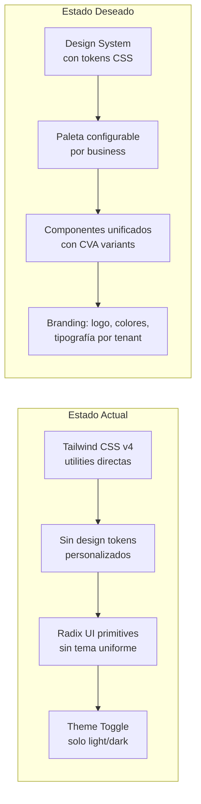
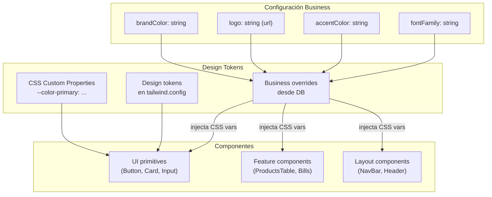
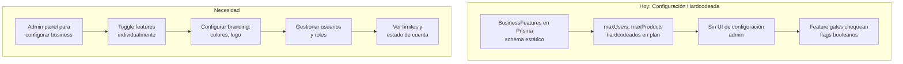
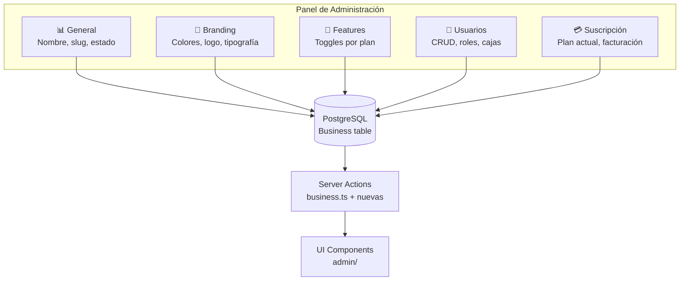
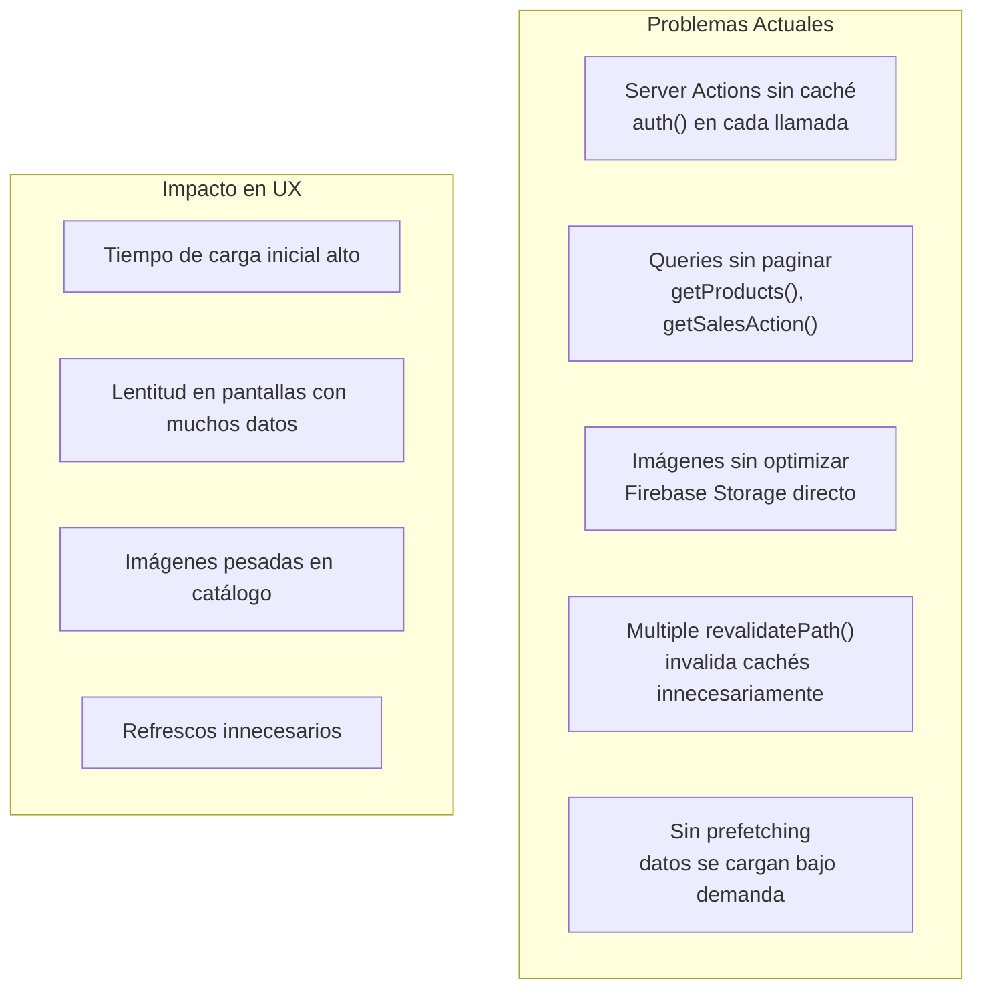
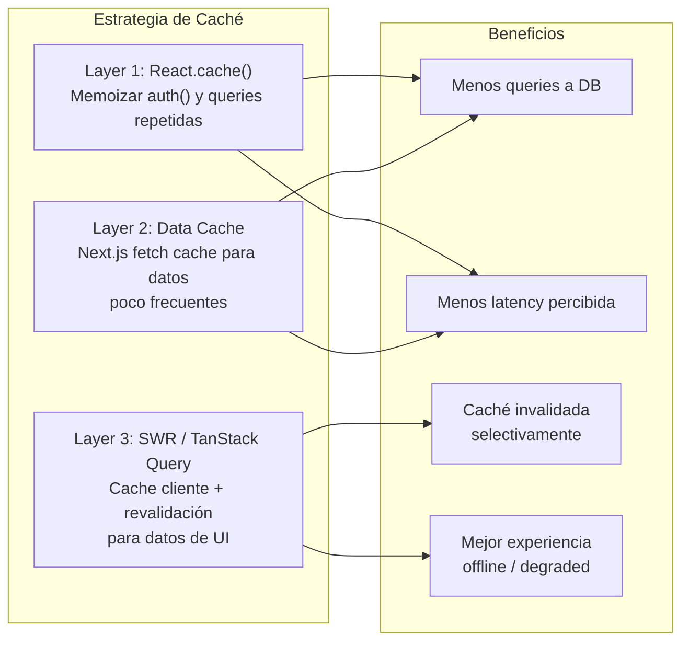
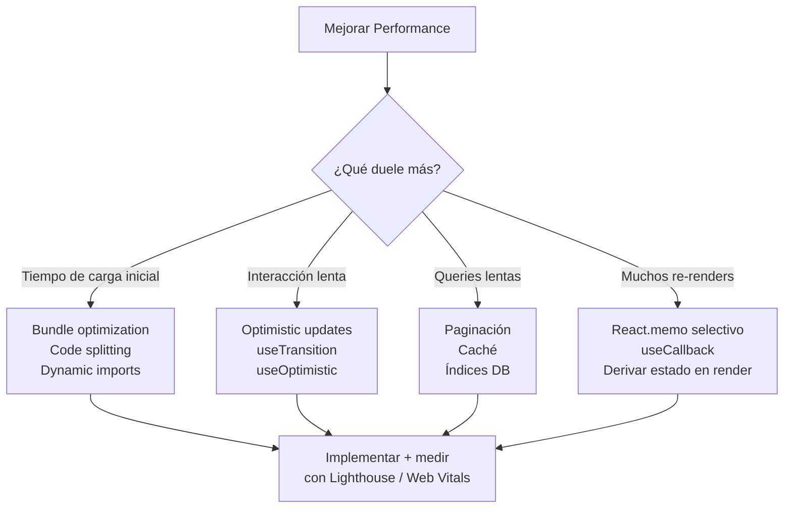
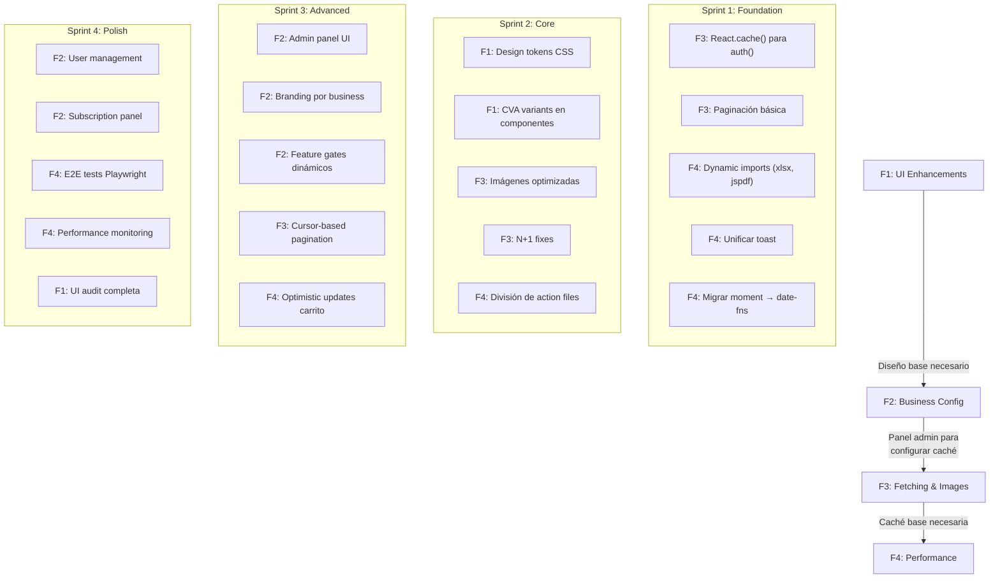

# 4. Análisis de Features Entrantes

> **Evaluación de los features planificados:** UI enhancements, configuración business, fetching/rendimiento, y performance general. Cada feature incluye análisis de impacto, riesgos, aproximación técnica, y relación con los issues de `03-cons.md`.

---

## Resumen

| Feature | Prioridad | Complejidad | Depende de Issues |
|---------|-----------|-------------|-------------------|
| **F1 — UI Enhancements** (minimalist, branding) | Alta | Media | C-11, C-14 |
| **F2 — Business Configuration** (features, branding, access) | Alta | Alta | C-02, C-09 |
| **F3 — Fetching & Images** (tiempos de carga) | Alta | Media | C-01, C-03, C-06, C-07 |
| **F4 — Performance General** | Crítica | Alta | C-01, C-03, C-04, C-07, C-10 |

---

## F1. UI Enhancements — Diseño Minimalista y Branding

### Objetivo

Modernizar la interfaz hacia un diseño minimalista, consistente, con identidad de marca configurable por negocio.

### Estado Actual



### Arquitectura Propuesta



### Implementación

**Fase 1 — Design Tokens Base**
```css
/* globals.css — Design tokens base */
:root {
  --color-primary: #3b82f6;
  --color-primary-foreground: #ffffff;
  --color-accent: #f59e0b;
  --font-family: 'Inter', sans-serif;
  --radius: 0.5rem;
  --spacing-unit: 0.25rem;
}

/* Business overrides via CSS variables in layout */
[data-brand="business-abc"] {
  --color-primary: #7c3aed;
  --color-accent: #10b981;
}
```

**Fase 2 — Componentes con Variants**
```typescript
// Usar CVA (ya en package.json) para variants consistentes
const buttonVariants = cva(
  "inline-flex items-center justify-center rounded-md font-medium transition-colors",
  {
    variants: {
      variant: {
        primary: "bg-[var(--color-primary)] text-[var(--color-primary-foreground)]",
        accent: "bg-[var(--color-accent)] text-white",
        outline: "border border-input bg-background",
      },
      size: {
        sm: "h-9 px-3 text-sm",
        md: "h-10 px-4",
        lg: "h-11 px-8",
      },
    },
  }
);
```

**Fase 3 — Branding por Business**
```typescript
// En el layout, leer configuración del business y aplicar CSS vars
const BusinessLayout = async ({ children }) => {
  const session = await auth();
  const business = await db.business.findUnique({
    where: { id: session?.user?.businessId },
    select: { brandColor: true, logo: true, accentColor: true }
  });
  
  return (
    <div data-brand={session?.user?.businessId}
         style={{ '--color-primary': business?.brandColor } as React.CSSProperties}>
      {children}
    </div>
  );
};
```

### Riesgos y Mitigaciones

| Riesgo | Probabilidad | Mitigación |
|--------|-------------|------------|
| CSS variables no soportadas en Radix | Baja | Radix usa tokens CSS modernos |
| Performance con muchos tenants | Baja | CSS variables son nativas, sin overhead |
| Diseño inconsistente durante migración | Media | Migrar componente por componente |

### Relación con Issues

| Issue | Relación |
|-------|----------|
| **C-11** (BillProvider verboso) | La refactorización del provider simplificará la UI |
| **C-14** (Bundle size) | UI enhancement es oportunidad para reducir bundles |

---

## F2. Business Configuration — Features, Branding, Access

### Objetivo

Panel de administración donde cada negocio configure: features habilitadas, colores de marca, logos, control de acceso por roles.

### Estado Actual



### Modelo de Datos Propuesto

```prisma
// Extensión del modelo Business existente
model Business {
  // ... campos existentes ...
  
  // NUEVOS campos de configuración
  brandColor     String?  @default("#3b82f6")
  accentColor    String?  @default("#f59e0b")
  logo           String?  // ya existe, usar para branding
  timezone       String?  @default("America/Argentina/Buenos_Aires")
  currency       String?  @default("ARS")
  locale         String?  @default("es-AR")
  
  features       BusinessFeatures?
}

// BusinessFeatures puede extenderse
model BusinessFeatures {
  // ... existentes: hasAfipBilling, hasPublicCatalog, etc.
  
  // NUEVOS toggles
  hasDashboardReports   Boolean @default(true)
  hasMultiUser          Boolean @default(false)
  hasApiAccess          Boolean @default(false)
  hasCustomBranding     Boolean @default(false)  // Feature pagado
  
  // Límites configurables
  maxStorageMb          Int     @default(100)
  maxMonthlyTransactions Int    @default(1000)
}
```

### Panel de Administración Propuesto



### Estructura de UI Propuesta

```
src/app/(protected)/admin/
├── page.tsx              # Dashboard admin
├── layout.tsx            # Admin layout con tabs
├── general/
│   └── page.tsx          # Nombre, slug, estado cuenta
├── branding/
│   └── page.tsx          # Colores, logo, preview
├── features/
│   └── page.tsx          # Feature toggles
├── users/
│   ├── page.tsx          # Lista de usuarios (existe)
│   └── [id]/page.tsx     # Editar usuario
└── subscription/
    └── page.tsx          # Plan, límites, historial pagos
```

### Feature Gates Dinámicos

```typescript
// Hook useFeatures actualizado
export const useFeatures = () => {
  // ... existente ...
  
  const hasCustomBranding = hasFeature("hasCustomBranding");
  
  return {
    brandColor: business?.brandColor || "#3b82f6",
    accentColor: business?.accentColor || "#f59e0b",
    canCustomizeBranding: hasCustomBranding && !isDelinquent,
    
    // Gates existentes se mantienen
    hasFeature,
    isPlanAtLeast,
    isOverLimit,
  };
};
```

### Riesgos y Mitigaciones

| Riesgo | Probabilidad | Mitigación |
|--------|-------------|------------|
| Migración de schema requiere downtime | Media | Usar Prisma sin `@@map` conflictos, deploy blue-green |
| Configuración inválida rompe UI | Media | Validar con Zod antes de guardar, fallbacks en UI |
| Permisos incorrectos exponen features | Alta | Server-side validation SIEMPRE, UI es solo cosmética |

### Relación con Issues

| Issue | Relación |
|-------|----------|
| **C-02** (Dual Firebase) | La configuración business debe centralizarse en Prisma |
| **C-09** (Type safety) | Tipos para configuración deben ser estrictos |

---

## F3. Fetching & Images — Tiempos de Carga

### Objetivo

Reducir tiempos de carga de la aplicación: optimizar fetching de datos, servir imágenes optimizadas, implementar estrategias de caché.

### Diagnóstico



### Estrategia de Optimización



### Implementación Detallada

#### 1. React.cache() para auth()

```typescript
// lib/auth.ts
import { cache } from "react";

export const getSession = cache(async () => {
  return await auth();
});

// En las Server Actions:
// Antes: const session = await auth();
// Después: const session = await getSession();
// Segundas llamadas en el mismo request usan caché
```

#### 2. Data Cache con Tags

```typescript
// stock.ts
export const getProductsPaginated = async (params) => {
  // Cache con tag específico
  const products = await db.product.findMany({
    where: { businessId, ...filters },
    skip,
    take: pageSize,
  });
  // No necesita next: { tags } porque Prisma no es fetch nativo
  // Alternativa: usar unstable_cache
};

// En lugar de revalidatePath("/stock"):
revalidateTag(`products-${businessId}`);
revalidateTag(`products-count-${businessId}`);
```

#### 3. Optimización de Imágenes

```typescript
// next.config.ts — Configuración mejorada
images: {
  remotePatterns: [
    {
      protocol: "https",
      hostname: "firebasestorage.googleapis.com",
      pathname: "/v0/b/**",
    },
  ],
  formats: ["image/webp", "image/avif"],
  deviceSizes: [320, 480, 640, 750, 1080],
},

// Cloud Function (Firebase) para generar thumbnails
// Al subir imagen:
// 1. Subir original a /products/{id}/original.webp
// 2. Cloud Function resize → thumb_200.webp, thumb_600.webp
// 3. Guardar URLs en ProductImage.url diferenciadas

// Componente Image optimizado:
import Image from "next/image";

<ProductImage
  src={product.images?.[0]?.url || "/placeholder.png"}
  alt={product.description || ""}
  width={200}
  height={200}
  loading="lazy"
  sizes="(max-width: 768px) 100vw, (max-width: 1200px) 50vw, 200px"
/>
```

#### 4. Paginación Cursor-based

```typescript
// En lugar de offset pagination, usar cursor-based para grandes datasets
export const getOrdersCursorPaginated = async ({
  businessId,
  cursor,      // Último id o fecha
  limit = 50,
}) => {
  const orders = await db.order.findMany({
    where: { businessId },
    take: limit + 1,  // +1 para saber si hay más
    cursor: cursor ? { id: cursor } : undefined,
    orderBy: { date: "desc" },
  });
  
  const hasMore = orders.length > limit;
  const items = hasMore ? orders.slice(0, limit) : orders;
  const nextCursor = hasMore ? items[items.length - 1].id : null;
  
  return { items, nextCursor, hasMore };
};
```

### Métricas Objetivo

| Métrica | Actual (est.) | Target |
|---------|--------------|--------|
| Tiempo carga inicial (productos) | 2-5s | < 1s |
| Tiempo carga catálogo público | 3-8s | < 1.5s |
| Imágenes cargadas | 5MB c/u | 50-200KB (WebP thumbnail) |
| Queries DB por página | 10-20 | < 5 |
| Revalidaciones por acción | 5 paths | 1-2 tags |

### Relación con Issues

| Issue | Relación |
|-------|----------|
| **C-01** (Sin caché) | Resuelto directamente |
| **C-03** (Sin paginación) | Resuelto con cursor-based |
| **C-06** (Imágenes sin optimizar) | Resuelto con next/image + thumbnails |
| **C-07** (N+1 queries) | Resuelto con batch queries |

---

## F4. Performance General

### Objetivo

Mejora integral del rendimiento: bundle size, re-renders, Server Actions eficientes, lazy loading, y E2E testing de performance.

### Árbol de Decisiones



### Plan de Acción por Prioridad

#### Semana 1-2: Quick Wins

| Acción | Impacto | Esfuerzo |
|--------|---------|----------|
| Reemplazar `moment` por `date-fns` | Bundle -200KB | 1 día |
| Dynamic imports para `xlsx`, `jspdf`, `html2canvas` | Bundle -900KB | 1 día |
| Unificar toast: eliminar `react-hot-toast` o `sonner` | Bundle -30KB | 0.5 día |
| Agregar loading states con Suspense | UX | 1 día |

#### Semana 3-4: Performance Medio

| Acción | Impacto | Esfuerzo |
|--------|---------|----------|
| Paginación cursor-based en ventas y productos | Queries | 2-3 días |
| React.cache() para auth() | Queries repetidas | 0.5 día |
| N+1 fix en bulkUpdatePrices y bulkUpdateAmounts | Queries | 0.5 día |
| Imágenes optimizadas con next/image | Carga | 2 días |

#### Semana 5-6: Performance Profundo

| Acción | Impacto | Esfuerzo |
|--------|---------|----------|
| Optimistic updates en carrito | UX | 3 días |
| Caché con revalidateTag() | Revalidación | 2 días |
| División de action files grandes | Mantenibilidad | 2 días |
| E2E tests de flujos críticos | Calidad | 3 días |

### Bundle Size Roadmap

```mermaid
flowchart LR
    subgraph Hoy["Hoy ~2.5MB JS"]
        M["moment (200KB)"]
        XL["xlsx (500KB)"]
        JP["jspdf (400KB)"]
        H2C["html2canvas (200KB)"]
        FM["framer-motion (150KB)"]
        RI["react-icons (50KB)"]
        HT["react-hot-toast + sonner (30KB)"]
        Other["Otro (~1MB)"]
    end

    subgraph Target["Target ~1.2MB JS"]
        M2["→ date-fns (0KB tree-shaken)"]
        XL2["→ dynamic import xlsx"]
        JP2["→ dynamic import jspdf"]
        H2C2["→ dynamic import html2canvas"]
        FM2["→ CSS transitions / motion (50KB)"]
        RI2["→ eliminar (usar lucide)"]
        HT2["→ sonner only (15KB)"]
        Other2["Otro (~1MB)"]
    end

    Hoy -->|"Eliminar dynamic imports"| Target
```



### Web Vitals Targets

| Métrica | Estado Actual | Target | Herramienta |
|---------|--------------|--------|-------------|
| **LCP** (Largest Contentful Paint) | ~3-4s | < 2.0s | Lighthouse |
| **FID** (First Input Delay) | ~150ms | < 100ms | Lighthouse |
| **CLS** (Cumulative Layout Shift) | ~0.15 | < 0.1 | Lighthouse |
| **TTI** (Time to Interactive) | ~4-5s | < 2.5s | Web Vitals |
| **Bundle JS inicial** | ~2.5MB | < 1.2MB | next/bundle-analyzer |
| **Queries por página** | 10-20 | < 5 | Prisma logging |

### Relación con Issues

| Issue | Relación |
|-------|----------|
| **C-01** (Sin caché) | Resuelto en F4 |
| **C-03** (Sin paginación) | Resuelto en F4 |
| **C-04** (Carga masiva lenta) | Resuelto parcial, requiere refactor específico |
| **C-07** (N+1) | Resuelto en F4 |
| **C-10** (Sin E2E) | Resuelto en F4 con tests de performance |
| **C-14** (Bundle size) | Resuelto en F4 |

---

## Roadmap Integrado

### Dependencias entre Features



### Estimación Total

| Sprint | Duración | Features | Issues Resueltos |
|--------|----------|----------|------------------|
| Sprint 1 | 2 semanas | F3, F4 partial | C-01, C-07, C-14 |
| Sprint 2 | 2 semanas | F1, F3, F4 | C-03, C-06, C-08 |
| Sprint 3 | 3 semanas | F2, F3, F4 | C-02, C-05, C-09 |
| Sprint 4 | 2 semanas | F2, F4 | C-10, C-11, C-12 |

**Total estimado: 9 semanas (~2 meses)**

### Riesgos Globales del Roadmap

| Riesgo | Impacto | Probabilidad | Mitigación |
|--------|---------|-------------|------------|
| Breaking changes de Next.js 16 | Alto | Media | Mantener Next.js actualizado semanalmente |
| ARCA/AFIP cambia API | Alto | Alta | Abstraer integración fiscal con adapter pattern |
| Firebase/Prisma dual no se resuelve | Alto | Media | Roadmap incluye migración completa a Prisma |
| Performance no mejora como esperado | Medio | Baja | Medir con Lighthouse cada sprint |
