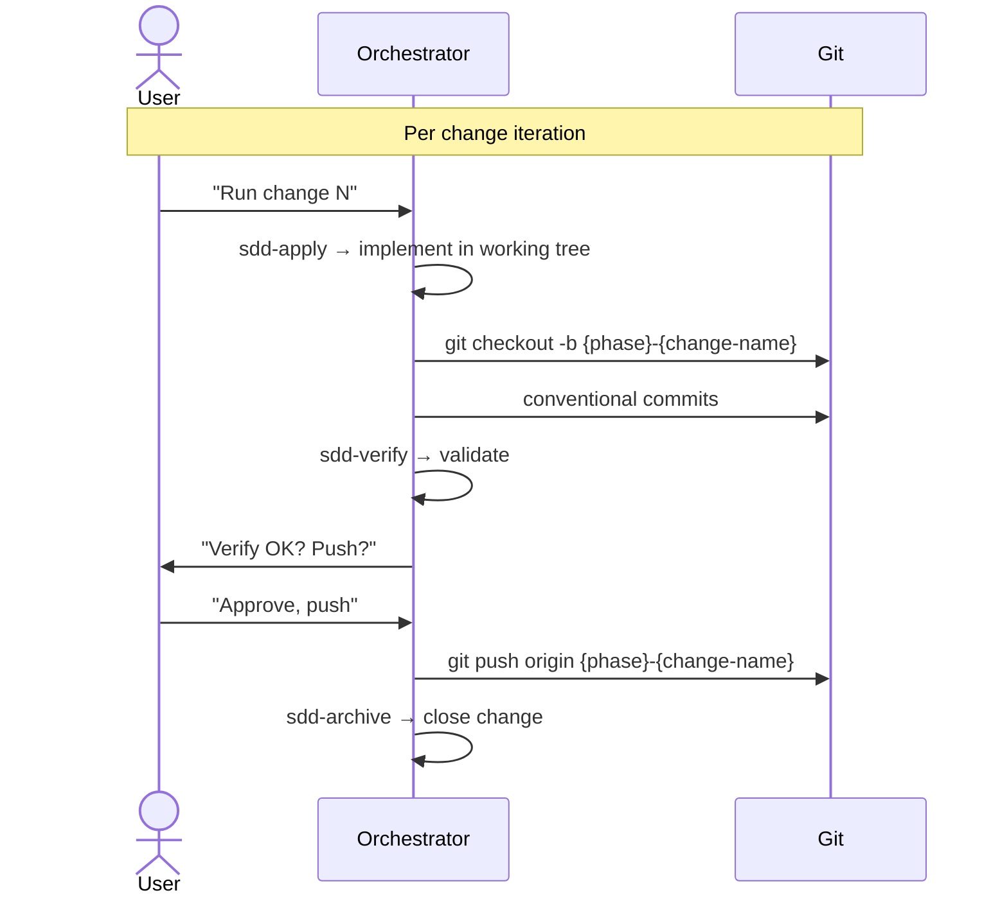

# Master Enhancement Plan — Design

## Architecture Decisions

### AD-01: Iterative by Phase, Sequential Within Phase
**Decision**: Execute phases sequentially. Within a phase, changes MAY run in parallel if they don't share files.
**Rationale**: Later phases depend on earlier ones (e.g., caching requires pagination first). Parallel changes within a phase avoid conflicts.
**Tradeoff**: Longer total time but safer and easier to review.

### AD-02: Each Issue = One SDD Change
**Decision**: Each C-## or F# issue becomes an independent SDD change with its own branch.
**Rationale**: Review isolation, clean git history, ability to skip/rollback individual changes.
**Tradeoff**: More branches, more PRs — but each is small and focused.

### AD-03: Hybrid Persistence
**Decision**: All SDD artifacts persist to BOTH openspec (files) AND Engram (memory).
**Rationale**: Files for team sharing and git history; Engram for cross-session recovery.
**Tradeoff**: Higher token cost per operation, but necessary for this scale of work.

### AD-04: Branch per Change, Conventional Commits
**Decision**: Branch = `{phase}-{change-name}`, commits use conventional commits scoped to change.
**Rationale**: Clean git history, easy rollback, automatic changelog generation.
**Tradeoff**: No atomic multi-change branches, but changes are small enough.

### AD-05: Pre-commit Quality Gates (Phase 1)
**Decision**: TypeScript check + lint + test run on every commit starting Phase 1 Change 1.3.
**Rationale**: Catch regressions early, enforce quality from the start.

## Change Template

Every change within the plan follows this structure:

```
openspec/changes/{change-name}/
├── state.yaml           <- DAG state
├── proposal.md          <- Problem + Solution
├── specs/
│   └── {domain}/
│       └── spec.md      <- Detailed requirements
├── design.md            <- Technical approach
├── tasks.md             <- Implementation checklist
└── verify-report.md     <- Created by sdd-verify
```

And in Engram:
```
title:     "sdd/{change-name}/proposal"
topic_key: "sdd/{change-name}/proposal"
title:     "sdd/{change-name}/spec"
topic_key: "sdd/{change-name}/spec"
... etc.
```

## Branch Workflow



## File Ownership Map

| Change | Files Touched | Risk |
|--------|--------------|------|
| dead-code-removal | *.ts, *.tsx | Low — deletions only |
| error-handling-unification | src/actions/*.ts | Medium — signature changes |
| pre-commit-hooks | package.json, root config | Low — infra only |
| test-dom-unification | vitest.config.mts | Low — config change |
| bundle-optimization | package.json, imports | Medium — functional impact |
| n-plus-one-fixes | src/actions/stock.ts | Low — query optimization |
| billprovider-refactor | src/context/BillProvider.tsx | Low — internal refactor |
| pagination-strategy | src/actions/*.ts | High — API signature changes |
| type-safety | src/types/*, auth.ts, etc. | Low — type-only changes |
| action-files-split | src/actions/ | Medium — import changes |
| bulk-upload-performance | src/actions/stock.ts | Medium — logic change |
| server-actions-caching | src/lib/auth.ts, actions/* | High — caching behavior |
| image-optimization | next.config.ts, components | Medium — visual change |
| middleware-review | routes.ts, auth.config.ts | High — auth security |
| rate-limiting | catalog.ts, public-orders.ts | Medium — new dependency |
| e2e-tests | tests/e2e/* | Low — new files only |
| firebase-migration | src/firebase/** | High — data layer changes |
| optimistic-updates | BillProvider, BillButtons | Medium — UX pattern change |
| ui-enhancements | globals.css, components/ui | Medium — visual change |
| business-configuration | Prisma schema, admin/* | High — schema migration |
| fetching-performance | Multiple | Medium — optimization |
| overall-performance | Global | Low — tuning |
