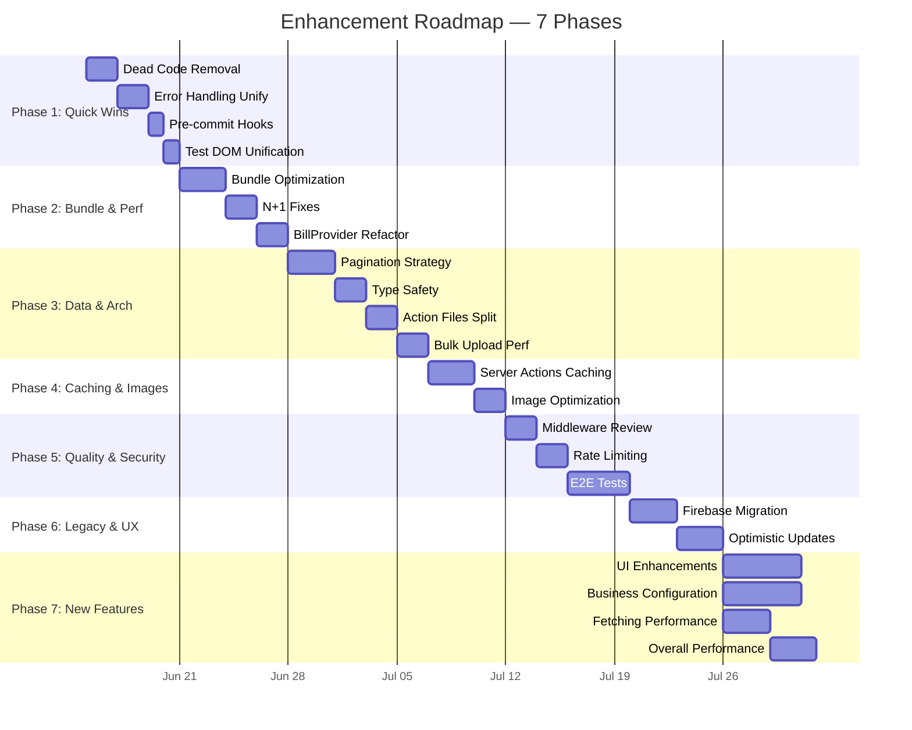
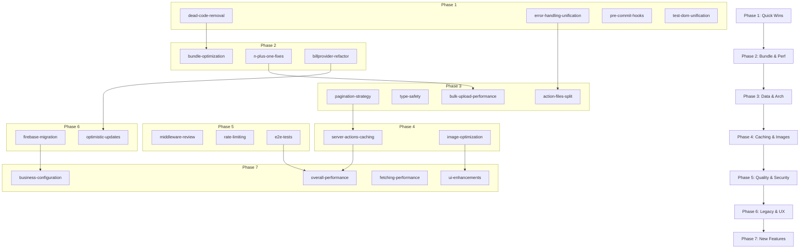

# Master Enhancement Plan — Proposal

## Problem Statement

The POS-Template codebase was analyzed in `docs/enhancements/` and 18 distinct issues were identified (C-01 through C-18), plus 4 incoming feature requirements (F1-F4). These range from CRITICAL (no caching strategy, dual persistence, un-paginated queries) to LOW (dead code, missing pre-commit hooks).

Without a structured plan, fixes will be applied ad-hoc, risking regressions, duplicated effort, and missed dependencies between issues.

## Proposed Solution

A **7-phase iterative plan** where each issue is treated as an SDD change with proposal → spec → design → tasks → apply → verify → archive. Changes are grouped into phases by dependency and impact.

## Affected Modules

| Module | Issues |
|--------|--------|
| All Server Actions (`src/actions/`) | C-01, C-03, C-07, C-08, C-09, C-12 |
| Firebase (`src/firebase/`) | C-02, C-17 |
| Context (`src/context/`) | C-05, C-11 |
| Components (`src/components/`) | C-05, C-06, F1 |
| Config (`next.config.ts`, `package.json`) | C-06, C-14 |
| Testing (`src/__tests__/`) | C-10, C-16 |
| Security/Infra | C-13, C-15, C-18 |
| New Features | F1, F2, F3, F4 |

## Plan Overview



## Dependency Graph



## Branch Strategy

Each change in every phase will be developed in its own branch following:
```
{phase-number}-{change-name}
```

Example: `1-dead-code-removal`, `3-pagination-strategy`

Conventional commits scoped by change name:
- `feat(actions): add ActionResult<T> unified return type`
- `fix(stock): batch queries in bulkUpdatePrices`
- `refactor(billing): simplify dispatch pattern in BillProvider`
- `chore(deps): remove moment, add dynamic imports`
- `test(e2e): add Playwright for sale flow`
- `docs(enhancements): archive phase report`

## Total Estimate

| Phase | Changes | Est. Duration |
|-------|---------|---------------|
| 1 — Quick Wins | 4 | ~6 days |
| 2 — Bundle & Perf | 3 | ~7 days |
| 3 — Data & Arch | 4 | ~9 days |
| 4 — Caching & Images | 2 | ~5 days |
| 5 — Quality & Security | 3 | ~8 days |
| 6 — Legacy & UX | 2 | ~6 days |
| 7 — New Features | 4 | ~16 days |
| **Total** | **22** | **~57 days** |

## Rollback Plan

If any change introduces regressions:
1. Revert the feature branch (`git revert`)
2. Document what failed in the change's archive report
3. Create a follow-up change with the fix

## Risks

| Risk | Impact | Mitigation |
|------|--------|------------|
| Firebase migration breaks existing features | High | Phase 6, after all tests are in place |
| Caching introduces stale data | Medium | Short TTLs, revalidateTag() granular |
| UI redesign hurts productivity | Medium | CSS variables first, no layout changes in Phase 7 |
