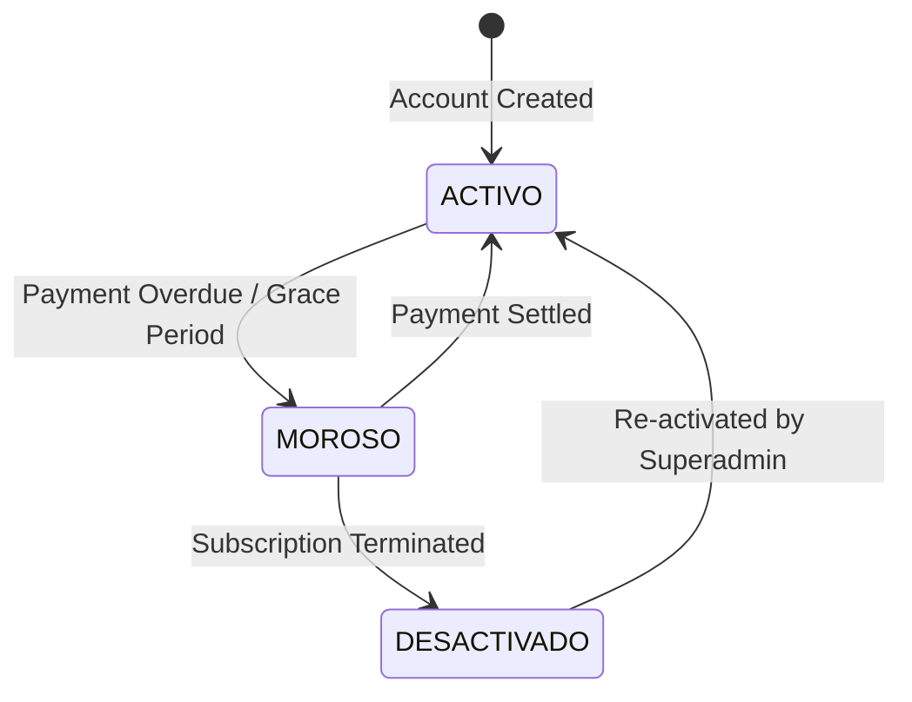
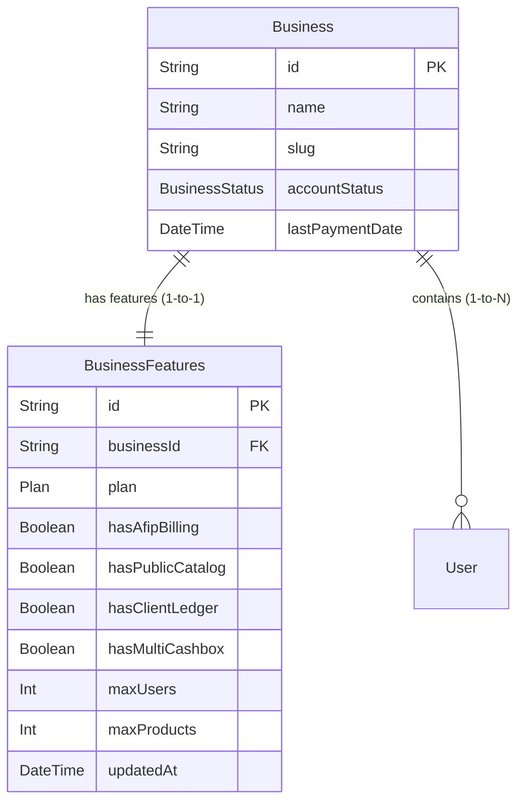
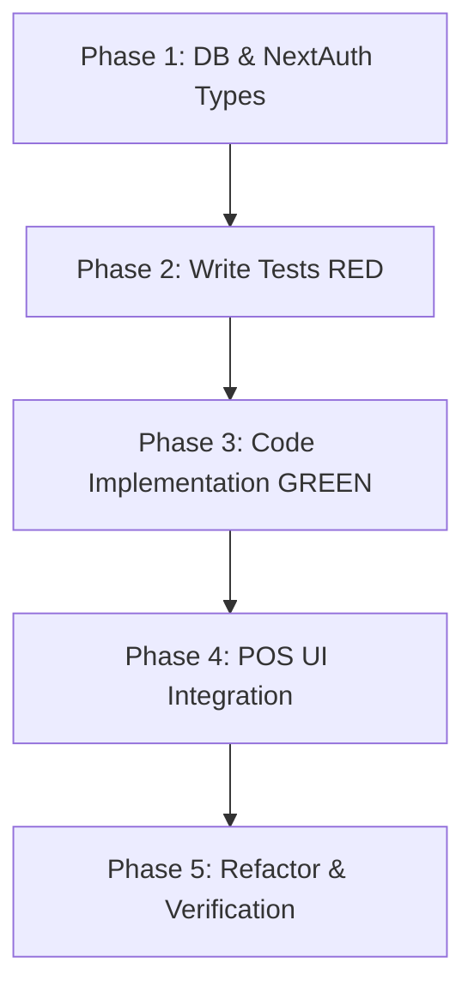

# Multi-Tier Subscription & Modular Feature System: Technical Specification

This document provides a highly detailed, premium-grade technical specification for implementing a robust, multi-tier subscription plan and granular modular feature gating system within the POS Template.

It is designed to serve as a comprehensive blueprint for developers and agentic workflows, adhering to **Test-Driven Development (TDD)** principles as defined in `AGENTS.md`.

---

## 1. Feature Overview & Architecture

The subscription architecture decouples the high-level plan definition from specific feature permissions. This allows the system to offer standard plans (**BASIC**, **PRO**, **ENTERPRISE**) while remaining flexible enough to toggle individual features or alter limits for a specific business (e.g., custom billing contracts or grandfathered tiers).

### 1.1 Subscription Plans & Gating Matrix
Each plan acts as a template defining a set of default capabilities:

| Plan / Feature | BASIC | PRO | ENTERPRISE |
| :--- | :---: | :---: | :---: |
| **Price / Period** | Free / Entry | Premium Monthly | Customized Enterprise |
| **Max Users Limit** | `1` | `5` | `9999` (Unlimited) |
| **Max Products Limit** | `100` | `1000` | `99999` (Unlimited) |
| **AFIP Electronic Billing** (`hasAfipBilling`) | ❌ No | ❌ No |  Yes |
| **Public Web Catalog** (`hasPublicCatalog`) | ❌ No |  Yes |  Yes |
| **Client Credit Ledger** (`hasClientLedger`) | ❌ No |  Yes |  Yes |
| **Multi-Cashbox Management** (`hasMultiCashbox`) | ❌ No | ❌ No |  Yes |

### 1.2 Business Status & Delinquency Logic
The system tracks the payment health of a business through the `accountStatus` field (defined in `BusinessStatus` enum):



*   **`ACTIVO`**: Full access to all features and limits included in the subscription plan.
*   **`MOROSO` (Delinquent)**:
    *   **Read-Only Integrity**: Access to dashboard remains open. View current products, orders, and sales history.
    *   **Write Restriction**: Creation of **new** orders, product listings, suppliers, or cashbox movements is strictly blocked.
    *   **Notification Banner**: A persistent, red premium global header alert encourages the user to settle the pending balance.
*   **`DESACTIVADO`**:
    *   **Total Lockout**: Session is invalidated upon check; login attempts are refused with an explicit error screen redirecting to billing/support.

---

## 2. Database Schema Changes

To store subscription plan information and granular toggles cleanly, a 1-to-1 relation model `BusinessFeatures` is introduced. This keeps the core `Business` model lean and segregates operational feature gates.

### 2.1 Prisma Schema Diagram



### 2.2 Prisma Schema Additions (`prisma/schema.prisma`)

Add the following structures to `prisma/schema.prisma`:

```prisma
enum Plan {
  BASIC
  PRO
  ENTERPRISE
}

model BusinessFeatures {
  id                String   @id @default(cuid())
  businessId        String   @unique
  business          Business @relation(fields: [businessId], references: [id], onDelete: Cascade)
  
  plan              Plan     @default(BASIC)
  
  // Feature Toggles
  hasAfipBilling    Boolean  @default(false)
  hasPublicCatalog  Boolean  @default(false)
  hasClientLedger   Boolean  @default(false)
  hasMultiCashbox   Boolean  @default(false)
  
  // Operational Limits
  maxUsers          Int      @default(1)
  maxProducts       Int      @default(100)
  
  updatedAt         DateTime @updatedAt

  @@index([businessId])
}
```

> [!IMPORTANT]
> Make sure to add a corresponding one-to-one relation field inside the existing `Business` model:
> ```prisma
> model Business {
>   // ... existing fields ...
>   features         BusinessFeatures?
> }
> ```

---

## 3. NextAuth Extension & Session Hydration

To prevent excessive, slow database queries on every server component render or server action call, the active subscription details, toggles, limits, and delinquency status are hydrated directly into the user session using NextAuth v5 callbacks.

### 3.1 NextAuth Session Interface Extensions (`src/types/next-auth.d.ts`)

Create or extend `src/types/next-auth.d.ts`:

```typescript
import NextAuth, { DefaultSession, DefaultUser } from "next-auth";
import { JWT as DefaultJWT } from "next-auth/jwt";
import { Plan, BusinessStatus } from "@prisma/client";

declare module "next-auth" {
  interface Session {
    user: {
      id: string;
      role: string;
      businessId: string;
      business: {
        name: string;
        slug: string;
        accountStatus: BusinessStatus;
        features: {
          plan: Plan;
          hasAfipBilling: boolean;
          hasPublicCatalog: boolean;
          hasClientLedger: boolean;
          hasMultiCashbox: boolean;
          maxUsers: number;
          maxProducts: number;
        };
      };
    } & DefaultSession["user"];
  }

  interface User extends DefaultUser {
    role: string;
    businessId: string;
  }
}

declare module "next-auth/jwt" {
  interface JWT extends DefaultJWT {
    role: string;
    businessId: string;
    business: Session["user"]["business"];
  }
}
```

### 3.2 NextAuth Configuration & Callback Hydration (`src/lib/auth-config.ts` or `src/app/api/auth/[...nextauth]/route.ts`)

Integrate these callbacks in your NextAuth structure to load features dynamically from the database and hydrate JWT:

```typescript
import { db } from "@/lib/db";
import { Plan, BusinessStatus } from "@prisma/client";

export const authOptions = {
  callbacks: {
    async jwt({ token, user, trigger, session }) {
      // On initial sign-in, load User and Business information from DB
      if (user) {
        token.role = user.role;
        token.businessId = user.businessId;

        // Fetch business status and features
        const business = await db.business.findUnique({
          where: { id: user.businessId },
          select: {
            name: true,
            slug: true,
            accountStatus: true,
            features: {
              select: {
                plan: true,
                hasAfipBilling: true,
                hasPublicCatalog: true,
                hasClientLedger: true,
                hasMultiCashbox: true,
                maxUsers: true,
                maxProducts: true,
              }
            }
          }
        });

        if (business) {
          token.business = {
            name: business.name,
            slug: business.slug,
            accountStatus: business.accountStatus,
            features: business.features || {
              plan: Plan.BASIC,
              hasAfipBilling: false,
              hasPublicCatalog: false,
              hasClientLedger: false,
              hasMultiCashbox: false,
              maxUsers: 1,
              maxProducts: 100,
            }
          };
        }
      }

      // Handle custom session updates (e.g. if superadmin modifies features in real-time)
      if (trigger === "update" && session?.business) {
        token.business = { ...token.business, ...session.business };
      }

      return token;
    },
    async session({ session, token }) {
      if (token && session.user) {
        session.user.id = token.sub as string;
        session.user.role = token.role;
        session.user.businessId = token.businessId;
        session.user.business = token.business;
      }
      return session;
    }
  }
};
```

---

## 4. Server-Side Gates (Actions Security)

A security utility layer at `src/lib/auth-gates.ts` provides clean, reusable server-side middleware checking. These helpers throw clear, typed errors to intercept unauthorized modifications inside Server Actions.

### 4.1 Security Gates Library (`src/lib/auth-gates.ts`)

```typescript
import { auth } from "@/lib/auth"; // Your NextAuth auth() function
import { Plan, BusinessStatus } from "@prisma/client";

export class FeatureAccessError extends Error {
  constructor(message: string, public code: "FORBIDDEN" | "LIMIT_EXCEEDED" | "DELINQUENT" | "UNAUTHENTICATED") {
    super(message);
    this.name = "FeatureAccessError";
  }
}

/**
 * Validates session and returns the user's business context.
 * Throws UNAUTHENTICATED if session is missing.
 */
export async function getAuthenticatedContext() {
  const session = await auth();
  if (!session?.user || !session.user.businessId) {
    throw new FeatureAccessError("Debes iniciar sesión para realizar esta acción.", "UNAUTHENTICATED");
  }
  
  const status = session.user.business.accountStatus;
  if (status === "DESACTIVADO") {
    throw new FeatureAccessError("Tu cuenta ha sido desactivada. Contacta al soporte técnico.", "FORBIDDEN");
  }
  
  return session.user;
}

/**
 * Asserts the business is active. Throws DELINQUENT if MOROSO for write actions.
 */
export async function assertWritePermission() {
  const user = await getAuthenticatedContext();
  if (user.business.accountStatus === "MOROSO") {
    throw new FeatureAccessError("Acción bloqueada. Tu cuenta posee facturas vencidas impagas.", "DELINQUENT");
  }
  return user;
}

/**
 * Asserts that a modular toggle is enabled.
 */
export async function requireFeature(featureKey: "hasAfipBilling" | "hasPublicCatalog" | "hasClientLedger" | "hasMultiCashbox") {
  const user = await getAuthenticatedContext();
  const features = user.business.features;
  
  if (!features[featureKey]) {
    throw new FeatureAccessError("Esta función no está habilitada en tu plan actual.", "FORBIDDEN");
  }
  return user;
}

/**
 * Asserts plan-based hierarchy limits (alternative checks).
 */
export async function requirePlan(allowedPlans: Plan[]) {
  const user = await getAuthenticatedContext();
  const currentPlan = user.business.features.plan;
  
  if (!allowedPlans.includes(currentPlan)) {
    throw new FeatureAccessError("Esta acción requiere un plan superior.", "FORBIDDEN");
  }
  return user;
}

/**
 * Asserts that a creation request conforms to operational limit constraints.
 */
export async function assertLimit(limitKey: "maxUsers" | "maxProducts", currentCount: number) {
  const user = await getAuthenticatedContext();
  const limit = user.business.features[limitKey];
  
  if (currentCount >= limit) {
    throw new FeatureAccessError(
      `Has superado el límite permitido de ${limitKey === "maxProducts" ? "productos" : "usuarios"} (${limit}). Mejora tu plan.`,
      "LIMIT_EXCEEDED"
    );
  }
  return user;
}
```

### 4.2 Pattern Applications inside Server Actions

Here is how these gates are applied to guard server actions.

#### Catalog Actions (`src/actions/catalog.ts`)
```typescript
"use server";

import { db } from "@/lib/db";
import { assertWritePermission, assertLimit } from "@/lib/auth-gates";
import { revalidatePath } from "next/cache";

export async function createProductAction(data: any) {
  try {
    const user = await assertWritePermission(); // Blocks delinquent status
    
    // Check product limits before creation
    const currentProductsCount = await db.product.count({
      where: { businessId: user.businessId }
    });
    await assertLimit("maxProducts", currentProductsCount);
    
    const newProduct = await db.product.create({
      data: {
        ...data,
        businessId: user.businessId
      }
    });
    
    revalidatePath("/dashboard/catalog");
    return { success: true, data: newProduct };
  } catch (error: any) {
    return { success: false, error: error.message };
  }
}
```

#### AFIP Billing Actions (`src/actions/afip.ts`)
```typescript
"use server";

import { requireFeature, assertWritePermission } from "@/lib/auth-gates";

export async function createAfipInvoiceAction(orderId: string) {
  try {
    await assertWritePermission();
    await requireFeature("hasAfipBilling"); // Strict modular block
    
    // Core AFIP electronic billing registration logic goes here
    return { success: true, invoiceNumber: "0004-00001234" };
  } catch (error: any) {
    return { success: false, error: error.message };
  }
}
```

#### Multi-Cashbox Actions (`src/actions/cashbox.ts`)
```typescript
"use server";

import { requireFeature, assertWritePermission } from "@/lib/auth-gates";
import { db } from "@/lib/db";

export async function createCashboxAction(name: string) {
  try {
    const user = await assertWritePermission();
    await requireFeature("hasMultiCashbox"); // Blocks unless Enterprise
    
    const newCashbox = await db.cashBox.create({
      data: {
        name,
        businessId: user.businessId
      }
    });
    
    return { success: true, data: newCashbox };
  } catch (error: any) {
    return { success: false, error: error.message };
  }
}
```

#### Client Ledger Operations (`src/actions/orders.ts`)
```typescript
"use server";

import { requireFeature, assertWritePermission } from "@/lib/auth-gates";
import { db } from "@/lib/db";

export async function chargeToClientLedgerAction(orderId: string, clientId: string) {
  try {
    await assertWritePermission();
    await requireFeature("hasClientLedger");
    
    // Core ledger balance updating logic...
    return { success: true };
  } catch (error: any) {
    return { success: false, error: error.message };
  }
}
```

---

## 5. Client-Side Hooks & UI Gates

To build an intuitive, secure, and beautiful interface, features are gated client-side using customized hooks and component styling strategies (locked state visual alerts and tooltips).

### 5.1 The `useFeatures` React Hook (`src/hooks/useFeatures.ts`)

```typescript
"use client";

import { useSession } from "next-auth/react";
import { Plan, BusinessStatus } from "@prisma/client";

export function useFeatures() {
  const { data: session, status } = useSession();
  
  const isLoading = status === "loading";
  const user = session?.user;
  const business = user?.business;
  const features = business?.features;
  
  const plan = features?.plan ?? Plan.BASIC;
  const accountStatus = business?.accountStatus ?? BusinessStatus.ACTIVO;
  
  // Plan hierarchy checker
  const isPlanAtLeast = (requiredPlan: Plan): boolean => {
    if (plan === Plan.ENTERPRISE) return true;
    if (plan === Plan.PRO) return requiredPlan !== Plan.ENTERPRISE;
    return requiredPlan === Plan.BASIC;
  };

  // Modular check helper
  const hasFeature = (featureKey: keyof typeof features): boolean => {
    if (!features) return false;
    return !!features[featureKey];
  };

  // Check limits
  const isOverLimit = (limitKey: "maxUsers" | "maxProducts", currentCount: number): boolean => {
    if (!features) return true;
    const limit = features[limitKey];
    return currentCount >= limit;
  };

  // Delinquency check
  const isDelinquent = accountStatus === BusinessStatus.MOROSO;
  const isDeactivated = accountStatus === BusinessStatus.DESACTIVADO;

  return {
    isLoading,
    plan,
    features,
    accountStatus,
    isPlanAtLeast,
    hasFeature,
    isOverLimit,
    isDelinquent,
    isDeactivated,
  };
}
```

### 5.2 Refactored Billing Actions UI Component (`src/components/Billing/BillButtons.tsx`)

This component shows how the active session parameters control the point of sale (POS) billing behaviors. It adds locks, plan badges, premium Radix tooltips, and validates key triggers.

```tsx
"use client";

import React, { useEffect } from "react";
import { useFeatures } from "@/hooks/useFeatures";
import { Lock, FileText, Wallet, CheckCircle } from "lucide-react";
import * as Tooltip from "@radix-ui/react-tooltip";

interface BillButtonsProps {
  onStandardCheckout: () => void;
  onLedgerCheckout: () => void;
  onAfipCheckout: () => void;
  disabled?: boolean;
}

export const BillButtons: React.FC<BillButtonsProps> = ({
  onStandardCheckout,
  onLedgerCheckout,
  onAfipCheckout,
  disabled = false,
}) => {
  const { hasFeature, isDelinquent } = useFeatures();
  
  const canUseLedger = hasFeature("hasClientLedger");
  const canUseAfip = hasFeature("hasAfipBilling");

  // Keyboard shortcut listener (F1, F2, F3)
  useEffect(() => {
    const handleKeyDown = (e: KeyboardEvent) => {
      if (disabled || isDelinquent) return;
      
      if (e.key === "F1") {
        e.preventDefault();
        onStandardCheckout();
      } else if (e.key === "F2") {
        e.preventDefault();
        if (canUseLedger) {
          onLedgerCheckout();
        }
      } else if (e.key === "F3") {
        e.preventDefault();
        if (canUseAfip) {
          onAfipCheckout();
        }
      }
    };

    window.addEventListener("keydown", handleKeyDown);
    return () => window.removeEventListener("keydown", handleKeyDown);
  }, [disabled, isDelinquent, canUseLedger, canUseAfip, onStandardCheckout, onLedgerCheckout, onAfipCheckout]);

  return (
    <Tooltip.Provider delayDuration={150}>
      <div className="grid grid-cols-1 md:grid-cols-3 gap-4 w-full">
        {/* F1: Standard Checkout */}
        <button
          onClick={onStandardCheckout}
          disabled={disabled || isDelinquent}
          className="flex flex-col items-center justify-center p-4 bg-emerald-600 hover:bg-emerald-700 disabled:bg-emerald-300 disabled:cursor-not-allowed text-white rounded-xl shadow-lg border border-emerald-500 transition-all font-semibold relative overflow-hidden group"
        >
          <CheckCircle className="h-6 w-6 mb-2 group-hover:scale-110 transition-transform" />
          <span className="text-sm">Efectivo / Débito</span>
          <kbd className="mt-2 text-xs bg-emerald-800 px-2 py-0.5 rounded opacity-80 border border-emerald-700">F1</kbd>
        </button>

        {/* F2: Client Ledger Checkout */}
        <Tooltip.Root>
          <Tooltip.Trigger asChild>
            <div className="w-full">
              <button
                onClick={onLedgerCheckout}
                disabled={disabled || isDelinquent || !canUseLedger}
                className={`w-full flex flex-col items-center justify-center p-4 rounded-xl shadow-lg border transition-all font-semibold relative overflow-hidden group
                  ${canUseLedger 
                    ? "bg-sky-600 hover:bg-sky-700 border-sky-500 text-white cursor-pointer" 
                    : "bg-gray-100 dark:bg-zinc-800 border-gray-200 dark:border-zinc-700 text-gray-400 cursor-not-allowed"
                  }
                  ${(disabled || isDelinquent) && "opacity-50 cursor-not-allowed"}
                `}
              >
                {!canUseLedger && (
                  <div className="absolute top-2 right-2 flex items-center gap-1 bg-amber-500 text-[10px] text-white font-extrabold px-1.5 py-0.5 rounded shadow">
                    <Lock className="h-3 w-3" /> PRO
                  </div>
                )}
                <Wallet className="h-6 w-6 mb-2 group-hover:scale-110 transition-transform" />
                <span className="text-sm">Cargar a Cuenta Corriente</span>
                <kbd className={`mt-2 text-xs px-2 py-0.5 rounded border ${canUseLedger ? "bg-sky-800 border-sky-700 text-sky-100 opacity-80" : "bg-gray-200 dark:bg-zinc-700 text-gray-400 border-gray-300 dark:border-zinc-600"}`}>F2</kbd>
              </button>
            </div>
          </Tooltip.Trigger>
          {!canUseLedger && (
            <Tooltip.Portal>
              <Tooltip.Content
                side="top"
                className="bg-zinc-900 text-white border border-zinc-700 text-xs px-3 py-1.5 rounded-lg shadow-xl max-w-xs leading-relaxed z-50"
                sideOffset={5}
              >
                La función de Cuenta Corriente requiere una suscripción **Plan PRO** o superior.
                <Tooltip.Arrow className="fill-zinc-950" />
              </Tooltip.Content>
            </Tooltip.Portal>
          )}
        </Tooltip.Root>

        {/* F3: AFIP Electronic Checkout */}
        <Tooltip.Root>
          <Tooltip.Trigger asChild>
            <div className="w-full">
              <button
                onClick={onAfipCheckout}
                disabled={disabled || isDelinquent || !canUseAfip}
                className={`w-full flex flex-col items-center justify-center p-4 rounded-xl shadow-lg border transition-all font-semibold relative overflow-hidden group
                  ${canUseAfip 
                    ? "bg-violet-600 hover:bg-violet-700 border-violet-500 text-white cursor-pointer" 
                    : "bg-gray-100 dark:bg-zinc-800 border-gray-200 dark:border-zinc-700 text-gray-400 cursor-not-allowed"
                  }
                  ${(disabled || isDelinquent) && "opacity-50 cursor-not-allowed"}
                `}
              >
                {!canUseAfip && (
                  <div className="absolute top-2 right-2 flex items-center gap-1 bg-amber-500 text-[10px] text-white font-extrabold px-1.5 py-0.5 rounded shadow">
                    <Lock className="h-3 w-3" /> ENTERPRISE
                  </div>
                )}
                <FileText className="h-6 w-6 mb-2 group-hover:scale-110 transition-transform" />
                <span className="text-sm">Facturación Electrónica</span>
                <kbd className={`mt-2 text-xs px-2 py-0.5 rounded border ${canUseAfip ? "bg-violet-800 border-violet-700 text-violet-100 opacity-80" : "bg-gray-200 dark:bg-zinc-700 text-gray-400 border-gray-300 dark:border-zinc-600"}`}>F3</kbd>
              </button>
            </div>
          </Tooltip.Trigger>
          {!canUseAfip && (
            <Tooltip.Portal>
              <Tooltip.Content
                side="top"
                className="bg-zinc-900 text-white border border-zinc-700 text-xs px-3 py-1.5 rounded-lg shadow-xl max-w-xs leading-relaxed z-50"
                sideOffset={5}
              >
                La Facturación Electrónica ARCA requiere una suscripción **Plan ENTERPRISE**.
                <Tooltip.Arrow className="fill-zinc-950" />
              </Tooltip.Content>
            </Tooltip.Portal>
          )}
        </Tooltip.Root>
      </div>
    </Tooltip.Provider>
  );
};
```

### 5.3 Page-Level Middleware Gates
For protected pages that require modular toggles (e.g. `/dashboard/afip-billing` or `/dashboard/cashbox/multi`), simple client component wrapper gates can be used if they don't load data, or server component gates using context checks:

```typescript
// Example inside: src/app/dashboard/afip-billing/page.tsx
import { auth } from "@/lib/auth";
import { redirect } from "next/navigation";

export default async function AfipBillingPage() {
  const session = await auth();
  
  if (!session?.user?.business?.features?.hasAfipBilling) {
    redirect("/dashboard/billing/upgrade?required=afip");
  }
  
  return (
    <div className="p-6">
      {/* AFIP specific view elements */}
    </div>
  );
}
```

---

## 6. Superadmin Business Feature UI

Superadmins must be able to fine-tune plan properties for individual businesses, elevating features or increasing operational limits dynamically in response to customized contracts.

### 6.1 Route Design & Context
*   **Path**: `/superadmin/businesses/[id]/features/page.tsx`
*   **Role Gate**: Strictly locked to `role === "SUPER_ADMIN"` via middleware or route-level session check.

### 6.2 Superadmin Features Management Server Action (`src/actions/superadmin.ts`)

```typescript
"use server";

import { db } from "@/lib/db";
import { auth } from "@/lib/auth";
import { Plan } from "@prisma/client";
import { revalidatePath } from "next/cache";
import { z } from "zod";

// Strict validation schema
const updateFeaturesSchema = z.object({
  businessId: z.string().min(1),
  plan: z.nativeEnum(Plan),
  hasAfipBilling: z.boolean(),
  hasPublicCatalog: z.boolean(),
  hasClientLedger: z.boolean(),
  hasMultiCashbox: z.boolean(),
  maxUsers: z.number().int().min(1),
  maxProducts: z.number().int().min(1),
});

export async function updateBusinessFeaturesAction(formData: z.infer<typeof updateFeaturesSchema>) {
  try {
    // 1. Authorize Superadmin
    const session = await auth();
    if (!session || session.user.role !== "SUPER_ADMIN") {
      return { success: false, error: "No autorizado. Acción restringida a Superadmins." };
    }

    // 2. Validate input payload
    const validated = updateFeaturesSchema.parse(formData);

    // 3. Perform Transaction (Upsert business feature toggles)
    await db.$transaction(async (tx) => {
      // Confirm target business exists
      const targetBusiness = await tx.business.findUnique({
        where: { id: validated.businessId }
      });
      if (!targetBusiness) throw new Error("La empresa especificada no existe.");

      await tx.businessFeatures.upsert({
        where: { businessId: validated.businessId },
        update: {
          plan: validated.plan,
          hasAfipBilling: validated.hasAfipBilling,
          hasPublicCatalog: validated.hasPublicCatalog,
          hasClientLedger: validated.hasClientLedger,
          hasMultiCashbox: validated.hasMultiCashbox,
          maxUsers: validated.maxUsers,
          maxProducts: validated.maxProducts,
        },
        create: {
          businessId: validated.businessId,
          plan: validated.plan,
          hasAfipBilling: validated.hasAfipBilling,
          hasPublicCatalog: validated.hasPublicCatalog,
          hasClientLedger: validated.hasClientLedger,
          hasMultiCashbox: validated.hasMultiCashbox,
          maxUsers: validated.maxUsers,
          maxProducts: validated.maxProducts,
        }
      });
    });

    revalidatePath(`/superadmin/businesses/${validated.businessId}/features`);
    return { success: true };
  } catch (error: any) {
    console.error("Error updating features:", error);
    return { success: false, error: error.message || "Error al actualizar características de la empresa." };
  }
}
```

### 6.3 Premium Interactive Form Component (`src/components/superadmin/FeaturesForm.tsx`)

This component provides a premium interface using Tailwind CSS and Radix switches. It offers an automatic alignment behavior when a preset plan is chosen.

```tsx
"use client";

import React, { useState, useTransition } from "react";
import { updateBusinessFeaturesAction } from "@/actions/superadmin";
import { Plan } from "@prisma/client";
import * as Switch from "@radix-ui/react-switch";
import { Sparkles, Save, ShieldAlert, Check } from "lucide-react";

interface FeaturesFormProps {
  businessId: string;
  initialFeatures: {
    plan: Plan;
    hasAfipBilling: boolean;
    hasPublicCatalog: boolean;
    hasClientLedger: boolean;
    hasMultiCashbox: boolean;
    maxUsers: number;
    maxProducts: number;
  };
}

// Default presets mapping to simplify superadmin workflow
const PLAN_PRESETS = {
  [Plan.BASIC]: {
    hasAfipBilling: false,
    hasPublicCatalog: false,
    hasClientLedger: false,
    hasMultiCashbox: false,
    maxUsers: 1,
    maxProducts: 100,
  },
  [Plan.PRO]: {
    hasAfipBilling: false,
    hasPublicCatalog: true,
    hasClientLedger: true,
    hasMultiCashbox: false,
    maxUsers: 5,
    maxProducts: 1000,
  },
  [Plan.ENTERPRISE]: {
    hasAfipBilling: true,
    hasPublicCatalog: true,
    hasClientLedger: true,
    hasMultiCashbox: true,
    maxUsers: 9999,
    maxProducts: 99999,
  },
};

export const FeaturesForm: React.FC<FeaturesFormProps> = ({ businessId, initialFeatures }) => {
  const [plan, setPlan] = useState<Plan>(initialFeatures.plan);
  const [hasAfipBilling, setHasAfipBilling] = useState(initialFeatures.hasAfipBilling);
  const [hasPublicCatalog, setHasPublicCatalog] = useState(initialFeatures.hasPublicCatalog);
  const [hasClientLedger, setHasClientLedger] = useState(initialFeatures.hasClientLedger);
  const [hasMultiCashbox, setHasMultiCashbox] = useState(initialFeatures.hasMultiCashbox);
  const [maxUsers, setMaxUsers] = useState(initialFeatures.maxUsers);
  const [maxProducts, setMaxProducts] = useState(initialFeatures.maxProducts);

  const [isPending, startTransition] = useTransition();
  const [status, setStatus] = useState<{ success?: boolean; error?: string } | null>(null);

  // Auto-alignment: updates feature toggles and limits based on selected plan
  const handlePlanPresetChange = (newPlan: Plan) => {
    setPlan(newPlan);
    const presets = PLAN_PRESETS[newPlan];
    setHasAfipBilling(presets.hasAfipBilling);
    setHasPublicCatalog(presets.hasPublicCatalog);
    setHasClientLedger(presets.hasClientLedger);
    setHasMultiCashbox(presets.hasMultiCashbox);
    setMaxUsers(presets.maxUsers);
    setMaxProducts(presets.maxProducts);
  };

  const handleSubmit = (e: React.FormEvent) => {
    e.preventDefault();
    setStatus(null);
    
    startTransition(async () => {
      const res = await updateBusinessFeaturesAction({
        businessId,
        plan,
        hasAfipBilling,
        hasPublicCatalog,
        hasClientLedger,
        hasMultiCashbox,
        maxUsers,
        maxProducts,
      });

      if (res.success) {
        setStatus({ success: true });
      } else {
        setStatus({ error: res.error });
      }
    });
  };

  return (
    <form onSubmit={handleSubmit} className="max-w-3xl bg-zinc-950 border border-zinc-800 rounded-2xl p-8 shadow-2xl text-zinc-100 space-y-6">
      <div>
        <h2 className="text-xl font-bold flex items-center gap-2 text-white">
          <Sparkles className="h-5 w-5 text-amber-500" />
          Características del Cliente POS
        </h2>
        <p className="text-sm text-zinc-400 mt-1">Configuración y personalización de módulos activos y limitaciones operativas.</p>
      </div>

      {status?.success && (
        <div className="flex items-center gap-2 p-3 bg-emerald-950/50 border border-emerald-800 text-emerald-300 rounded-lg text-sm">
          <Check className="h-4 w-4 shrink-0" />
          <span>Características de la empresa actualizadas con éxito.</span>
        </div>
      )}

      {status?.error && (
        <div className="flex items-center gap-2 p-3 bg-rose-950/50 border border-rose-800 text-rose-300 rounded-lg text-sm">
          <ShieldAlert className="h-4 w-4 shrink-0" />
          <span>{status.error}</span>
        </div>
      )}

      <div className="grid grid-cols-1 md:grid-cols-2 gap-6">
        {/* Preset Selector */}
        <div className="flex flex-col gap-2">
          <label className="text-sm font-semibold text-zinc-300">Plan de Suscripción</label>
          <select
            value={plan}
            onChange={(e) => handlePlanPresetChange(e.target.value as Plan)}
            className="w-full bg-zinc-900 border border-zinc-700 rounded-lg px-4 py-2.5 text-white outline-none focus:border-amber-500 transition-colors"
          >
            <option value={Plan.BASIC}>Plan BASIC (Entrada)</option>
            <option value={Plan.PRO}>Plan PRO (Comercio)</option>
            <option value={Plan.ENTERPRISE}>Plan ENTERPRISE (Corporativo)</option>
          </select>
        </div>

        {/* Space for layout */}
        <div className="hidden md:block" />

        {/* Operational Limits */}
        <div className="flex flex-col gap-2">
          <label className="text-sm font-semibold text-zinc-300">Máximo de Usuarios</label>
          <input
            type="number"
            value={maxUsers}
            onChange={(e) => setMaxUsers(parseInt(e.target.value) || 1)}
            className="bg-zinc-900 border border-zinc-700 rounded-lg px-4 py-2.5 text-white outline-none focus:border-amber-500"
          />
        </div>

        <div className="flex flex-col gap-2">
          <label className="text-sm font-semibold text-zinc-300">Máximo de Productos</label>
          <input
            type="number"
            value={maxProducts}
            onChange={(e) => setMaxProducts(parseInt(e.target.value) || 1)}
            className="bg-zinc-900 border border-zinc-700 rounded-lg px-4 py-2.5 text-white outline-none focus:border-amber-500"
          />
        </div>
      </div>

      <hr className="border-zinc-800" />

      {/* Feature Toggles using Radix Switch */}
      <div className="space-y-4">
        <label className="text-sm font-bold uppercase tracking-wider text-zinc-500">Módulos Habilitados</label>
        
        <div className="grid grid-cols-1 md:grid-cols-2 gap-4">
          {/* AFIP Billing Toggle */}
          <div className="flex items-center justify-between p-4 bg-zinc-900/40 border border-zinc-800 rounded-xl">
            <div>
              <p className="text-sm font-semibold text-white">Facturación Electrónica ARCA</p>
              <p className="text-xs text-zinc-400">Emisión de CAE automático homologado.</p>
            </div>
            <Switch.Root
              checked={hasAfipBilling}
              onCheckedChange={setHasAfipBilling}
              className="w-11 h-6 bg-zinc-700 rounded-full relative outline-none cursor-pointer data-[state=checked]:bg-emerald-600 transition-colors"
            >
              <Switch.Thumb className="block w-5 h-5 bg-white rounded-full transition-transform duration-100 translate-x-0.5 will-change-transform data-[state=checked]:translate-x-[22px]" />
            </Switch.Root>
          </div>

          {/* Public Catalog Toggle */}
          <div className="flex items-center justify-between p-4 bg-zinc-900/40 border border-zinc-800 rounded-xl">
            <div>
              <p className="text-sm font-semibold text-white">Catálogo Público Online</p>
              <p className="text-xs text-zinc-400">Catálogo web autogestionado.</p>
            </div>
            <Switch.Root
              checked={hasPublicCatalog}
              onCheckedChange={setHasPublicCatalog}
              className="w-11 h-6 bg-zinc-700 rounded-full relative outline-none cursor-pointer data-[state=checked]:bg-emerald-600 transition-colors"
            >
              <Switch.Thumb className="block w-5 h-5 bg-white rounded-full transition-transform duration-100 translate-x-0.5 will-change-transform data-[state=checked]:translate-x-[22px]" />
            </Switch.Root>
          </div>

          {/* Client Ledger Toggle */}
          <div className="flex items-center justify-between p-4 bg-zinc-900/40 border border-zinc-800 rounded-xl">
            <div>
              <p className="text-sm font-semibold text-white">Cuenta Corriente de Clientes</p>
              <p className="text-xs text-zinc-400">Gestión de créditos de clientes (F2).</p>
            </div>
            <Switch.Root
              checked={hasClientLedger}
              onCheckedChange={setHasClientLedger}
              className="w-11 h-6 bg-zinc-700 rounded-full relative outline-none cursor-pointer data-[state=checked]:bg-emerald-600 transition-colors"
            >
              <Switch.Thumb className="block w-5 h-5 bg-white rounded-full transition-transform duration-100 translate-x-0.5 will-change-transform data-[state=checked]:translate-x-[22px]" />
            </Switch.Root>
          </div>

          {/* Multi-Cashbox Toggle */}
          <div className="flex items-center justify-between p-4 bg-zinc-900/40 border border-zinc-800 rounded-xl">
            <div>
              <p className="text-sm font-semibold text-white">Cajas Múltiples</p>
              <p className="text-xs text-zinc-400">Varias cajas simultáneas independientes.</p>
            </div>
            <Switch.Root
              checked={hasMultiCashbox}
              onCheckedChange={setHasMultiCashbox}
              className="w-11 h-6 bg-zinc-700 rounded-full relative outline-none cursor-pointer data-[state=checked]:bg-emerald-600 transition-colors"
            >
              <Switch.Thumb className="block w-5 h-5 bg-white rounded-full transition-transform duration-100 translate-x-0.5 will-change-transform data-[state=checked]:translate-x-[22px]" />
            </Switch.Root>
          </div>
        </div>
      </div>

      <div className="pt-4 flex justify-end">
        <button
          type="submit"
          disabled={isPending}
          className="flex items-center gap-2 px-6 py-3 bg-amber-500 hover:bg-amber-600 disabled:bg-amber-800 disabled:cursor-not-allowed text-zinc-950 font-bold rounded-xl shadow-lg shadow-amber-500/20 transition-all cursor-pointer"
        >
          <Save className="h-5 w-5" />
          {isPending ? "Guardando..." : "Guardar Cambios"}
        </button>
      </div>
    </form>
  );
};
```

---

## 7. Complete TDD Roadmap & Test Suites

According to our primary development workflow constraint (TDD), we must provide comprehensive and detailed unit and integration tests. The testing harness is configured using **Vitest** combined with **happy-dom** and **React Testing Library**.

### 7.1 Vitest Configuration File (`vitest.config.ts`)

```typescript
import { defineConfig } from "vitest/config";
import react from "@vitejs/plugin-react";
import path from "path";

export default defineConfig({
  plugins: [react()],
  test: {
    environment: "happy-dom",
    globals: true,
    setupFiles: "./tests/setup.ts",
    alias: {
      "@": path.resolve(__dirname, "./src"),
    },
  },
});
```

### 7.2 Custom Testing Library Wrapper (`tests/test-utils.tsx`)

This helper simulates standard react contexts to test our gates, hooks, and UI elements.

```tsx
import React, { ReactElement } from "react";
import { render, RenderOptions } from "@testing-library/react";
import { SessionProvider } from "next-auth/react";

interface AllTheProvidersProps {
  children: React.ReactNode;
  sessionMock?: any;
}

const AllTheProviders = ({ children, sessionMock }: AllTheProvidersProps) => {
  return (
    <SessionProvider session={sessionMock}>
      {children}
    </SessionProvider>
  );
};

const customRender = (
  ui: ReactElement,
  options?: Omit<RenderOptions, "wrapper"> & { sessionMock?: any }
) =>
  render(ui, {
    wrapper: (props) => <AllTheProviders {...props} sessionMock={options?.sessionMock} />,
    ...options,
  });

export * from "@testing-library/react";
export { customRender as render };
```

---

### 7.3 Test Suite 1: Client Features Hook (`tests/hooks/useFeatures.test.tsx`)

```tsx
import { renderHook } from "@testing-library/react";
import { useFeatures } from "@/hooks/useFeatures";
import { describe, it, expect, vi } from "vitest";
import { useSession } from "next-auth/react";
import { Plan, BusinessStatus } from "@prisma/client";

// Mock next-auth react hooks
vi.mock("next-auth/react", () => ({
  useSession: vi.fn(),
}));

describe("useFeatures Client Hook Test Suite", () => {
  it("should return basic plan features if no session exists", () => {
    vi.mocked(useSession).mockReturnValue({
      data: null,
      status: "unauthenticated",
      update: vi.fn(),
    } as any);

    const { result } = renderHook(() => useFeatures());

    expect(result.current.plan).toBe(Plan.BASIC);
    expect(result.current.hasFeature("hasAfipBilling")).toBe(false);
    expect(result.current.isPlanAtLeast(Plan.PRO)).toBe(false);
  });

  it("should validate active toggles for Enterprise tier", () => {
    vi.mocked(useSession).mockReturnValue({
      data: {
        user: {
          business: {
            accountStatus: BusinessStatus.ACTIVO,
            features: {
              plan: Plan.ENTERPRISE,
              hasAfipBilling: true,
              hasPublicCatalog: true,
              hasClientLedger: true,
              hasMultiCashbox: true,
              maxUsers: 9999,
              maxProducts: 99999,
            },
          },
        },
      },
      status: "authenticated",
      update: vi.fn(),
    } as any);

    const { result } = renderHook(() => useFeatures());

    expect(result.current.plan).toBe(Plan.ENTERPRISE);
    expect(result.current.hasFeature("hasAfipBilling")).toBe(true);
    expect(result.current.isPlanAtLeast(Plan.PRO)).toBe(true);
    expect(result.current.isPlanAtLeast(Plan.ENTERPRISE)).toBe(true);
  });

  it("should assert limits accurately", () => {
    vi.mocked(useSession).mockReturnValue({
      data: {
        user: {
          business: {
            accountStatus: BusinessStatus.ACTIVO,
            features: {
              plan: Plan.PRO,
              maxProducts: 1000,
            },
          },
        },
      },
      status: "authenticated",
      update: vi.fn(),
    } as any);

    const { result } = renderHook(() => useFeatures());
    expect(result.current.isOverLimit("maxProducts", 999)).toBe(false);
    expect(result.current.isOverLimit("maxProducts", 1000)).toBe(true);
  });

  it("should detect delinquency status", () => {
    vi.mocked(useSession).mockReturnValue({
      data: {
        user: {
          business: {
            accountStatus: BusinessStatus.MOROSO,
            features: { plan: Plan.BASIC },
          },
        },
      },
      status: "authenticated",
      update: vi.fn(),
    } as any);

    const { result } = renderHook(() => useFeatures());
    expect(result.current.isDelinquent).toBe(true);
  });
});
```

---

### 7.4 Test Suite 2: POS Billing UI Gating (`tests/components/BillButtons.test.tsx`)

```tsx
import React from "react";
import { screen, fireEvent, render } from "../test-utils";
import { BillButtons } from "@/components/Billing/BillButtons";
import { describe, it, expect, vi, beforeEach } from "vitest";
import { useFeatures } from "@/hooks/useFeatures";

vi.mock("@/hooks/useFeatures", () => ({
  useFeatures: vi.fn(),
}));

describe("BillButtons Point of Sale Component Test Suite", () => {
  const onStandard = vi.fn();
  const onLedger = vi.fn();
  const onAfip = vi.fn();

  beforeEach(() => {
    vi.clearAllMocks();
  });

  it("should render standard cash checkout but disabled locked features in BASIC plan", () => {
    vi.mocked(useFeatures).mockReturnValue({
      plan: "BASIC",
      hasFeature: (key: string) => false,
      isDelinquent: false,
    } as any);

    render(
      <BillButtons
        onStandardCheckout={onStandard}
        onLedgerCheckout={onLedger}
        onAfipCheckout={onAfip}
      />
    );

    // Standard button is active
    const standardBtn = screen.getByRole("button", { name: /Efectivo \/ Débito/i });
    expect(standardBtn).not.toBeDisabled();

    // Credit Ledger and AFIP buttons are disabled due to feature lock
    const ledgerBtn = screen.getByRole("button", { name: /Cargar a Cuenta Corriente/i });
    const afipBtn = screen.getByRole("button", { name: /Facturación Electrónica/i });

    expect(ledgerBtn).toBeDisabled();
    expect(afipBtn).toBeDisabled();
  });

  it("should trigger standard callback but ignore locks when clicked", () => {
    vi.mocked(useFeatures).mockReturnValue({
      plan: "BASIC",
      hasFeature: () => false,
      isDelinquent: false,
    } as any);

    render(
      <BillButtons
        onStandardCheckout={onStandard}
        onLedgerCheckout={onLedger}
        onAfipCheckout={onAfip}
      />
    );

    const standardBtn = screen.getByRole("button", { name: /Efectivo \/ Débito/i });
    fireEvent.click(standardBtn);
    expect(onStandard).toHaveBeenCalledTimes(1);
  });

  it("should enable and trigger F2 and F3 checkouts if features are enabled in premium tiers", () => {
    vi.mocked(useFeatures).mockReturnValue({
      plan: "ENTERPRISE",
      hasFeature: (key: string) => true,
      isDelinquent: false,
    } as any);

    render(
      <BillButtons
        onStandardCheckout={onStandard}
        onLedgerCheckout={onLedger}
        onAfipCheckout={onAfip}
      />
    );

    const ledgerBtn = screen.getByRole("button", { name: /Cargar a Cuenta Corriente/i });
    const afipBtn = screen.getByRole("button", { name: /Facturación Electrónica/i });

    expect(ledgerBtn).not.toBeDisabled();
    expect(afipBtn).not.toBeDisabled();

    fireEvent.click(ledgerBtn);
    expect(onLedger).toHaveBeenCalledTimes(1);

    fireEvent.click(afipBtn);
    expect(onAfip).toHaveBeenCalledTimes(1);
  });

  it("should block all checkout options if business account is MOROSO (delinquent)", () => {
    vi.mocked(useFeatures).mockReturnValue({
      plan: "ENTERPRISE",
      hasFeature: () => true,
      isDelinquent: true,
    } as any);

    render(
      <BillButtons
        onStandardCheckout={onStandard}
        onLedgerCheckout={onLedger}
        onAfipCheckout={onAfip}
      />
    );

    expect(screen.getByRole("button", { name: /Efectivo \/ Débito/i })).toBeDisabled();
    expect(screen.getByRole("button", { name: /Cargar a Cuenta Corriente/i })).toBeDisabled();
    expect(screen.getByRole("button", { name: /Facturación Electrónica/i })).toBeDisabled();
  });
});
```

---

### 7.5 Test Suite 3: Server Actions Security & Feature Gates (`tests/actions/security.test.ts`)

```typescript
import { describe, it, expect, vi, beforeEach } from "vitest";
import { requireFeature, assertWritePermission, assertLimit, FeatureAccessError } from "@/lib/auth-gates";
import { auth } from "@/lib/auth";

vi.mock("@/lib/auth", () => ({
  auth: vi.fn(),
}));

describe("Server-Side Action Security Gates Test Suite", () => {
  beforeEach(() => {
    vi.clearAllMocks();
  });

  it("should fail validation if user is unauthenticated", async () => {
    vi.mocked(auth).mockResolvedValue(null);

    await expect(assertWritePermission()).rejects.toThrowError(
      new FeatureAccessError("Debes iniciar sesión para realizar esta acción.", "UNAUTHENTICATED")
    );
  });

  it("should fail validation with DELINQUENT if business status is MOROSO", async () => {
    vi.mocked(auth).mockResolvedValue({
      user: {
        businessId: "business_123",
        business: {
          accountStatus: "MOROSO",
        },
      },
    } as any);

    await expect(assertWritePermission()).rejects.toThrowError(
      new FeatureAccessError("Acción bloqueada. Tu cuenta posee facturas vencidas impagas.", "DELINQUENT")
    );
  });

  it("should fail module gate with FORBIDDEN if specific feature toggle is disabled", async () => {
    vi.mocked(auth).mockResolvedValue({
      user: {
        businessId: "business_123",
        business: {
          accountStatus: "ACTIVO",
          features: {
            hasAfipBilling: false,
          },
        },
      },
    } as any);

    await expect(requireFeature("hasAfipBilling")).rejects.toThrowError(
      new FeatureAccessError("Esta función no está habilitada en tu plan actual.", "FORBIDDEN")
    );
  });

  it("should pass module gate if specific feature toggle is enabled", async () => {
    vi.mocked(auth).mockResolvedValue({
      user: {
        businessId: "business_123",
        business: {
          accountStatus: "ACTIVO",
          features: {
            hasAfipBilling: true,
          },
        },
      },
    } as any);

    const user = await requireFeature("hasAfipBilling");
    expect(user.businessId).toBe("business_123");
  });

  it("should block user limit checks if threshold is exceeded", async () => {
    vi.mocked(auth).mockResolvedValue({
      user: {
        businessId: "business_123",
        business: {
          accountStatus: "ACTIVO",
          features: {
            maxProducts: 100,
          },
        },
      },
    } as any);

    await expect(assertLimit("maxProducts", 100)).rejects.toThrowError(
      new FeatureAccessError("Has superado el límite permitido de maxProducts (100). Mejora tu plan.", "LIMIT_EXCEEDED")
    );
  });
});
```

---

### 7.6 Test Suite 4: Superadmin Validation Server Action (`tests/actions/superadmin.test.ts`)

```typescript
import { describe, it, expect, vi, beforeEach } from "vitest";
import { updateBusinessFeaturesAction } from "@/actions/superadmin";
import { auth } from "@/lib/auth";
import { db } from "@/lib/db";
import { Plan } from "@prisma/client";

vi.mock("@/lib/auth", () => ({
  auth: vi.fn(),
}));

vi.mock("@/lib/db", () => ({
  db: {
    $transaction: vi.fn(),
  },
}));

describe("Superadmin Actions Test Suite", () => {
  beforeEach(() => {
    vi.clearAllMocks();
  });

  it("should reject validation if user role is not SUPER_ADMIN", async () => {
    vi.mocked(auth).mockResolvedValue({
      user: {
        role: "ADMIN",
      },
    } as any);

    const payload = {
      businessId: "biz_1",
      plan: Plan.PRO,
      hasAfipBilling: false,
      hasPublicCatalog: true,
      hasClientLedger: true,
      hasMultiCashbox: false,
      maxUsers: 5,
      maxProducts: 1000,
    };

    const result = await updateBusinessFeaturesAction(payload);
    expect(result.success).toBe(false);
    expect(result.error).toContain("No autorizado");
  });

  it("should execute updates successfully inside a transaction for valid payload and role", async () => {
    vi.mocked(auth).mockResolvedValue({
      user: {
        role: "SUPER_ADMIN",
      },
    } as any);

    const mockTx = {
      business: {
        findUnique: vi.fn().mockResolvedValue({ id: "biz_1" }),
      },
      businessFeatures: {
        upsert: vi.fn().mockResolvedValue({}),
      },
    };

    vi.mocked(db.$transaction).mockImplementation(async (callback: any) => {
      return callback(mockTx);
    });

    const payload = {
      businessId: "biz_1",
      plan: Plan.PRO,
      hasAfipBilling: false,
      hasPublicCatalog: true,
      hasClientLedger: true,
      hasMultiCashbox: false,
      maxUsers: 5,
      maxProducts: 1000,
    };

    const result = await updateBusinessFeaturesAction(payload);
    expect(result.success).toBe(true);
    expect(mockTx.businessFeatures.upsert).toHaveBeenCalledTimes(1);
  });
});
```

---

## 8. Step-by-Step TDD Execution Roadmap

To successfully implement the modular subscription plans, the executing agent should follow these detailed sequential instructions:



### Phase 1: Database & Identity Extensions
1. Update `prisma/schema.prisma` file with the `BusinessFeatures` model, relation mapping, and the `Plan` enum.
2. Regenerate prisma client using: `npx prisma generate`
3. Implement `src/types/next-auth.d.ts` extending the Auth interfaces. Make sure strict TypeScript rules in `tsconfig.json` are complied with.

### Phase 2: Setup Test Harness & Implement Red Tests
1. Configure `vitest.config.ts` and set up the test runner parameters.
2. Build custom testing utility helper `tests/test-utils.tsx`.
3. Create all test suite files containing empty/stubbed imports, ensuring tests compile but fail (`RED` stage):
    *   `tests/hooks/useFeatures.test.tsx`
    *   `tests/components/BillButtons.test.tsx`
    *   `tests/actions/security.test.ts`
    *   `tests/actions/superadmin.test.ts`

### Phase 3: Core Business Feature Logic (Green Phase)
1. Set up NextAuth jwt/session token hydration callback handlers inside `src/lib/auth-config.ts` or equivalent.
2. Implement reusable auth security gates inside `src/lib/auth-gates.ts` to satisfy the requirements of `tests/actions/security.test.ts`.
3. Add security filters and limits checks to target Server Actions (`catalog.ts`, `afip.ts`, `cashbox.ts`, `orders.ts`).
4. Implement client custom React Hook `src/hooks/useFeatures.ts`.
5. Execute unit tests (`npm run test` or `npx vitest run`) to verify all hooks, actions, and security gates pass cleanly (`GREEN` stage).

### Phase 4: Frontend UI Customization
1. Build `updateBusinessFeaturesAction` inside `src/actions/superadmin.ts` with strict Zod validation schema.
2. Implement the premium `FeaturesForm.tsx` visual interface incorporating Radix UI Switches and the auto-preset plan alignment mechanism.
3. Integrate the features form into the superadmin sub-directory: `/superadmin/businesses/[id]/features/page.tsx`.
4. Refactor the Point of Sale component `src/components/Billing/BillButtons.tsx` using `useFeatures`, lock badges, keyboard event listener shortcuts, and radix tooltips.

### Phase 5: Verification & Refactoring
1. Run all test suites: `npm run test` or `npx vitest` to confirm perfect execution across all frontend/backend layers.
2. Run project builds and checks: `npm run build` and `npm run lint`.
3. Clear up temporary imports or debug artifacts before submitting.
